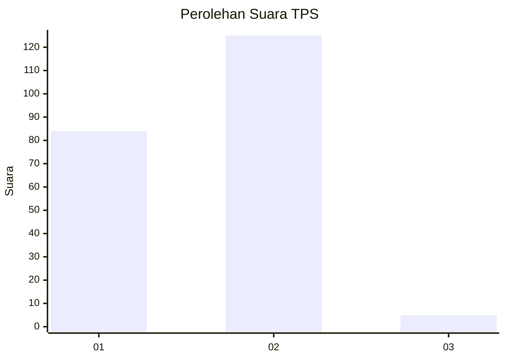
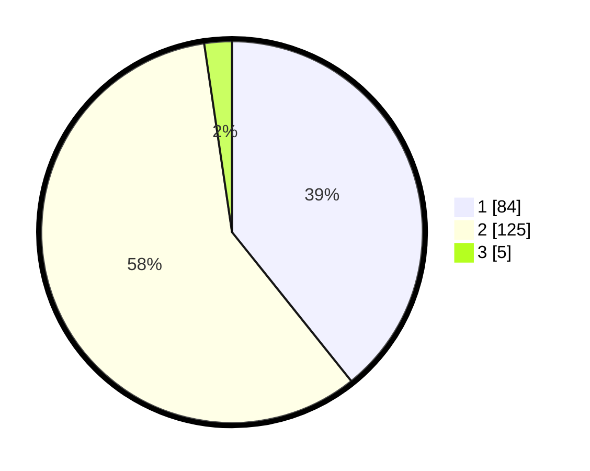

# Hasil

## Grafik

## Tabel

| No. | Nama Paslon    | Suara | Suara (raw) | Persentase |
|:--- |:-------------- | -----:| -----------:| ----------:|
| 1   | ANIES MUHAIMIN | 84    | [84][p-1]   | 39,25      |
| 2   | PRABOWO GIBRAN | 125   | [125][p-2]  | 58,41      |
| 3   | GANJAR MAHFUD  | 5     | [5][p-3]    | 2,34       |

[p-1]: https://github.com/gigit-pemilu/pemilu-2024/blob/main/pilpres/hitung-suara/sub/35-jawa-timur/sub/09-jember/sub/31-sumberjambe/sub/2003-pringgondani/sub/005-tps/sub/paslon-1.txt
[p-2]: https://github.com/gigit-pemilu/pemilu-2024/blob/main/pilpres/hitung-suara/sub/35-jawa-timur/sub/09-jember/sub/31-sumberjambe/sub/2003-pringgondani/sub/005-tps/sub/paslon-2.txt
[p-3]: https://github.com/gigit-pemilu/pemilu-2024/blob/main/pilpres/hitung-suara/sub/35-jawa-timur/sub/09-jember/sub/31-sumberjambe/sub/2003-pringgondani/sub/005-tps/sub/paslon-3.txt

## Foto C Plano

https://sirekap-obj-formc.kpu.go.id/9752/pemilu/ppwp/35/09/31/20/03/3509312003005-20240214-232155--a97c7288-0252-4fb8-bab8-81880dc98828.jpg

https://sirekap-obj-formc.kpu.go.id/9752/pemilu/ppwp/35/09/31/20/03/3509312003005-20240214-234611--a91dec5d-0c80-41e3-98f8-25c4f3b6a9bf.jpg

https://sirekap-obj-formc.kpu.go.id/9752/pemilu/ppwp/35/09/31/20/03/3509312003005-20240214-234645--17e67918-44a6-4dd2-ba03-3d236b545093.jpg

## Metadata

| Key        | Value               |
| ---------- | ------------------- |
| Time Stamp | 2024-02-15 18:30:25 |

