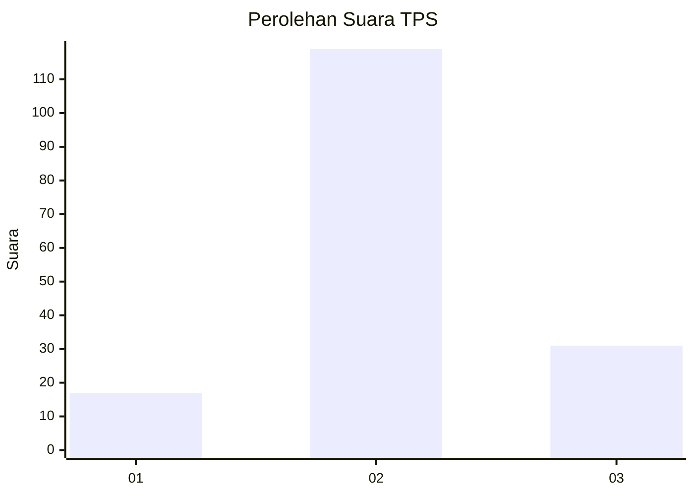
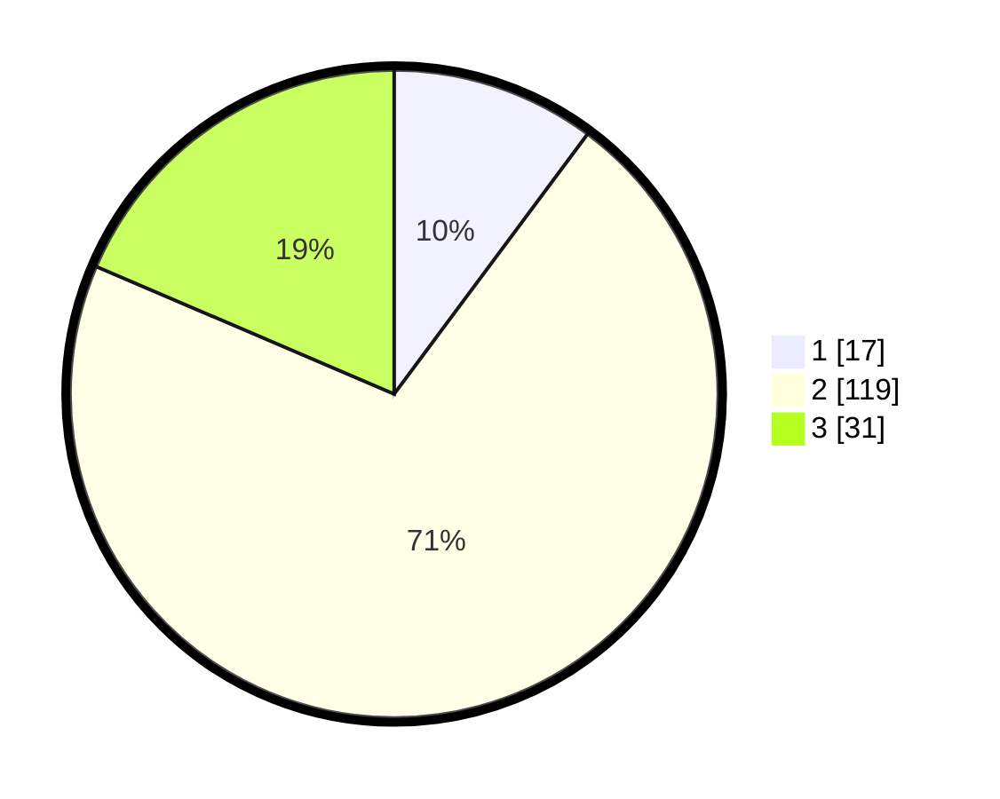

# Hasil

## Grafik

## Tabel

| No. | Nama Paslon    | Suara | Suara (raw) | Persentase |
|:--- |:-------------- | -----:| -----------:| ----------:|
| 1   | ANIES MUHAIMIN | 17    | [17][p-1]   | 10,18      |
| 2   | PRABOWO GIBRAN | 119   | [119][p-2]  | 71,26      |
| 3   | GANJAR MAHFUD  | 31    | [31][p-3]   | 18,56      |

[p-1]: https://github.com/gigit-pemilu/pemilu-2024-35-jawa-timur/blob/main/pilpres/hitung-suara/sub/35-jawa-timur/sub/09-jember/sub/31-sumberjambe/sub/2006-sumberjambe/sub/002-tps/sub/paslon-1.txt
[p-2]: https://github.com/gigit-pemilu/pemilu-2024-35-jawa-timur/blob/main/pilpres/hitung-suara/sub/35-jawa-timur/sub/09-jember/sub/31-sumberjambe/sub/2006-sumberjambe/sub/002-tps/sub/paslon-2.txt
[p-3]: https://github.com/gigit-pemilu/pemilu-2024-35-jawa-timur/blob/main/pilpres/hitung-suara/sub/35-jawa-timur/sub/09-jember/sub/31-sumberjambe/sub/2006-sumberjambe/sub/002-tps/sub/paslon-3.txt

## Foto C Plano

https://sirekap-obj-formc.kpu.go.id/5c5e/pemilu/ppwp/35/09/31/20/06/3509312006002-20240220-193506--5f4c5f47-4cda-4118-9b0e-3cf26087dfaf.jpg

https://sirekap-obj-formc.kpu.go.id/5c5e/pemilu/ppwp/35/09/31/20/06/3509312006002-20240220-194356--436b52e0-eb41-45de-bf40-382f49484dce.jpg

https://sirekap-obj-formc.kpu.go.id/5c5e/pemilu/ppwp/35/09/31/20/06/3509312006002-20240220-194101--ed4d48f1-d158-4509-8a1f-cbde0e5262c8.jpg

## Metadata

| Key        | Value               |
| ---------- | ------------------- |
| Time Stamp | 2024-02-24 22:31:28 |

