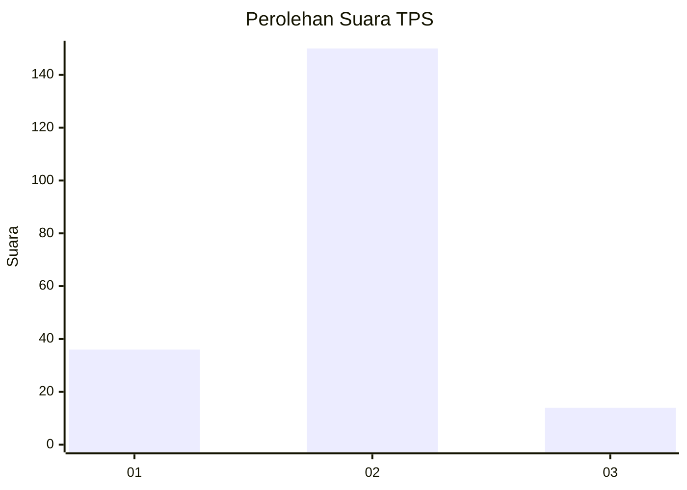
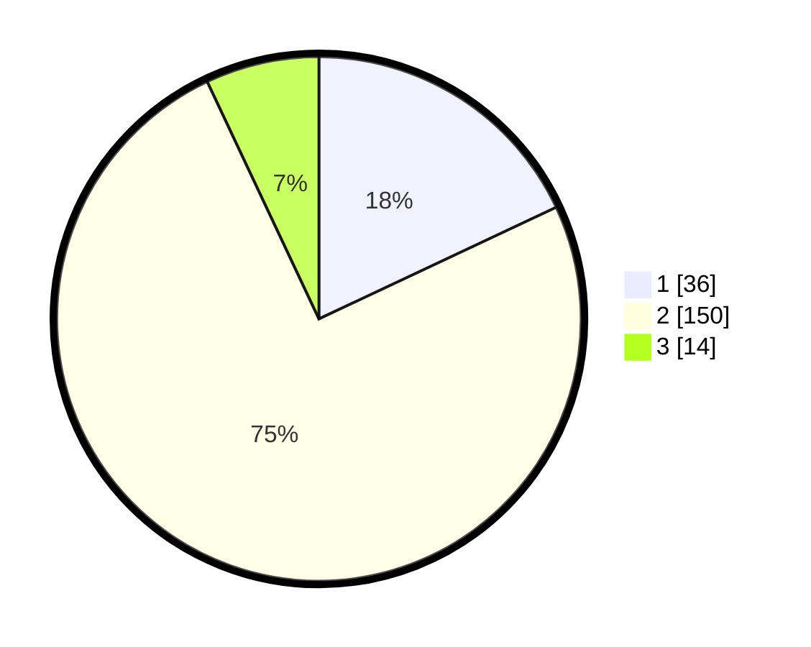

# Hasil

## Grafik

## Tabel

| No. | Nama Paslon    | Suara | Suara (raw) | Persentase |
|:--- |:-------------- | -----:| -----------:| ----------:|
| 1   | ANIES MUHAIMIN | 36    | [36][p-1]   | 18,00      |
| 2   | PRABOWO GIBRAN | 150   | [150][p-2]  | 75,00      |
| 3   | GANJAR MAHFUD  | 14    | [14][p-3]   | 7,00       |

[p-1]: https://github.com/gigit-pemilu/pemilu-2024-35-jawa-timur/blob/main/pilpres/hitung-suara/sub/35-jawa-timur/sub/09-jember/sub/31-sumberjambe/sub/2006-sumberjambe/sub/004-tps/sub/paslon-1.txt
[p-2]: https://github.com/gigit-pemilu/pemilu-2024-35-jawa-timur/blob/main/pilpres/hitung-suara/sub/35-jawa-timur/sub/09-jember/sub/31-sumberjambe/sub/2006-sumberjambe/sub/004-tps/sub/paslon-2.txt
[p-3]: https://github.com/gigit-pemilu/pemilu-2024-35-jawa-timur/blob/main/pilpres/hitung-suara/sub/35-jawa-timur/sub/09-jember/sub/31-sumberjambe/sub/2006-sumberjambe/sub/004-tps/sub/paslon-3.txt

## Foto C Plano

https://sirekap-obj-formc.kpu.go.id/b596/pemilu/ppwp/35/09/31/20/06/3509312006004-20240220-194055--f1a733ca-06d1-4209-a625-71299747b75e.jpg

https://sirekap-obj-formc.kpu.go.id/b596/pemilu/ppwp/35/09/31/20/06/3509312006004-20240214-202202--d9a02482-25a3-49e3-9ef7-d303d957ca69.jpg

https://sirekap-obj-formc.kpu.go.id/b596/pemilu/ppwp/35/09/31/20/06/3509312006004-20240214-202313--418f526c-1340-4231-86f6-98ec95e6a6e0.jpg

## Metadata

| Key        | Value               |
| ---------- | ------------------- |
| Time Stamp | 2024-02-20 20:00:00 |

