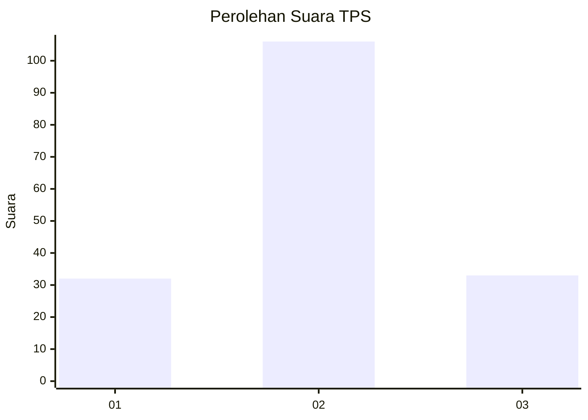
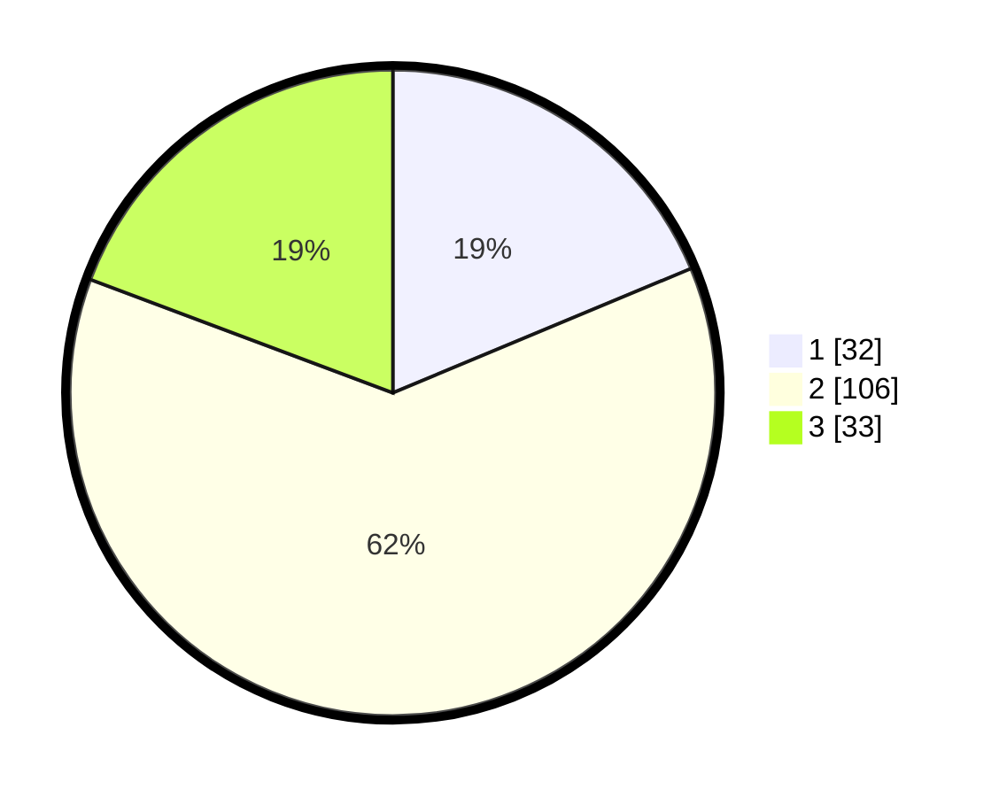

# Hasil

## Grafik

## Tabel

| No. | Nama Paslon    | Suara | Suara (raw) | Persentase |
|:--- |:-------------- | -----:| -----------:| ----------:|
| 1   | ANIES MUHAIMIN | 32    | [32][p-1]   | 18,71      |
| 2   | PRABOWO GIBRAN | 106   | [106][p-2]  | 61,99      |
| 3   | GANJAR MAHFUD  | 33    | [33][p-3]   | 19,30      |

[p-1]: https://github.com/gigit-pemilu/pemilu-2024/blob/main/pilpres/hitung-suara/sub/35-jawa-timur/sub/09-jember/sub/31-sumberjambe/sub/2007-gunungmalang/sub/002-tps/sub/paslon-1.txt
[p-2]: https://github.com/gigit-pemilu/pemilu-2024/blob/main/pilpres/hitung-suara/sub/35-jawa-timur/sub/09-jember/sub/31-sumberjambe/sub/2007-gunungmalang/sub/002-tps/sub/paslon-2.txt
[p-3]: https://github.com/gigit-pemilu/pemilu-2024/blob/main/pilpres/hitung-suara/sub/35-jawa-timur/sub/09-jember/sub/31-sumberjambe/sub/2007-gunungmalang/sub/002-tps/sub/paslon-3.txt

## Foto C Plano

https://sirekap-obj-formc.kpu.go.id/fc62/pemilu/ppwp/35/09/31/20/07/3509312007002-20240219-221155--a73d8d4c-a55e-4614-8640-7c87f6be7acb.jpg

https://sirekap-obj-formc.kpu.go.id/fc62/pemilu/ppwp/35/09/31/20/07/3509312007002-20240219-221258--97f0c91a-9cc2-48b5-b422-9f20c9741142.jpg

https://sirekap-obj-formc.kpu.go.id/fc62/pemilu/ppwp/35/09/31/20/07/3509312007002-20240219-221340--79fff896-914d-4e5d-980b-824e12cfbca5.jpg

## Metadata

| Key        | Value               |
| ---------- | ------------------- |
| Time Stamp | 2024-02-25 22:00:00 |

