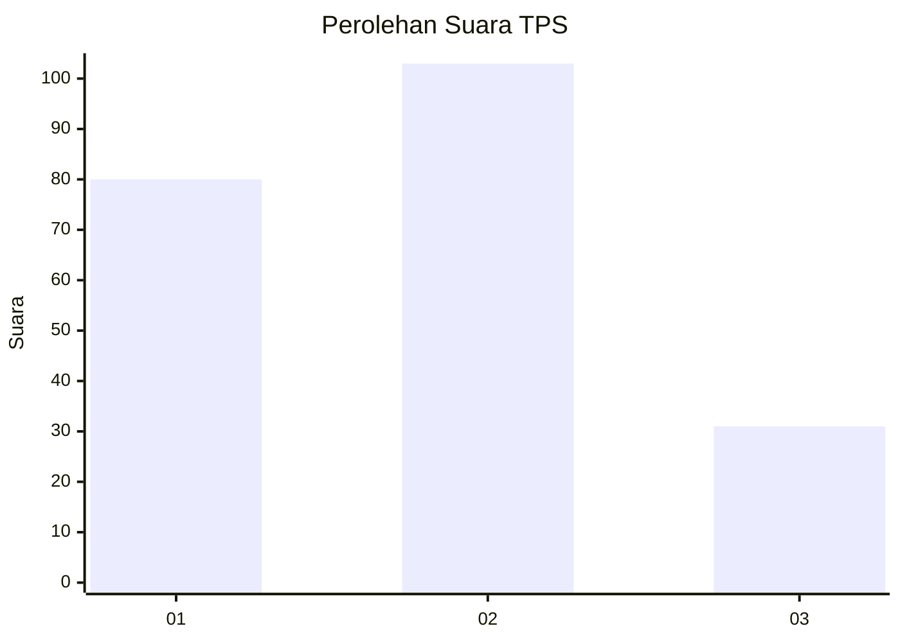
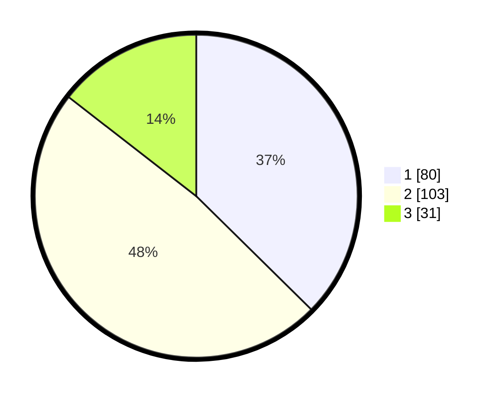

# Hasil

## Grafik

## Tabel

| No. | Nama Paslon    | Suara | Suara (raw) | Persentase |
|:--- |:-------------- | -----:| -----------:| ----------:|
| 1   | ANIES MUHAIMIN | 80    | [80][p-1]   | 37,38      |
| 2   | PRABOWO GIBRAN | 103   | [103][p-2]  | 48,13      |
| 3   | GANJAR MAHFUD  | 31    | [31][p-3]   | 14,49      |

[p-1]: https://github.com/gigit-pemilu/pemilu-2024/blob/main/pilpres/hitung-suara/sub/35-jawa-timur/sub/09-jember/sub/31-sumberjambe/sub/2007-gunungmalang/sub/005-tps/sub/paslon-1.txt
[p-2]: https://github.com/gigit-pemilu/pemilu-2024/blob/main/pilpres/hitung-suara/sub/35-jawa-timur/sub/09-jember/sub/31-sumberjambe/sub/2007-gunungmalang/sub/005-tps/sub/paslon-2.txt
[p-3]: https://github.com/gigit-pemilu/pemilu-2024/blob/main/pilpres/hitung-suara/sub/35-jawa-timur/sub/09-jember/sub/31-sumberjambe/sub/2007-gunungmalang/sub/005-tps/sub/paslon-3.txt

## Foto C Plano

https://sirekap-obj-formc.kpu.go.id/f559/pemilu/ppwp/35/09/31/20/07/3509312007005-20240219-222401--6f7a1a68-e9d8-4205-95e8-735700efdf95.jpg

https://sirekap-obj-formc.kpu.go.id/f559/pemilu/ppwp/35/09/31/20/07/3509312007005-20240219-222554--e0c5bd34-ca95-416a-8247-0db583d3f1b2.jpg

https://sirekap-obj-formc.kpu.go.id/f559/pemilu/ppwp/35/09/31/20/07/3509312007005-20240219-222705--e46d66a3-3b81-4ddd-a1f6-5791fd6fa6bd.jpg

## Metadata

| Key        | Value               |
| ---------- | ------------------- |
| Time Stamp | 2024-02-25 21:00:00 |

