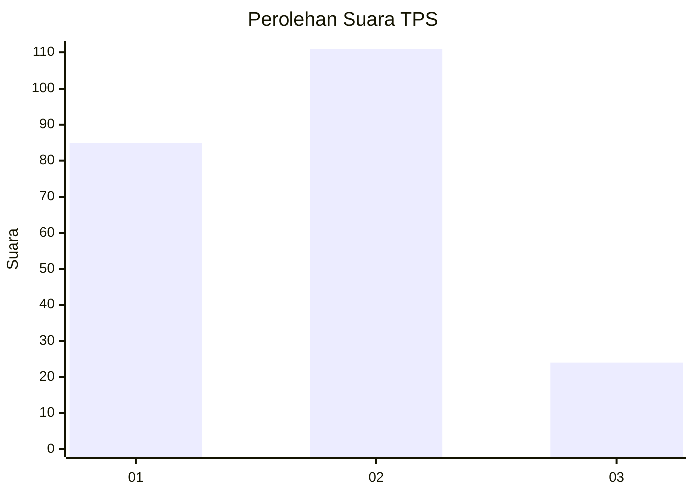
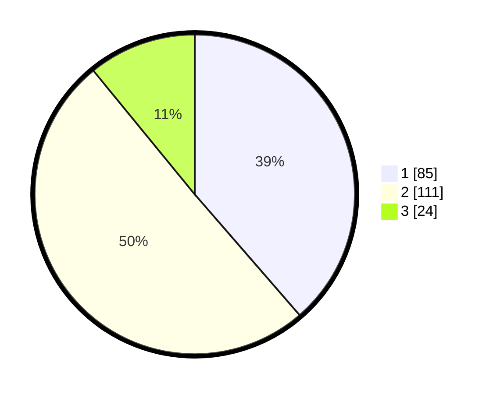

# Hasil

## Grafik

## Tabel

| No. | Nama Paslon    | Suara | Suara (raw) | Persentase |
|:--- |:-------------- | -----:| -----------:| ----------:|
| 1   | ANIES MUHAIMIN | 85    | [85][p-1]   | 38,64      |
| 2   | PRABOWO GIBRAN | 111   | [111][p-2]  | 50,45      |
| 3   | GANJAR MAHFUD  | 24    | [24][p-3]   | 10,91      |

[p-1]: https://github.com/gigit-pemilu/pemilu-2024-35-jawa-timur/blob/main/pilpres/hitung-suara/sub/35-jawa-timur/sub/09-jember/sub/31-sumberjambe/sub/2007-gunungmalang/sub/008-tps/sub/paslon-1.txt
[p-2]: https://github.com/gigit-pemilu/pemilu-2024-35-jawa-timur/blob/main/pilpres/hitung-suara/sub/35-jawa-timur/sub/09-jember/sub/31-sumberjambe/sub/2007-gunungmalang/sub/008-tps/sub/paslon-2.txt
[p-3]: https://github.com/gigit-pemilu/pemilu-2024-35-jawa-timur/blob/main/pilpres/hitung-suara/sub/35-jawa-timur/sub/09-jember/sub/31-sumberjambe/sub/2007-gunungmalang/sub/008-tps/sub/paslon-3.txt

## Foto C Plano

https://sirekap-obj-formc.kpu.go.id/c3b5/pemilu/ppwp/35/09/31/20/07/3509312007008-20240219-221835--1e8a73d4-9aed-4c51-a46a-762d3c604b5d.jpg

https://sirekap-obj-formc.kpu.go.id/c3b5/pemilu/ppwp/35/09/31/20/07/3509312007008-20240219-221924--e77360fa-c89a-4f79-b240-e6a1badec5f6.jpg

https://sirekap-obj-formc.kpu.go.id/c3b5/pemilu/ppwp/35/09/31/20/07/3509312007008-20240219-222104--21612abb-a251-4696-a412-1c80e9d42bec.jpg

## Metadata

| Key        | Value               |
| ---------- | ------------------- |
| Time Stamp | 2024-02-25 20:00:00 |

