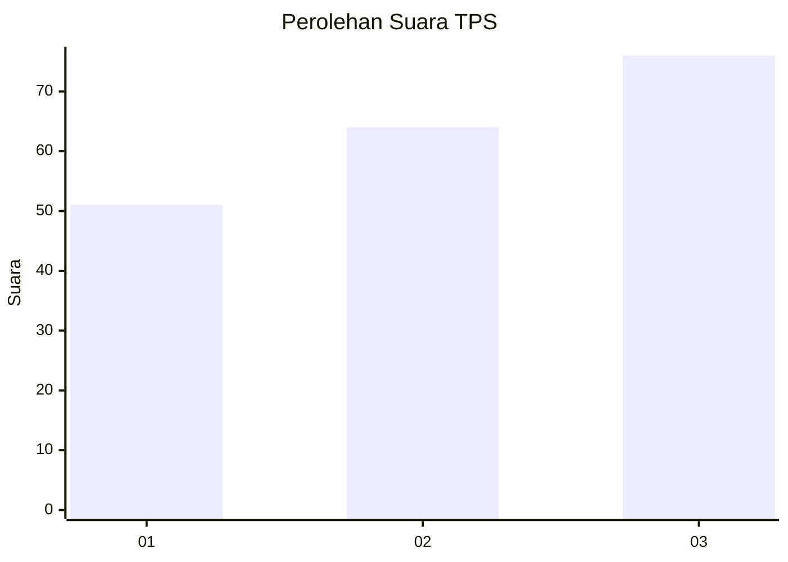
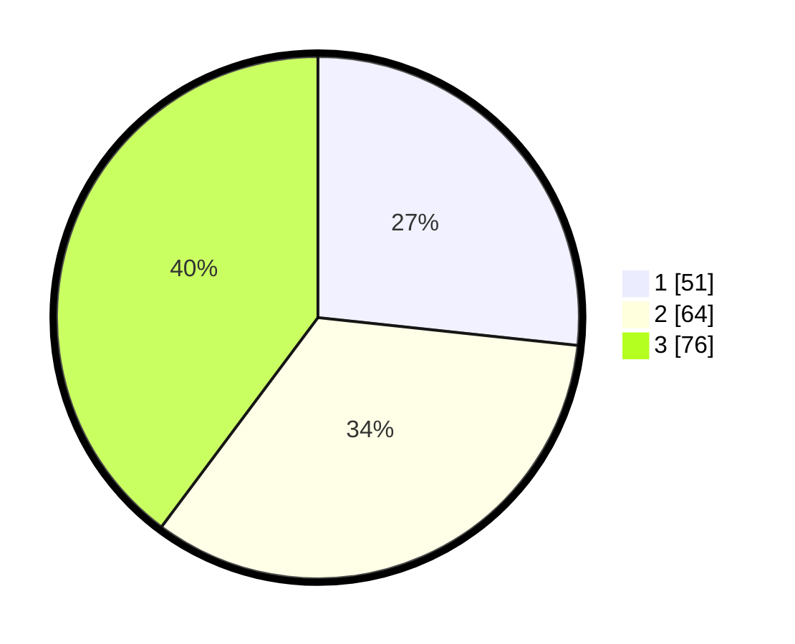

# Hasil

## Grafik

## Tabel

| No. | Nama Paslon    | Suara | Suara (raw) | Persentase |
|:--- |:-------------- | -----:| -----------:| ----------:|
| 1   | ANIES MUHAIMIN | 51    | [51][p-1]   | 26,70      |
| 2   | PRABOWO GIBRAN | 64    | [64][p-2]   | 33,51      |
| 3   | GANJAR MAHFUD  | 76    | [76][p-3]   | 39,79      |

[p-1]: https://github.com/gigit-pemilu/pemilu-2024-35-jawa-timur/blob/main/pilpres/hitung-suara/sub/35-jawa-timur/sub/09-jember/sub/31-sumberjambe/sub/2007-gunungmalang/sub/020-tps/sub/paslon-1.txt
[p-2]: https://github.com/gigit-pemilu/pemilu-2024-35-jawa-timur/blob/main/pilpres/hitung-suara/sub/35-jawa-timur/sub/09-jember/sub/31-sumberjambe/sub/2007-gunungmalang/sub/020-tps/sub/paslon-2.txt
[p-3]: https://github.com/gigit-pemilu/pemilu-2024-35-jawa-timur/blob/main/pilpres/hitung-suara/sub/35-jawa-timur/sub/09-jember/sub/31-sumberjambe/sub/2007-gunungmalang/sub/020-tps/sub/paslon-3.txt

## Foto C Plano

https://sirekap-obj-formc.kpu.go.id/0be3/pemilu/ppwp/35/09/31/20/07/3509312007020-20240214-221416--27b27caf-cae4-488d-a6a4-1f4be247f665.jpg

https://sirekap-obj-formc.kpu.go.id/0be3/pemilu/ppwp/35/09/31/20/07/3509312007020-20240215-023801--55b1c072-8f6c-4003-91b1-be3c04236efc.jpg

https://sirekap-obj-formc.kpu.go.id/0be3/pemilu/ppwp/35/09/31/20/07/3509312007020-20240214-222122--d0a45140-29ca-4550-8365-681e76fabef4.jpg

## Metadata

| Key        | Value               |
| ---------- | ------------------- |
| Time Stamp | 2024-02-15 20:30:46 |

