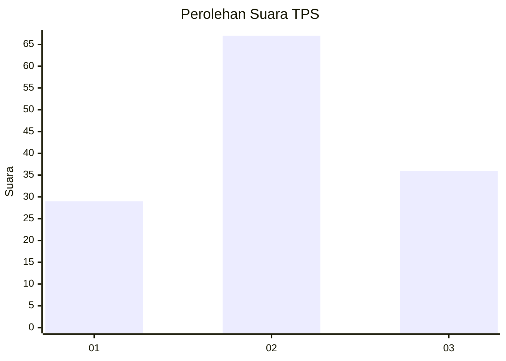
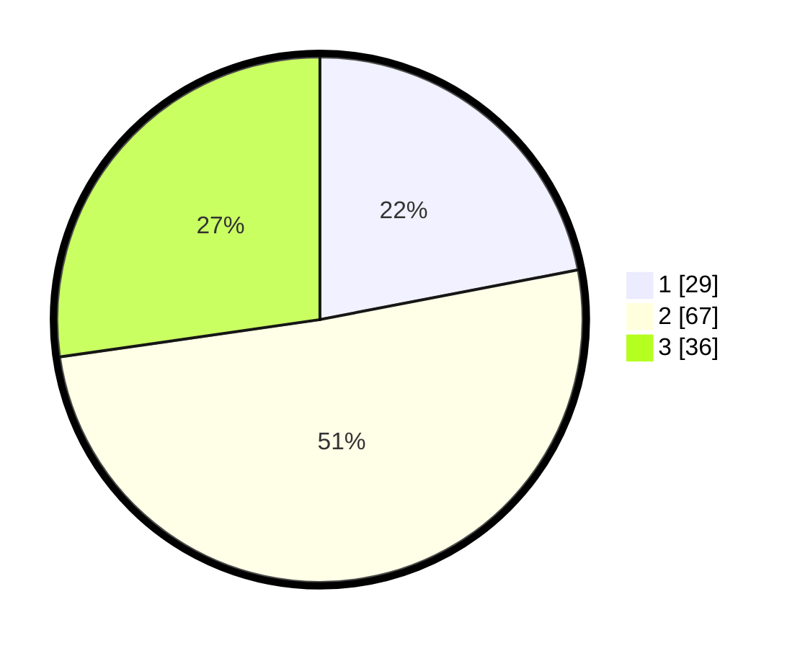

# Hasil

## Grafik

## Tabel

| No. | Nama Paslon    | Suara | Suara (raw) | Persentase |
|:--- |:-------------- | -----:| -----------:| ----------:|
| 1   | ANIES MUHAIMIN | 29    | [29][p-1]   | 21,97      |
| 2   | PRABOWO GIBRAN | 67    | [67][p-2]   | 50,76      |
| 3   | GANJAR MAHFUD  | 36    | [36][p-3]   | 27,27      |

[p-1]: https://github.com/gigit-pemilu/pemilu-2024/blob/main/pilpres/hitung-suara/sub/35-jawa-timur/sub/09-jember/sub/31-sumberjambe/sub/2007-gunungmalang/sub/021-tps/sub/paslon-1.txt
[p-2]: https://github.com/gigit-pemilu/pemilu-2024/blob/main/pilpres/hitung-suara/sub/35-jawa-timur/sub/09-jember/sub/31-sumberjambe/sub/2007-gunungmalang/sub/021-tps/sub/paslon-2.txt
[p-3]: https://github.com/gigit-pemilu/pemilu-2024/blob/main/pilpres/hitung-suara/sub/35-jawa-timur/sub/09-jember/sub/31-sumberjambe/sub/2007-gunungmalang/sub/021-tps/sub/paslon-3.txt

## Foto C Plano

https://sirekap-obj-formc.kpu.go.id/98f8/pemilu/ppwp/35/09/31/20/07/3509312007021-20240219-214622--982d2b63-1a55-49ee-ad92-b73175387080.jpg

https://sirekap-obj-formc.kpu.go.id/98f8/pemilu/ppwp/35/09/31/20/07/3509312007021-20240219-214721--64fcaec4-3090-4c88-a42f-923cd1168948.jpg

https://sirekap-obj-formc.kpu.go.id/98f8/pemilu/ppwp/35/09/31/20/07/3509312007021-20240219-214812--f7e8cb1d-c010-44b1-874a-4c099379590f.jpg

## Metadata

| Key        | Value               |
| ---------- | ------------------- |
| Time Stamp | 2024-02-25 11:00:00 |

