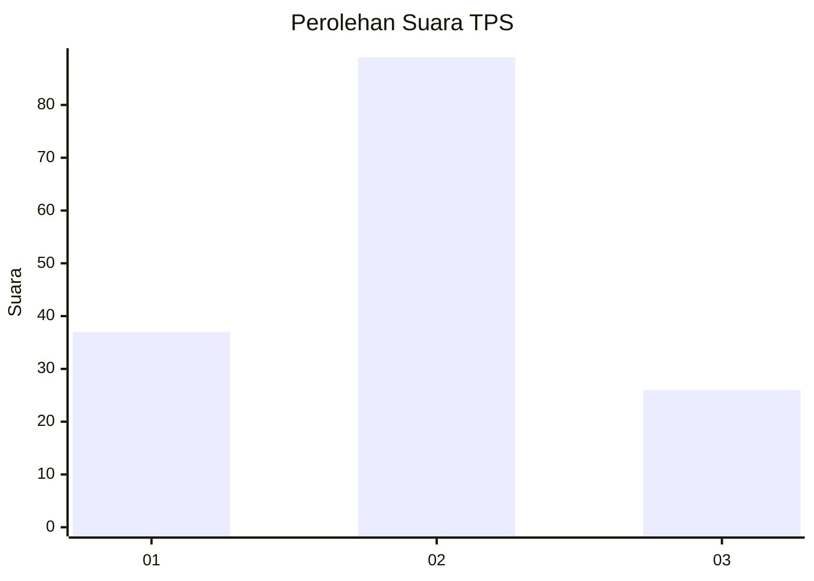

# Hasil

## Grafik

## Tabel

| No. | Nama Paslon    | Suara | Suara (raw) | Persentase |
|:--- |:-------------- | -----:| -----------:| ----------:|
| 1   | ANIES MUHAIMIN | 37    | [37][p-1]   | 24,34      |
| 2   | PRABOWO GIBRAN | 89    | [89][p-2]   | 58,55      |
| 3   | GANJAR MAHFUD  | 26    | [26][p-3]   | 17,11      |

[p-1]: https://github.com/gigit-pemilu/pemilu-2024/blob/main/pilpres/hitung-suara/sub/35-jawa-timur/sub/09-jember/sub/31-sumberjambe/sub/2007-gunungmalang/sub/025-tps/sub/paslon-1.txt
[p-2]: https://github.com/gigit-pemilu/pemilu-2024/blob/main/pilpres/hitung-suara/sub/35-jawa-timur/sub/09-jember/sub/31-sumberjambe/sub/2007-gunungmalang/sub/025-tps/sub/paslon-2.txt
[p-3]: https://github.com/gigit-pemilu/pemilu-2024/blob/main/pilpres/hitung-suara/sub/35-jawa-timur/sub/09-jember/sub/31-sumberjambe/sub/2007-gunungmalang/sub/025-tps/sub/paslon-3.txt

## Foto C Plano

https://sirekap-obj-formc.kpu.go.id/adfc/pemilu/ppwp/35/09/31/20/07/3509312007025-20240219-213746--1ae09bf7-51f1-45c9-9dac-f5a31beb7a73.jpg

https://sirekap-obj-formc.kpu.go.id/adfc/pemilu/ppwp/35/09/31/20/07/3509312007025-20240219-213854--b9c75f89-b96b-4bab-9be5-c554db195c9b.jpg

https://sirekap-obj-formc.kpu.go.id/adfc/pemilu/ppwp/35/09/31/20/07/3509312007025-20240219-214013--633d4569-ee92-488a-b6bb-aa7822ee72e3.jpg

## Metadata

| Key        | Value               |
| ---------- | ------------------- |
| Time Stamp | 2024-02-24 22:31:28 |

