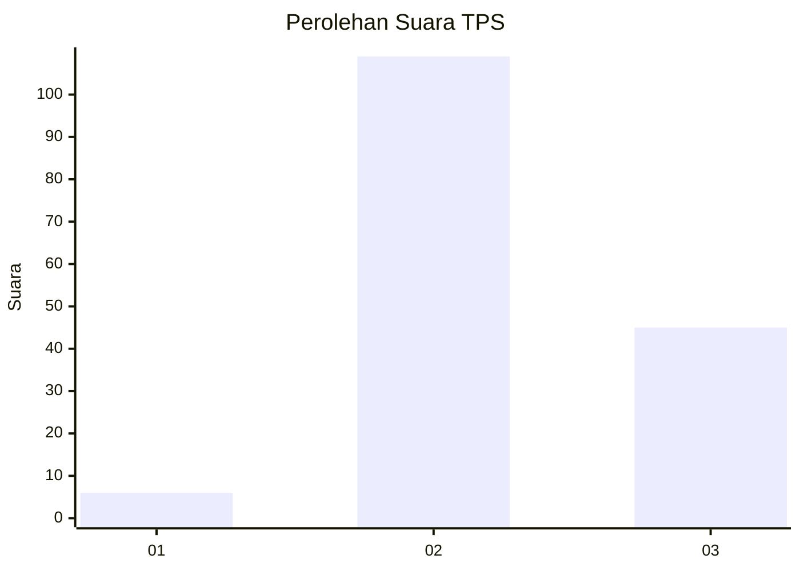
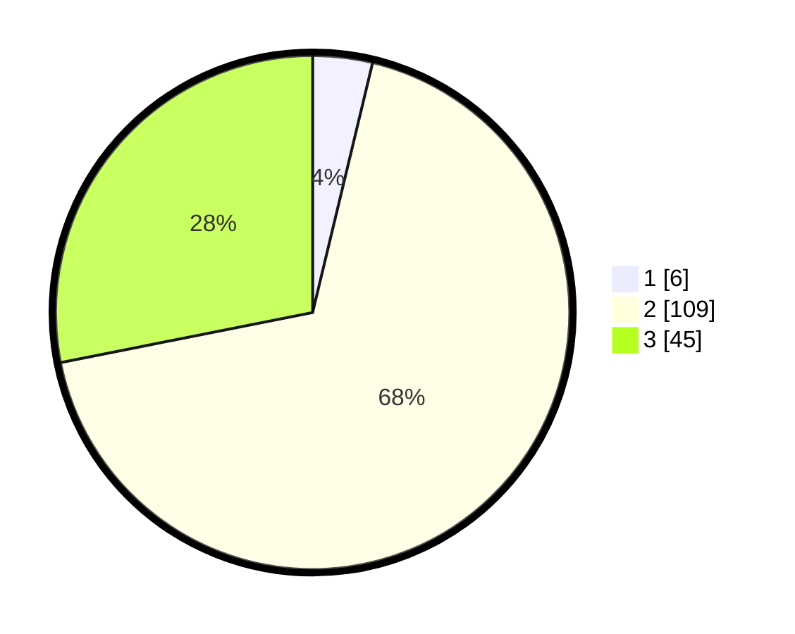

# Hasil

## Grafik

## Tabel

| No. | Nama Paslon    | Suara | Suara (raw) | Persentase |
|:--- |:-------------- | -----:| -----------:| ----------:|
| 1   | ANIES MUHAIMIN | 6     | [6][p-1]    | 3,75       |
| 2   | PRABOWO GIBRAN | 109   | [109][p-2]  | 68,13      |
| 3   | GANJAR MAHFUD  | 45    | [45][p-3]   | 28,13      |

[p-1]: https://github.com/gigit-pemilu/pemilu-2024-35-jawa-timur/blob/main/pilpres/hitung-suara/sub/35-jawa-timur/sub/10-banyuwangi/sub/01-pesanggaran/sub/2001-sarongan/sub/001-tps/sub/paslon-1.txt
[p-2]: https://github.com/gigit-pemilu/pemilu-2024-35-jawa-timur/blob/main/pilpres/hitung-suara/sub/35-jawa-timur/sub/10-banyuwangi/sub/01-pesanggaran/sub/2001-sarongan/sub/001-tps/sub/paslon-2.txt
[p-3]: https://github.com/gigit-pemilu/pemilu-2024-35-jawa-timur/blob/main/pilpres/hitung-suara/sub/35-jawa-timur/sub/10-banyuwangi/sub/01-pesanggaran/sub/2001-sarongan/sub/001-tps/sub/paslon-3.txt

## Foto C Plano

https://sirekap-obj-formc.kpu.go.id/7b97/pemilu/ppwp/35/10/01/20/01/3510012001001-20240214-192300--58ecddd7-92d9-4e32-89f3-3ba1fa86ab38.jpg

https://sirekap-obj-formc.kpu.go.id/7b97/pemilu/ppwp/35/10/01/20/01/3510012001001-20240216-132934--baf6031c-71fc-4f44-b4ca-29b9ee735ca1.jpg

https://sirekap-obj-formc.kpu.go.id/7b97/pemilu/ppwp/35/10/01/20/01/3510012001001-20240216-133914--323cd69e-e708-452c-b839-ce441b49cf5a.jpg

## Metadata

| Key        | Value               |
| ---------- | ------------------- |
| Time Stamp | 2024-02-16 16:25:10 |

## DATA PEMILIH TETAP

Jumlah pemilih dalam DPT: **203**.
 * L: **105**.
 * P: **98**.

## DATA PENGGUNA HAK PILIH

Jumlah pengguna hak pilih dalam DPT: **164**.
 * L: **89**.
 * P: **75**.

Jumlah pengguna hak pilih dalam DPTb: **0**.
 * L: **0**.
 * P: **0**.

Jumlah pengguna hak pilih dalam DPK: **2**.
 * L: **1**.
 * P: **1**.

Jumlah pengguna hak pilih: **166**.
 * L: **90**.
 * P: **76**.

## JUMLAH SUARA SAH DAN TIDAK SAH

JUMLAH SELURUH SUARA SAH: **160**.

JUMLAH SUARA TIDAK SAH: **6**.

JUMLAH SELURUH SUARA SAH DAN SUARA TIDAK SAH: **166**.

