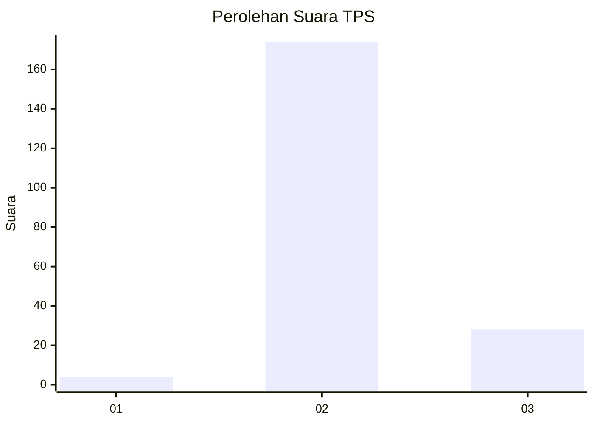
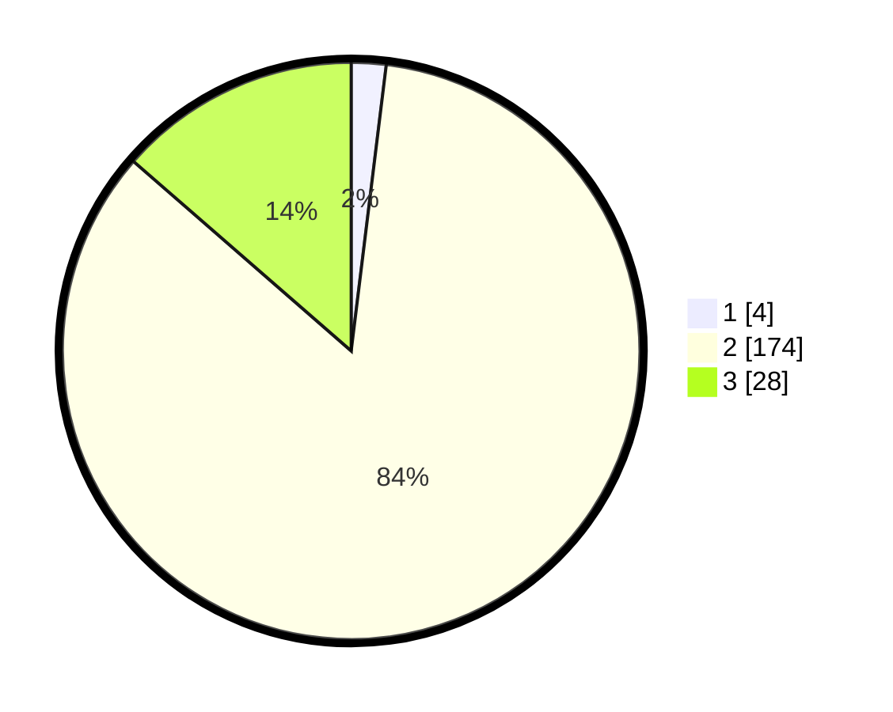

# Hasil

## Grafik

## Tabel

| No. | Nama Paslon    | Suara | Suara (raw) | Persentase |
|:--- |:-------------- | -----:| -----------:| ----------:|
| 1   | ANIES MUHAIMIN | 4     | [4][p-1]    | 1,94       |
| 2   | PRABOWO GIBRAN | 174   | [174][p-2]  | 84,47      |
| 3   | GANJAR MAHFUD  | 28    | [28][p-3]   | 13,59      |

[p-1]: https://github.com/gigit-pemilu/pemilu-2024/blob/main/pilpres/hitung-suara/sub/35-jawa-timur/sub/10-banyuwangi/sub/01-pesanggaran/sub/2009-kandangan/sub/021-tps/sub/paslon-1.txt
[p-2]: https://github.com/gigit-pemilu/pemilu-2024/blob/main/pilpres/hitung-suara/sub/35-jawa-timur/sub/10-banyuwangi/sub/01-pesanggaran/sub/2009-kandangan/sub/021-tps/sub/paslon-2.txt
[p-3]: https://github.com/gigit-pemilu/pemilu-2024/blob/main/pilpres/hitung-suara/sub/35-jawa-timur/sub/10-banyuwangi/sub/01-pesanggaran/sub/2009-kandangan/sub/021-tps/sub/paslon-3.txt

## Foto C Plano

https://sirekap-obj-formc.kpu.go.id/085c/pemilu/ppwp/35/10/01/20/09/3510012009021-20240221-211244--a3e58040-a4a5-4332-ac09-28f2abcb7963.jpg

https://sirekap-obj-formc.kpu.go.id/085c/pemilu/ppwp/35/10/01/20/09/3510012009021-20240221-211353--a9c0ee93-60b8-46f7-a78e-f7c396043fa2.jpg

https://sirekap-obj-formc.kpu.go.id/085c/pemilu/ppwp/35/10/01/20/09/3510012009021-20240221-211611--467e02d6-7c2b-4a9d-af72-d6176d37df43.jpg

## Metadata

| Key        | Value               |
| ---------- | ------------------- |
| Time Stamp | 2024-02-22 12:00:00 |

## DATA PEMILIH TETAP

Jumlah pemilih dalam DPT: **295**.
 * L: **647**.
 * P: **48**.

## DATA PENGGUNA HAK PILIH

Jumlah pengguna hak pilih dalam DPT: **205**.
 * L: **604**.
 * P: **4**.

Jumlah pengguna hak pilih dalam DPTb: **778**.
 * L: **580**.
 * P: **0**.

Jumlah pengguna hak pilih dalam DPK: **2**.
 * L: **802**.
 * P: **2**.

Jumlah pengguna hak pilih: **207**.
 * L: **606**.
 * P: **806**.

## JUMLAH SUARA SAH DAN TIDAK SAH

JUMLAH SELURUH SUARA SAH: **206**.

JUMLAH SUARA TIDAK SAH: **1**.

JUMLAH SELURUH SUARA SAH DAN SUARA TIDAK SAH: **207**.

