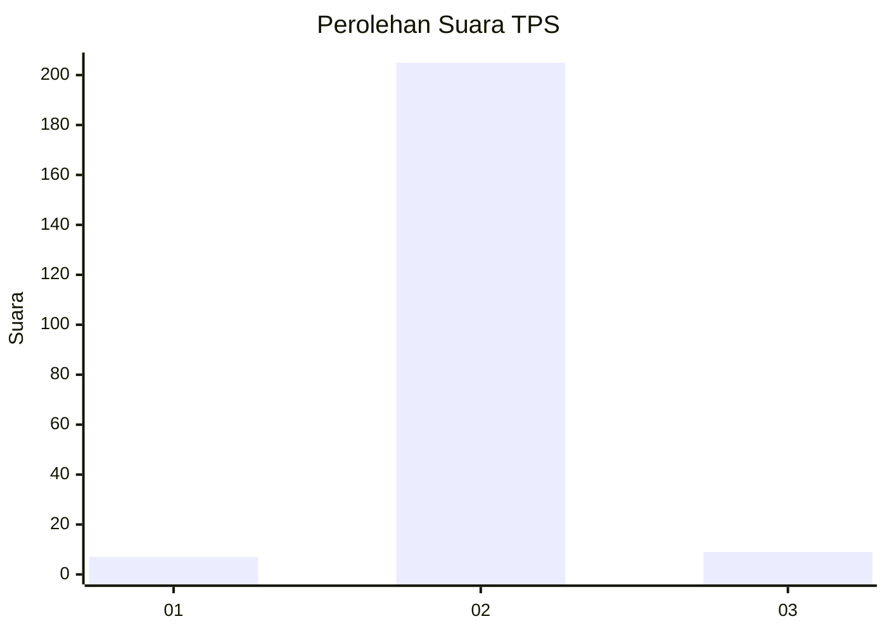
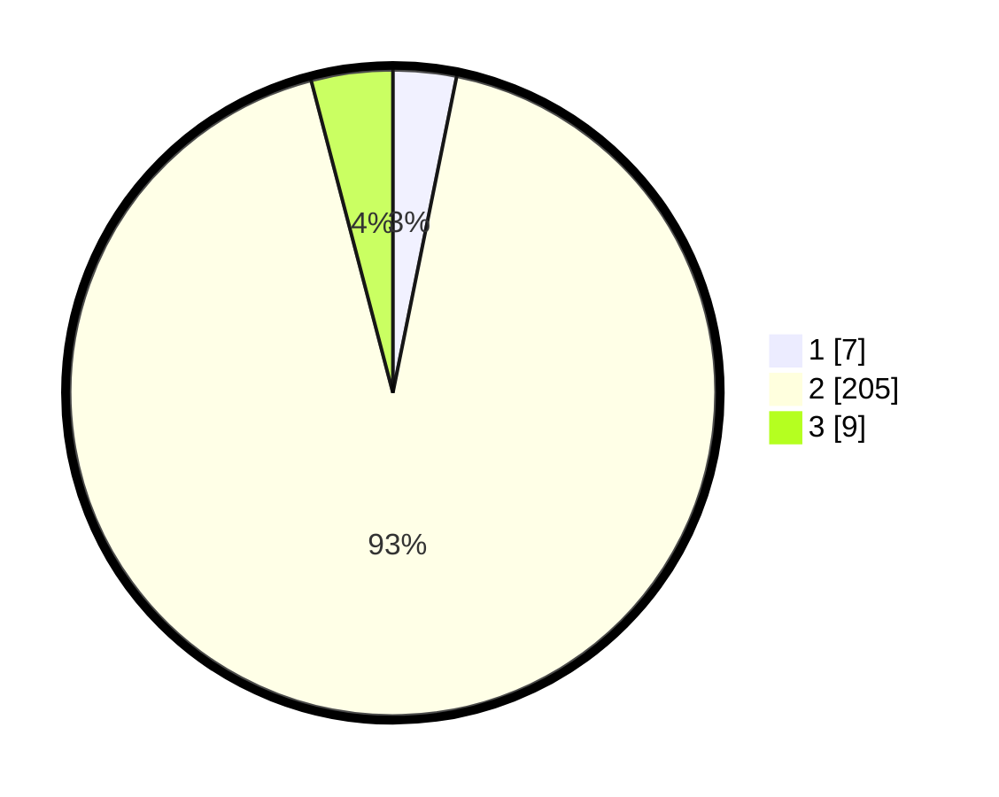

# Hasil

## Grafik

## Tabel

| No. | Nama Paslon    | Suara | Suara (raw) | Persentase |
|:--- |:-------------- | -----:| -----------:| ----------:|
| 1   | ANIES MUHAIMIN | 7     | [7][p-1]    | 3,17       |
| 2   | PRABOWO GIBRAN | 205   | [205][p-2]  | 92,76      |
| 3   | GANJAR MAHFUD  | 9     | [9][p-3]    | 4,07       |

[p-1]: https://github.com/gigit-pemilu/pemilu-2024/blob/main/pilpres/hitung-suara/sub/35-jawa-timur/sub/10-banyuwangi/sub/03-purwoharjo/sub/2001-grajagan/sub/021-tps/sub/paslon-1.txt
[p-2]: https://github.com/gigit-pemilu/pemilu-2024/blob/main/pilpres/hitung-suara/sub/35-jawa-timur/sub/10-banyuwangi/sub/03-purwoharjo/sub/2001-grajagan/sub/021-tps/sub/paslon-2.txt
[p-3]: https://github.com/gigit-pemilu/pemilu-2024/blob/main/pilpres/hitung-suara/sub/35-jawa-timur/sub/10-banyuwangi/sub/03-purwoharjo/sub/2001-grajagan/sub/021-tps/sub/paslon-3.txt

## Foto C Plano

https://sirekap-obj-formc.kpu.go.id/c224/pemilu/ppwp/35/10/03/20/01/3510032001021-20240217-191305--81c7230b-68a1-4715-acc4-a9288923f750.jpg

https://sirekap-obj-formc.kpu.go.id/c224/pemilu/ppwp/35/10/03/20/01/3510032001021-20240217-192325--a42e9d2b-832f-45a7-be1b-48a4e1757958.jpg

https://sirekap-obj-formc.kpu.go.id/c224/pemilu/ppwp/35/10/03/20/01/3510032001021-20240217-192136--b5ffb15e-257e-413e-b478-72529f572bf4.jpg

## Metadata

| Key        | Value               |
| ---------- | ------------------- |
| Time Stamp | 2024-02-19 06:16:00 |

