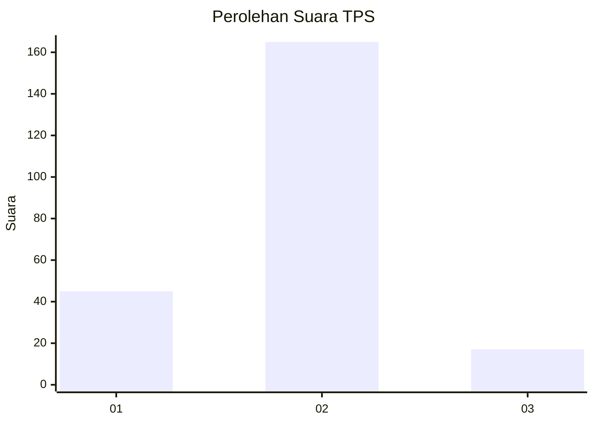
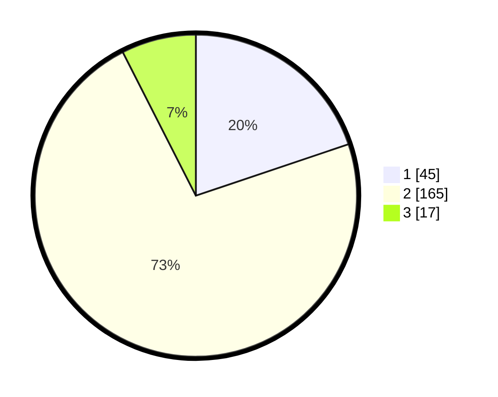

# Hasil

## Grafik

## Tabel

| No. | Nama Paslon    | Suara | Suara (raw) | Persentase |
|:--- |:-------------- | -----:| -----------:| ----------:|
| 1   | ANIES MUHAIMIN | 45    | [45][p-1]   | 19,82      |
| 2   | PRABOWO GIBRAN | 165   | [165][p-2]  | 72,69      |
| 3   | GANJAR MAHFUD  | 17    | [17][p-3]   | 7,49       |

[p-1]: https://github.com/gigit-pemilu/pemilu-2024/blob/main/pilpres/hitung-suara/sub/35-jawa-timur/sub/10-banyuwangi/sub/03-purwoharjo/sub/2002-sumberasri/sub/005-tps/sub/paslon-1.txt
[p-2]: https://github.com/gigit-pemilu/pemilu-2024/blob/main/pilpres/hitung-suara/sub/35-jawa-timur/sub/10-banyuwangi/sub/03-purwoharjo/sub/2002-sumberasri/sub/005-tps/sub/paslon-2.txt
[p-3]: https://github.com/gigit-pemilu/pemilu-2024/blob/main/pilpres/hitung-suara/sub/35-jawa-timur/sub/10-banyuwangi/sub/03-purwoharjo/sub/2002-sumberasri/sub/005-tps/sub/paslon-3.txt

## Foto C Plano

https://sirekap-obj-formc.kpu.go.id/8abc/pemilu/ppwp/35/10/03/20/02/3510032002005-20240214-220123--3e6bda5d-0dec-4c3b-8030-c994970fdecb.jpg

https://sirekap-obj-formc.kpu.go.id/8abc/pemilu/ppwp/35/10/03/20/02/3510032002005-20240214-220710--b1e66272-5cf7-4cf3-b0f3-8bc9fa2b87c0.jpg

https://sirekap-obj-formc.kpu.go.id/8abc/pemilu/ppwp/35/10/03/20/02/3510032002005-20240214-221201--2d01c351-c0b7-4d8c-b0f8-a69638c0bafc.jpg

## Metadata

| Key        | Value               |
| ---------- | ------------------- |
| Time Stamp | 2024-02-21 17:00:00 |

