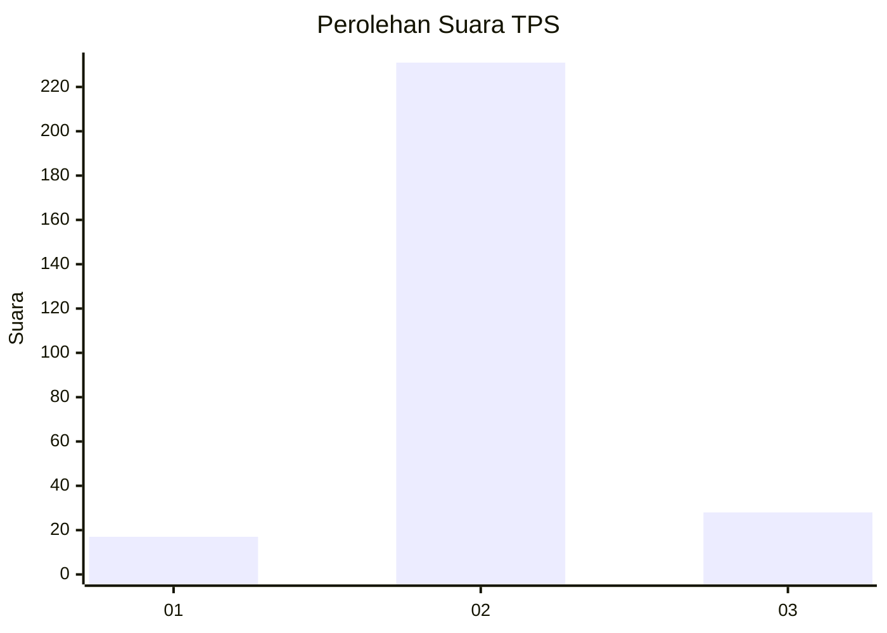
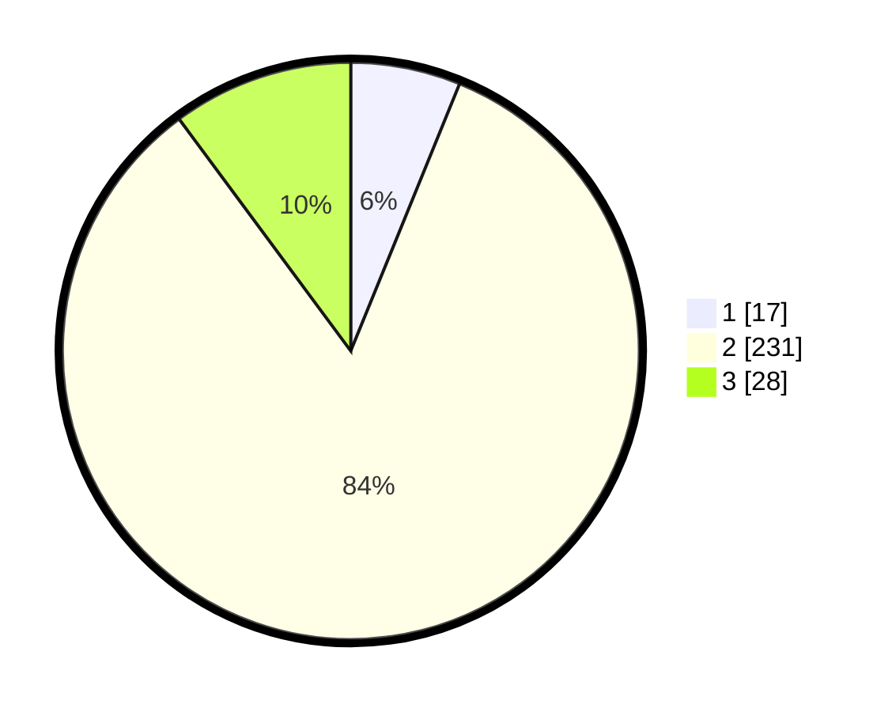

# Hasil

## Grafik

## Tabel

| No. | Nama Paslon    | Suara | Suara (raw) | Persentase |
|:--- |:-------------- | -----:| -----------:| ----------:|
| 1   | ANIES MUHAIMIN | 17    | [17][p-1]   | 6,16       |
| 2   | PRABOWO GIBRAN | 231   | [231][p-2]  | 83,70      |
| 3   | GANJAR MAHFUD  | 28    | [28][p-3]   | 10,14      |

[p-1]: https://github.com/gigit-pemilu/pemilu-2024/blob/main/pilpres/hitung-suara/sub/35-jawa-timur/sub/10-banyuwangi/sub/03-purwoharjo/sub/2002-sumberasri/sub/019-tps/sub/paslon-1.txt
[p-2]: https://github.com/gigit-pemilu/pemilu-2024/blob/main/pilpres/hitung-suara/sub/35-jawa-timur/sub/10-banyuwangi/sub/03-purwoharjo/sub/2002-sumberasri/sub/019-tps/sub/paslon-2.txt
[p-3]: https://github.com/gigit-pemilu/pemilu-2024/blob/main/pilpres/hitung-suara/sub/35-jawa-timur/sub/10-banyuwangi/sub/03-purwoharjo/sub/2002-sumberasri/sub/019-tps/sub/paslon-3.txt

## Foto C Plano

https://sirekap-obj-formc.kpu.go.id/f9af/pemilu/ppwp/35/10/03/20/02/3510032002019-20240214-220951--31fed82d-35e5-4708-be70-bdb96cdef5bc.jpg

https://sirekap-obj-formc.kpu.go.id/f9af/pemilu/ppwp/35/10/03/20/02/3510032002019-20240214-221106--9186e4b0-9af1-41c0-9522-ab00e4b5e9af.jpg

https://sirekap-obj-formc.kpu.go.id/f9af/pemilu/ppwp/35/10/03/20/02/3510032002019-20240214-221147--960ec47d-701b-4bac-bb5b-fa46b847ec1e.jpg

## Metadata

| Key        | Value               |
| ---------- | ------------------- |
| Time Stamp | 2024-02-16 16:25:10 |

