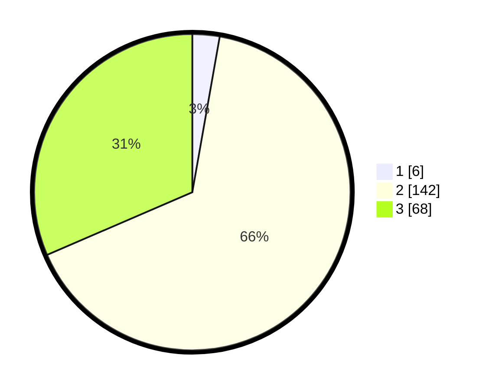

# Hasil

## Grafik

## Tabel

| No. | Nama Paslon    | Suara | Suara (raw) | Persentase |
|:--- |:-------------- | -----:| -----------:| ----------:|
| 1   | ANIES MUHAIMIN | 6     | [6][p-1]    | 2,78       |
| 2   | PRABOWO GIBRAN | 142   | [142][p-2]  | 65,74      |
| 3   | GANJAR MAHFUD  | 68    | [68][p-3]   | 31,48      |

[p-1]: https://github.com/gigit-pemilu/pemilu-2024/blob/main/pilpres/hitung-suara/sub/35-jawa-timur/sub/10-banyuwangi/sub/03-purwoharjo/sub/2003-glagahagung/sub/001-tps/sub/paslon-1.txt
[p-2]: https://github.com/gigit-pemilu/pemilu-2024/blob/main/pilpres/hitung-suara/sub/35-jawa-timur/sub/10-banyuwangi/sub/03-purwoharjo/sub/2003-glagahagung/sub/001-tps/sub/paslon-2.txt
[p-3]: https://github.com/gigit-pemilu/pemilu-2024/blob/main/pilpres/hitung-suara/sub/35-jawa-timur/sub/10-banyuwangi/sub/03-purwoharjo/sub/2003-glagahagung/sub/001-tps/sub/paslon-3.txt

## Foto C Plano

https://sirekap-obj-formc.kpu.go.id/8897/pemilu/ppwp/35/10/03/20/03/3510032003001-20240220-142647--60f10d2f-ce70-433b-9dba-b7afd3bc78a0.jpg

https://sirekap-obj-formc.kpu.go.id/8897/pemilu/ppwp/35/10/03/20/03/3510032003001-20240220-142942--90a3f53b-493c-4b25-a303-2aecb3eeb615.jpg

https://sirekap-obj-formc.kpu.go.id/8897/pemilu/ppwp/35/10/03/20/03/3510032003001-20240217-151746--901f4fc3-3d76-4f28-b88e-e70c570a6552.jpg

## Metadata

| Key        | Value               |
| ---------- | ------------------- |
| Time Stamp | 2024-02-21 17:00:00 |

