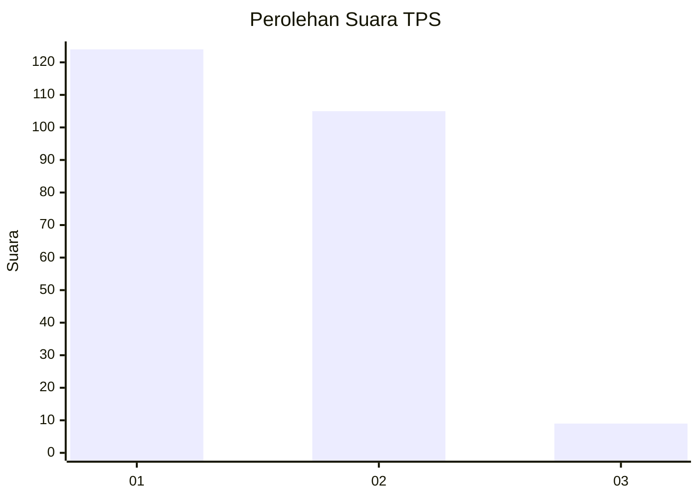
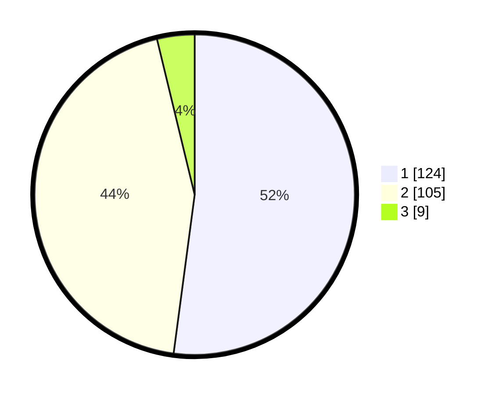

# Hasil

## Grafik

## Tabel

| No. | Nama Paslon    | Suara | Suara (raw) | Persentase |
|:--- |:-------------- | -----:| -----------:| ----------:|
| 1   | ANIES MUHAIMIN | 124   | [124][p-1]  | 52,10      |
| 2   | PRABOWO GIBRAN | 105   | [105][p-2]  | 44,12      |
| 3   | GANJAR MAHFUD  | 9     | [9][p-3]    | 3,78       |

[p-1]: https://github.com/gigit-pemilu/pemilu-2024/blob/main/pilpres/hitung-suara/sub/35-jawa-timur/sub/10-banyuwangi/sub/03-purwoharjo/sub/2003-glagahagung/sub/012-tps/sub/paslon-1.txt
[p-2]: https://github.com/gigit-pemilu/pemilu-2024/blob/main/pilpres/hitung-suara/sub/35-jawa-timur/sub/10-banyuwangi/sub/03-purwoharjo/sub/2003-glagahagung/sub/012-tps/sub/paslon-2.txt
[p-3]: https://github.com/gigit-pemilu/pemilu-2024/blob/main/pilpres/hitung-suara/sub/35-jawa-timur/sub/10-banyuwangi/sub/03-purwoharjo/sub/2003-glagahagung/sub/012-tps/sub/paslon-3.txt

## Foto C Plano

https://sirekap-obj-formc.kpu.go.id/7707/pemilu/ppwp/35/10/03/20/03/3510032003012-20240217-153935--895b7a94-ba6d-49c2-a601-9b549fe60ffa.jpg

https://sirekap-obj-formc.kpu.go.id/7707/pemilu/ppwp/35/10/03/20/03/3510032003012-20240215-023431--76ccc581-e8ec-42e2-a3da-d58a7ca04f1f.jpg

https://sirekap-obj-formc.kpu.go.id/7707/pemilu/ppwp/35/10/03/20/03/3510032003012-20240215-023558--847e2f6d-f924-4db4-9261-41bac99ff6e6.jpg

## Metadata

| Key        | Value               |
| ---------- | ------------------- |
| Time Stamp | 2024-02-24 22:31:28 |

