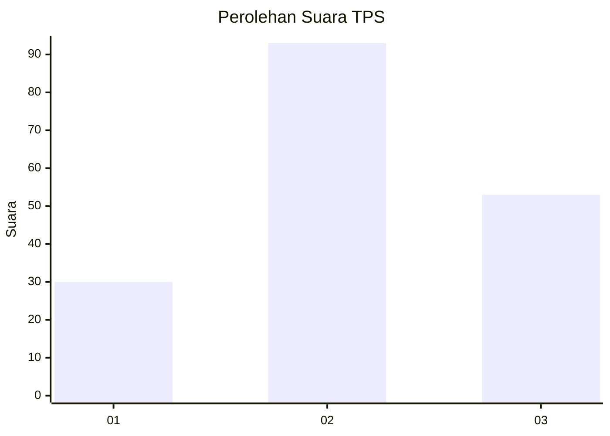
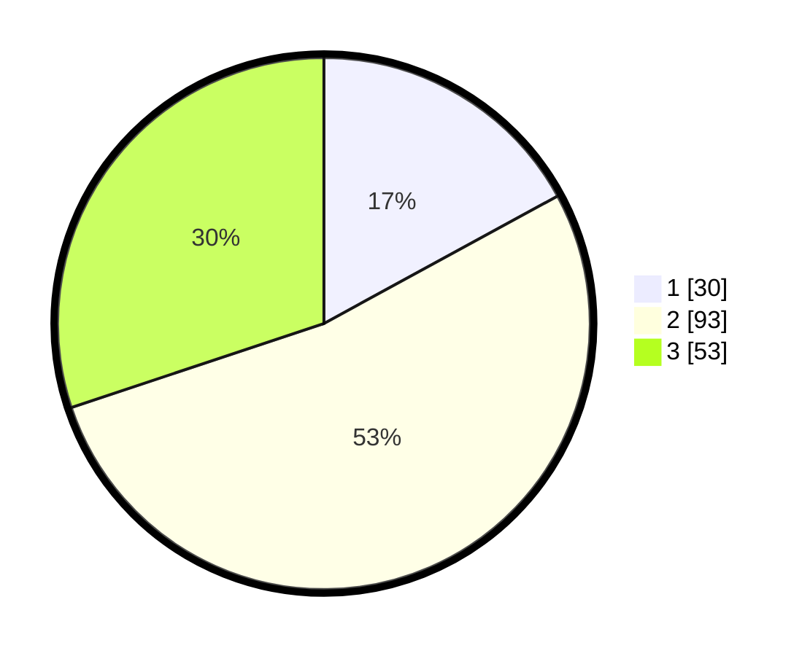

# Hasil

## Grafik

## Tabel

| No. | Nama Paslon    | Suara | Suara (raw) | Persentase |
|:--- |:-------------- | -----:| -----------:| ----------:|
| 1   | ANIES MUHAIMIN | 30    | [30][p-1]   | 17,05      |
| 2   | PRABOWO GIBRAN | 93    | [93][p-2]   | 52,84      |
| 3   | GANJAR MAHFUD  | 53    | [53][p-3]   | 30,11      |

[p-1]: https://github.com/gigit-pemilu/pemilu-2024/blob/main/pilpres/hitung-suara/sub/35-jawa-timur/sub/10-banyuwangi/sub/03-purwoharjo/sub/2007-kradenan/sub/025-tps/sub/paslon-1.txt
[p-2]: https://github.com/gigit-pemilu/pemilu-2024/blob/main/pilpres/hitung-suara/sub/35-jawa-timur/sub/10-banyuwangi/sub/03-purwoharjo/sub/2007-kradenan/sub/025-tps/sub/paslon-2.txt
[p-3]: https://github.com/gigit-pemilu/pemilu-2024/blob/main/pilpres/hitung-suara/sub/35-jawa-timur/sub/10-banyuwangi/sub/03-purwoharjo/sub/2007-kradenan/sub/025-tps/sub/paslon-3.txt

## Foto C Plano

https://sirekap-obj-formc.kpu.go.id/3d4e/pemilu/ppwp/35/10/03/20/07/3510032007025-20240217-102650--e961cd38-7de1-4975-a2f7-3d82477455d9.jpg

https://sirekap-obj-formc.kpu.go.id/3d4e/pemilu/ppwp/35/10/03/20/07/3510032007025-20240214-212233--54e4112f-4f5c-42e6-a537-9a16a68662cd.jpg

https://sirekap-obj-formc.kpu.go.id/3d4e/pemilu/ppwp/35/10/03/20/07/3510032007025-20240214-212506--65af507b-d52a-4005-8a15-e6730f665a9b.jpg

## Metadata

| Key        | Value               |
| ---------- | ------------------- |
| Time Stamp | 2024-02-17 10:30:03 |

