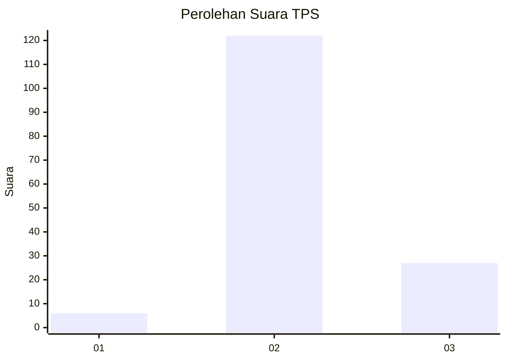

# Hasil

## Grafik

## Tabel

| No. | Nama Paslon    | Suara | Suara (raw) | Persentase |
|:--- |:-------------- | -----:| -----------:| ----------:|
| 1   | ANIES MUHAIMIN | 6     | [6][p-1]    | 3,87       |
| 2   | PRABOWO GIBRAN | 122   | [122][p-2]  | 78,71      |
| 3   | GANJAR MAHFUD  | 27    | [27][p-3]   | 17,42      |

[p-1]: https://github.com/gigit-pemilu/pemilu-2024/blob/main/pilpres/hitung-suara/sub/35-jawa-timur/sub/10-banyuwangi/sub/03-purwoharjo/sub/2008-karetan/sub/008-tps/sub/paslon-1.txt
[p-2]: https://github.com/gigit-pemilu/pemilu-2024/blob/main/pilpres/hitung-suara/sub/35-jawa-timur/sub/10-banyuwangi/sub/03-purwoharjo/sub/2008-karetan/sub/008-tps/sub/paslon-2.txt
[p-3]: https://github.com/gigit-pemilu/pemilu-2024/blob/main/pilpres/hitung-suara/sub/35-jawa-timur/sub/10-banyuwangi/sub/03-purwoharjo/sub/2008-karetan/sub/008-tps/sub/paslon-3.txt

## Foto C Plano

https://sirekap-obj-formc.kpu.go.id/1ca1/pemilu/ppwp/35/10/03/20/08/3510032008008-20240215-012230--60c03a18-69f5-45ab-b3e5-496d142e58f5.jpg

https://sirekap-obj-formc.kpu.go.id/1ca1/pemilu/ppwp/35/10/03/20/08/3510032008008-20240215-012319--ea90e21e-a271-4ce4-b90c-b6b76f16cea9.jpg

https://sirekap-obj-formc.kpu.go.id/1ca1/pemilu/ppwp/35/10/03/20/08/3510032008008-20240215-012413--95ab29dd-3eca-4c63-9974-2c2abcee743a.jpg

## Metadata

| Key        | Value               |
| ---------- | ------------------- |
| Time Stamp | 2024-02-16 16:25:10 |

