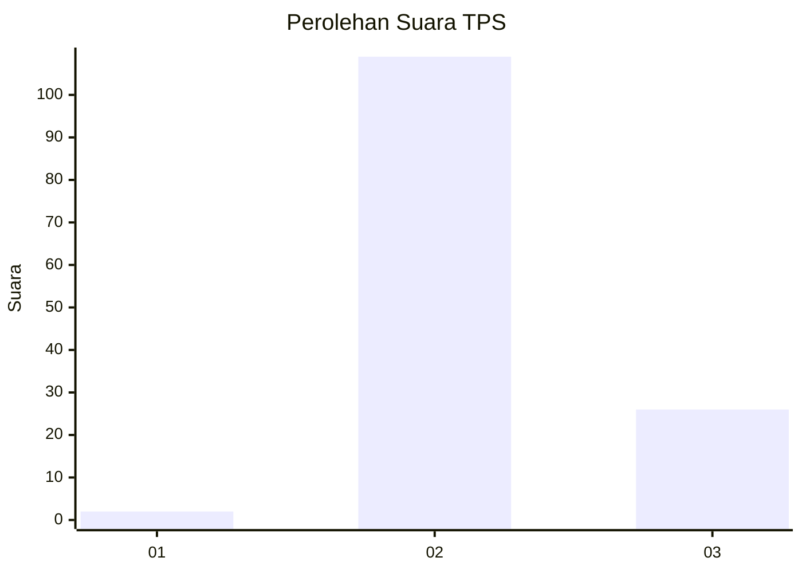
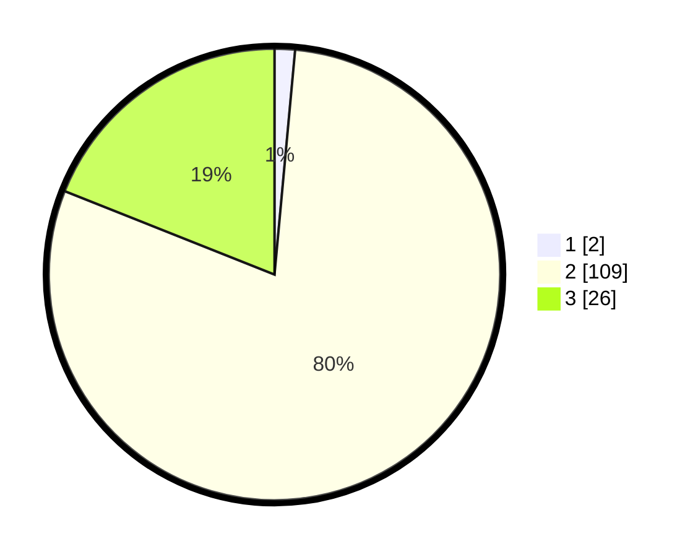

# Hasil

## Grafik

## Tabel

| No. | Nama Paslon    | Suara | Suara (raw) | Persentase |
|:--- |:-------------- | -----:| -----------:| ----------:|
| 1   | ANIES MUHAIMIN | 2     | [2][p-1]    | 1,46       |
| 2   | PRABOWO GIBRAN | 109   | [109][p-2]  | 79,56      |
| 3   | GANJAR MAHFUD  | 26    | [26][p-3]   | 18,98      |

[p-1]: https://github.com/gigit-pemilu/pemilu-2024-35-jawa-timur/blob/main/pilpres/hitung-suara/sub/35-jawa-timur/sub/10-banyuwangi/sub/03-purwoharjo/sub/2008-karetan/sub/009-tps/sub/paslon-1.txt
[p-2]: https://github.com/gigit-pemilu/pemilu-2024-35-jawa-timur/blob/main/pilpres/hitung-suara/sub/35-jawa-timur/sub/10-banyuwangi/sub/03-purwoharjo/sub/2008-karetan/sub/009-tps/sub/paslon-2.txt
[p-3]: https://github.com/gigit-pemilu/pemilu-2024-35-jawa-timur/blob/main/pilpres/hitung-suara/sub/35-jawa-timur/sub/10-banyuwangi/sub/03-purwoharjo/sub/2008-karetan/sub/009-tps/sub/paslon-3.txt

## Foto C Plano

https://sirekap-obj-formc.kpu.go.id/7356/pemilu/ppwp/35/10/03/20/08/3510032008009-20240215-003930--15698b9b-4186-429a-a1e7-09f5148e8198.jpg

https://sirekap-obj-formc.kpu.go.id/7356/pemilu/ppwp/35/10/03/20/08/3510032008009-20240215-004031--57cd9e3a-b92a-452c-ad6f-20905ca5eeb0.jpg

https://sirekap-obj-formc.kpu.go.id/7356/pemilu/ppwp/35/10/03/20/08/3510032008009-20240215-004424--379ddec6-23c0-4405-ba89-f72832136399.jpg

## Metadata

| Key        | Value               |
| ---------- | ------------------- |
| Time Stamp | 2024-02-16 16:25:10 |

