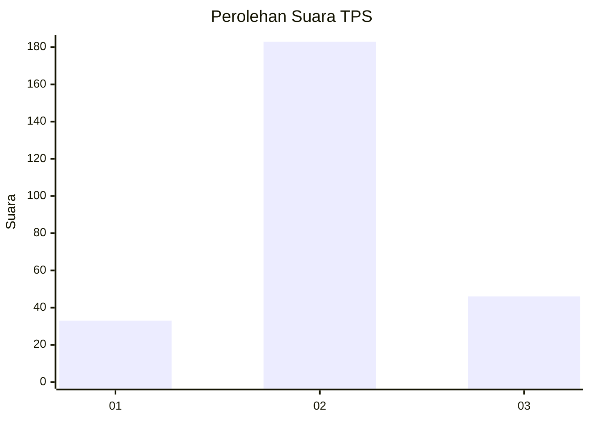
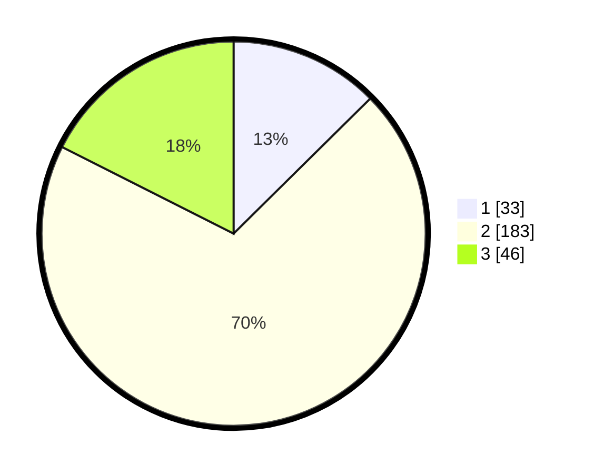

# Hasil

## Grafik

## Tabel

| No. | Nama Paslon    | Suara | Suara (raw) | Persentase |
|:--- |:-------------- | -----:| -----------:| ----------:|
| 1   | ANIES MUHAIMIN | 33    | [33][p-1]   | 12,60      |
| 2   | PRABOWO GIBRAN | 183   | [183][p-2]  | 69,85      |
| 3   | GANJAR MAHFUD  | 46    | [46][p-3]   | 17,56      |

[p-1]: https://github.com/gigit-pemilu/pemilu-2024/blob/main/pilpres/hitung-suara/sub/35-jawa-timur/sub/10-banyuwangi/sub/04-tegaldlimo/sub/2001-purwoasri/sub/003-tps/sub/paslon-1.txt
[p-2]: https://github.com/gigit-pemilu/pemilu-2024/blob/main/pilpres/hitung-suara/sub/35-jawa-timur/sub/10-banyuwangi/sub/04-tegaldlimo/sub/2001-purwoasri/sub/003-tps/sub/paslon-2.txt
[p-3]: https://github.com/gigit-pemilu/pemilu-2024/blob/main/pilpres/hitung-suara/sub/35-jawa-timur/sub/10-banyuwangi/sub/04-tegaldlimo/sub/2001-purwoasri/sub/003-tps/sub/paslon-3.txt

## Foto C Plano

https://sirekap-obj-formc.kpu.go.id/04ff/pemilu/ppwp/35/10/04/20/01/3510042001003-20240216-162254--2fe53a97-ccdd-4b22-9ea5-1a00b70dddff.jpg

https://sirekap-obj-formc.kpu.go.id/04ff/pemilu/ppwp/35/10/04/20/01/3510042001003-20240216-164437--7a17c0e4-42f2-4015-8087-73b2b14c9f6f.jpg

https://sirekap-obj-formc.kpu.go.id/04ff/pemilu/ppwp/35/10/04/20/01/3510042001003-20240216-164034--70023b44-3600-4eaf-a135-8ff2976cd9e6.jpg

## Metadata

| Key        | Value               |
| ---------- | ------------------- |
| Time Stamp | 2024-02-16 17:00:00 |

## DATA PEMILIH TETAP

Jumlah pemilih dalam DPT: **295**.
 * L: **158**.
 * P: **137**.

## DATA PENGGUNA HAK PILIH

Jumlah pengguna hak pilih dalam DPT: **261**.
 * L: **139**.
 * P: **122**.

Jumlah pengguna hak pilih dalam DPTb: **1**.
 * L: **1**.
 * P: **0**.

Jumlah pengguna hak pilih dalam DPK: **0**.
 * L: **0**.
 * P: **0**.

Jumlah pengguna hak pilih: **262**.
 * L: **140**.
 * P: **122**.

## JUMLAH SUARA SAH DAN TIDAK SAH

JUMLAH SELURUH SUARA SAH: **262**.

JUMLAH SUARA TIDAK SAH: **0**.

JUMLAH SELURUH SUARA SAH DAN SUARA TIDAK SAH: **262**.

