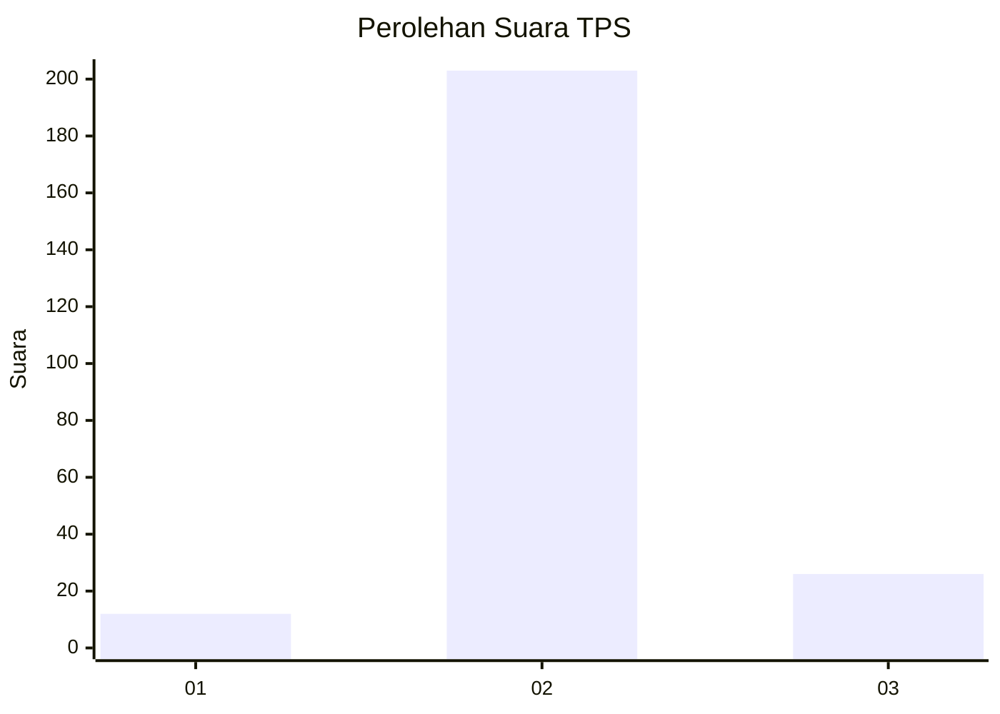
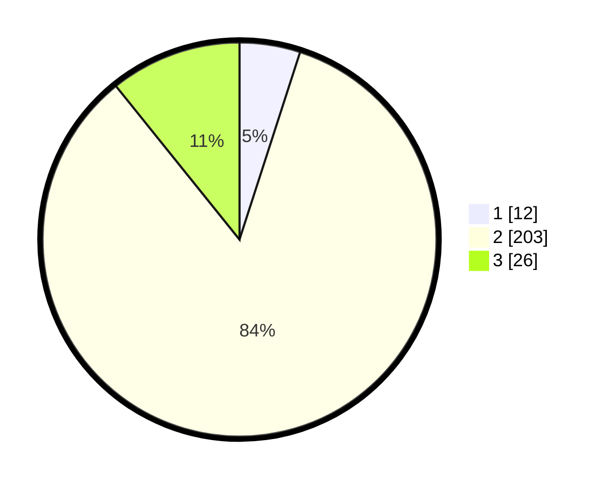

# Hasil

## Grafik

## Tabel

| No. | Nama Paslon    | Suara | Suara (raw) | Persentase |
|:--- |:-------------- | -----:| -----------:| ----------:|
| 1   | ANIES MUHAIMIN | 12    | [12][p-1]   | 4,98       |
| 2   | PRABOWO GIBRAN | 203   | [203][p-2]  | 84,23      |
| 3   | GANJAR MAHFUD  | 26    | [26][p-3]   | 10,79      |

[p-1]: https://github.com/gigit-pemilu/pemilu-2024-35-jawa-timur/blob/main/pilpres/hitung-suara/sub/35-jawa-timur/sub/10-banyuwangi/sub/04-tegaldlimo/sub/2001-purwoasri/sub/007-tps/sub/paslon-1.txt
[p-2]: https://github.com/gigit-pemilu/pemilu-2024-35-jawa-timur/blob/main/pilpres/hitung-suara/sub/35-jawa-timur/sub/10-banyuwangi/sub/04-tegaldlimo/sub/2001-purwoasri/sub/007-tps/sub/paslon-2.txt
[p-3]: https://github.com/gigit-pemilu/pemilu-2024-35-jawa-timur/blob/main/pilpres/hitung-suara/sub/35-jawa-timur/sub/10-banyuwangi/sub/04-tegaldlimo/sub/2001-purwoasri/sub/007-tps/sub/paslon-3.txt

## Foto C Plano

https://sirekap-obj-formc.kpu.go.id/e27f/pemilu/ppwp/35/10/04/20/01/3510042001007-20240214-233342--dd52f5a6-a22b-4db0-8b08-df81448154d0.jpg

https://sirekap-obj-formc.kpu.go.id/e27f/pemilu/ppwp/35/10/04/20/01/3510042001007-20240217-073405--1e52f8df-c8ff-4b5c-b564-d987cd9d0877.jpg

https://sirekap-obj-formc.kpu.go.id/e27f/pemilu/ppwp/35/10/04/20/01/3510042001007-20240214-233521--0573495c-c5d5-476e-a12b-225dc2be4584.jpg

## Metadata

| Key        | Value               |
| ---------- | ------------------- |
| Time Stamp | 2024-02-21 18:00:00 |

