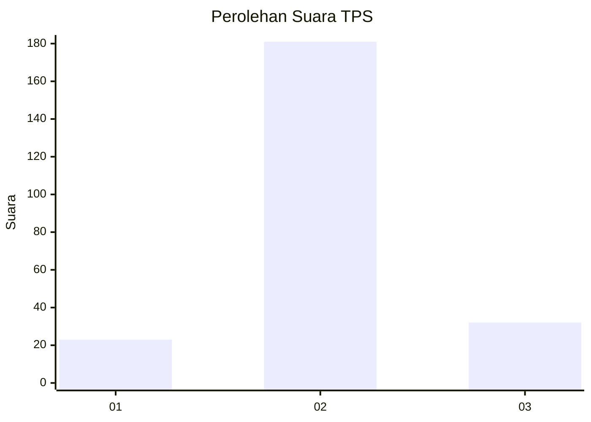
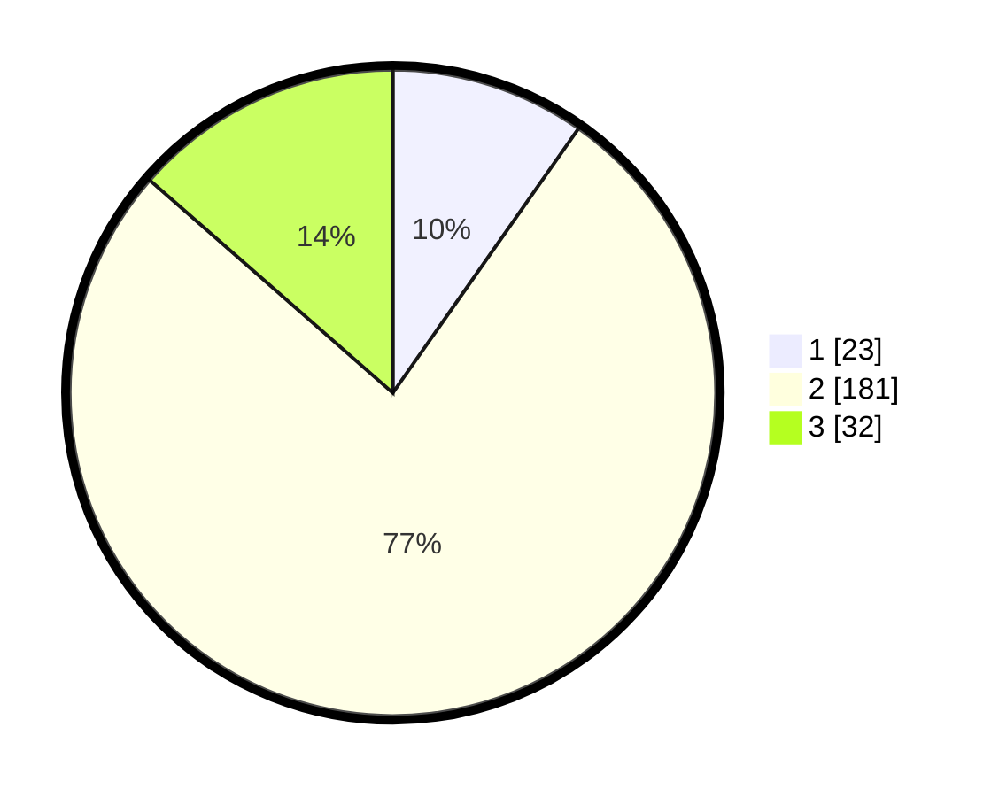

# Hasil

## Grafik

## Tabel

| No. | Nama Paslon    | Suara | Suara (raw) | Persentase |
|:--- |:-------------- | -----:| -----------:| ----------:|
| 1   | ANIES MUHAIMIN | 23    | [23][p-1]   | 9,75       |
| 2   | PRABOWO GIBRAN | 181   | [181][p-2]  | 76,69      |
| 3   | GANJAR MAHFUD  | 32    | [32][p-3]   | 13,56      |

[p-1]: https://github.com/gigit-pemilu/pemilu-2024-35-jawa-timur/blob/main/pilpres/hitung-suara/sub/35-jawa-timur/sub/10-banyuwangi/sub/04-tegaldlimo/sub/2003-kedungasri/sub/001-tps/sub/paslon-1.txt
[p-2]: https://github.com/gigit-pemilu/pemilu-2024-35-jawa-timur/blob/main/pilpres/hitung-suara/sub/35-jawa-timur/sub/10-banyuwangi/sub/04-tegaldlimo/sub/2003-kedungasri/sub/001-tps/sub/paslon-2.txt
[p-3]: https://github.com/gigit-pemilu/pemilu-2024-35-jawa-timur/blob/main/pilpres/hitung-suara/sub/35-jawa-timur/sub/10-banyuwangi/sub/04-tegaldlimo/sub/2003-kedungasri/sub/001-tps/sub/paslon-3.txt

## Foto C Plano

https://sirekap-obj-formc.kpu.go.id/29f4/pemilu/ppwp/35/10/04/20/03/3510042003001-20240216-181130--2ba65e2a-f3db-4197-8354-03b07d02ae01.jpg

https://sirekap-obj-formc.kpu.go.id/29f4/pemilu/ppwp/35/10/04/20/03/3510042003001-20240216-182501--46003296-1ca3-4dde-89b5-73040ea14ab0.jpg

https://sirekap-obj-formc.kpu.go.id/29f4/pemilu/ppwp/35/10/04/20/03/3510042003001-20240216-182537--e1377f3f-cbf0-4fb4-a179-bd90a64df0e1.jpg

## Metadata

| Key        | Value               |
| ---------- | ------------------- |
| Time Stamp | 2024-02-21 18:00:00 |

