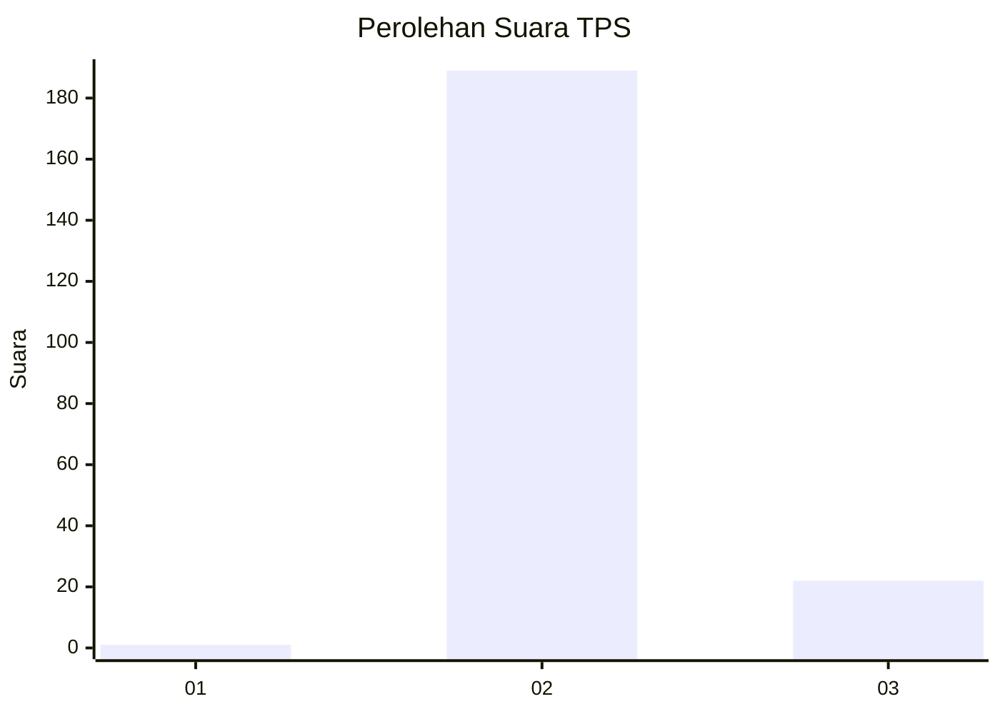
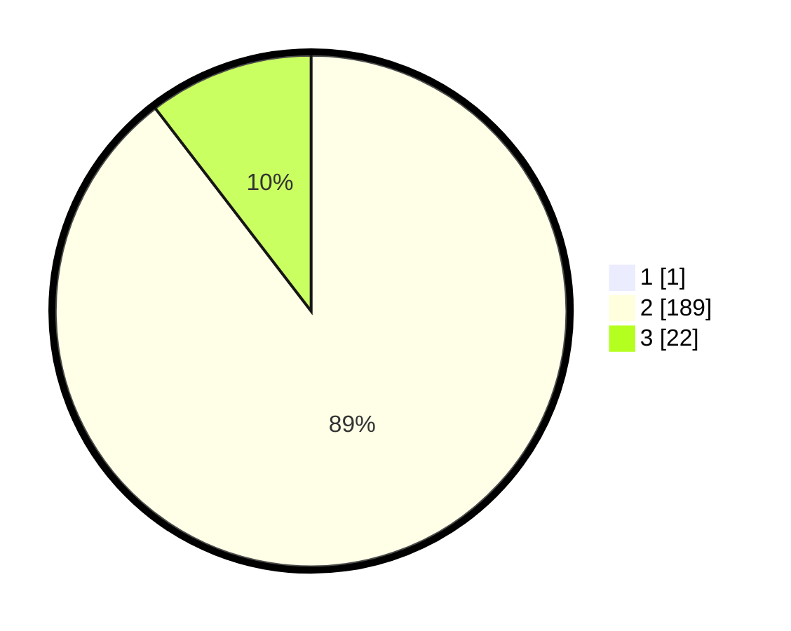

# Hasil

## Grafik

## Tabel

| No. | Nama Paslon    | Suara | Suara (raw) | Persentase |
|:--- |:-------------- | -----:| -----------:| ----------:|
| 1   | ANIES MUHAIMIN | 1     | [1][p-1]    | 0,47       |
| 2   | PRABOWO GIBRAN | 189   | [189][p-2]  | 89,15      |
| 3   | GANJAR MAHFUD  | 22    | [22][p-3]   | 10,38      |

[p-1]: https://github.com/gigit-pemilu/pemilu-2024/blob/main/pilpres/hitung-suara/sub/35-jawa-timur/sub/10-banyuwangi/sub/04-tegaldlimo/sub/2003-kedungasri/sub/015-tps/sub/paslon-1.txt
[p-2]: https://github.com/gigit-pemilu/pemilu-2024/blob/main/pilpres/hitung-suara/sub/35-jawa-timur/sub/10-banyuwangi/sub/04-tegaldlimo/sub/2003-kedungasri/sub/015-tps/sub/paslon-2.txt
[p-3]: https://github.com/gigit-pemilu/pemilu-2024/blob/main/pilpres/hitung-suara/sub/35-jawa-timur/sub/10-banyuwangi/sub/04-tegaldlimo/sub/2003-kedungasri/sub/015-tps/sub/paslon-3.txt

## Foto C Plano

https://sirekap-obj-formc.kpu.go.id/5677/pemilu/ppwp/35/10/04/20/03/3510042003015-20240217-211523--2932a4b7-ce8b-4d7c-89d4-d0a4f417879b.jpg

https://sirekap-obj-formc.kpu.go.id/5677/pemilu/ppwp/35/10/04/20/03/3510042003015-20240217-211926--144b5e3c-d1bb-47dc-9dce-57524fcb8429.jpg

https://sirekap-obj-formc.kpu.go.id/5677/pemilu/ppwp/35/10/04/20/03/3510042003015-20240217-212015--25a0f9b3-0a28-42f8-8b96-b5dc211d0902.jpg

## Metadata

| Key        | Value               |
| ---------- | ------------------- |
| Time Stamp | 2024-02-21 18:00:00 |

