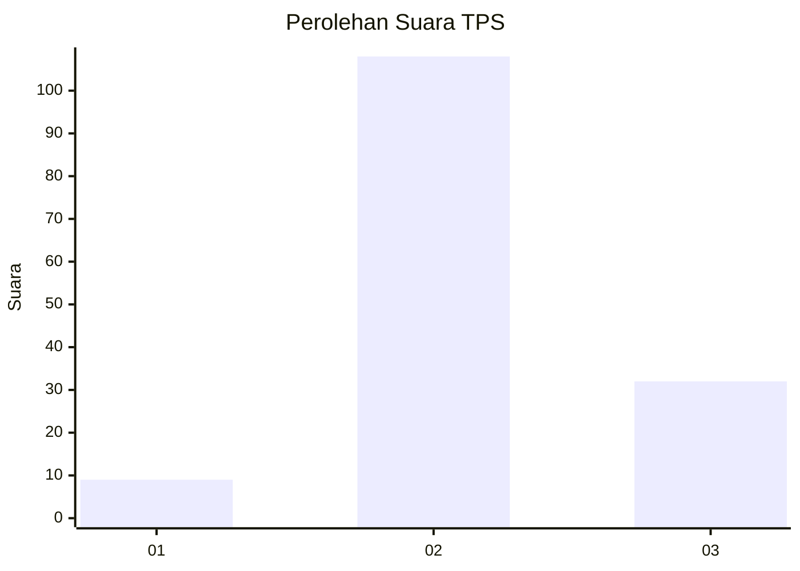

# Hasil

## Grafik

## Tabel

| No. | Nama Paslon    | Suara | Suara (raw) | Persentase |
|:--- |:-------------- | -----:| -----------:| ----------:|
| 1   | ANIES MUHAIMIN | 9     | [9][p-1]    | 6,04       |
| 2   | PRABOWO GIBRAN | 108   | [108][p-2]  | 72,48      |
| 3   | GANJAR MAHFUD  | 32    | [32][p-3]   | 21,48      |

[p-1]: https://github.com/gigit-pemilu/pemilu-2024/blob/main/pilpres/hitung-suara/sub/35-jawa-timur/sub/10-banyuwangi/sub/04-tegaldlimo/sub/2004-kedungwungu/sub/019-tps/sub/paslon-1.txt
[p-2]: https://github.com/gigit-pemilu/pemilu-2024/blob/main/pilpres/hitung-suara/sub/35-jawa-timur/sub/10-banyuwangi/sub/04-tegaldlimo/sub/2004-kedungwungu/sub/019-tps/sub/paslon-2.txt
[p-3]: https://github.com/gigit-pemilu/pemilu-2024/blob/main/pilpres/hitung-suara/sub/35-jawa-timur/sub/10-banyuwangi/sub/04-tegaldlimo/sub/2004-kedungwungu/sub/019-tps/sub/paslon-3.txt

## Foto C Plano

https://sirekap-obj-formc.kpu.go.id/0b61/pemilu/ppwp/35/10/04/20/04/3510042004019-20240215-013719--3abb0aa9-e5bc-4fd8-bfd8-c1ebf8811ab9.jpg

https://sirekap-obj-formc.kpu.go.id/0b61/pemilu/ppwp/35/10/04/20/04/3510042004019-20240215-013829--4a26ec7d-0d36-4e06-824b-e0042229733a.jpg

https://sirekap-obj-formc.kpu.go.id/0b61/pemilu/ppwp/35/10/04/20/04/3510042004019-20240215-013902--c423f430-5907-42d6-b012-d66973925fe2.jpg

## Metadata

| Key        | Value               |
| ---------- | ------------------- |
| Time Stamp | 2024-02-19 06:16:00 |

