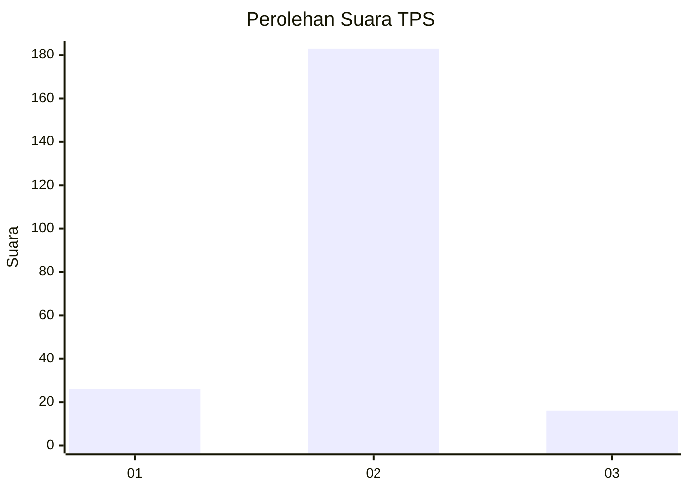
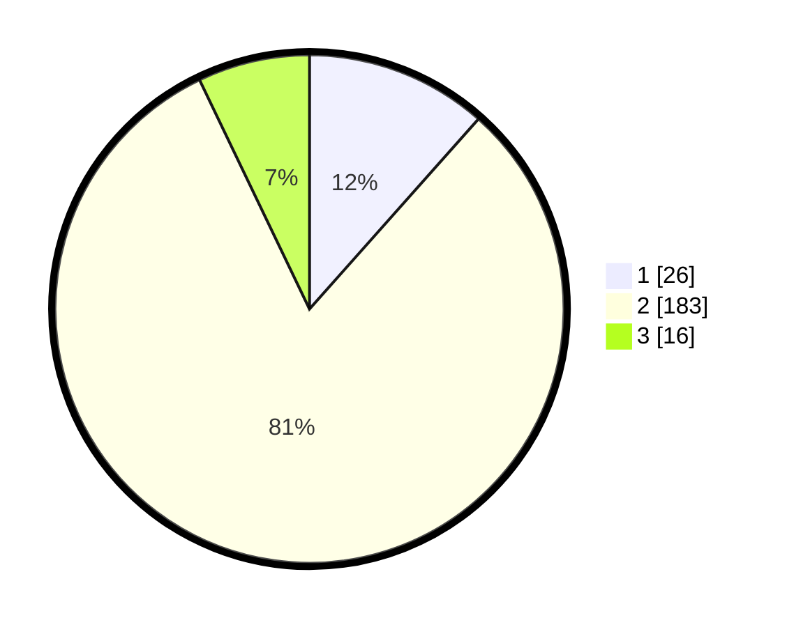

# Hasil

## Grafik

## Tabel

| No. | Nama Paslon    | Suara | Suara (raw) | Persentase |
|:--- |:-------------- | -----:| -----------:| ----------:|
| 1   | ANIES MUHAIMIN | 26    | [26][p-1]   | 11,56      |
| 2   | PRABOWO GIBRAN | 183   | [183][p-2]  | 81,33      |
| 3   | GANJAR MAHFUD  | 16    | [16][p-3]   | 7,11       |

[p-1]: https://github.com/gigit-pemilu/pemilu-2024/blob/main/pilpres/hitung-suara/sub/35-jawa-timur/sub/10-banyuwangi/sub/04-tegaldlimo/sub/2004-kedungwungu/sub/023-tps/sub/paslon-1.txt
[p-2]: https://github.com/gigit-pemilu/pemilu-2024/blob/main/pilpres/hitung-suara/sub/35-jawa-timur/sub/10-banyuwangi/sub/04-tegaldlimo/sub/2004-kedungwungu/sub/023-tps/sub/paslon-2.txt
[p-3]: https://github.com/gigit-pemilu/pemilu-2024/blob/main/pilpres/hitung-suara/sub/35-jawa-timur/sub/10-banyuwangi/sub/04-tegaldlimo/sub/2004-kedungwungu/sub/023-tps/sub/paslon-3.txt

## Foto C Plano

https://sirekap-obj-formc.kpu.go.id/c68f/pemilu/ppwp/35/10/04/20/04/3510042004023-20240217-122945--7aef9811-6a41-43a7-9516-1f45ddb35ad5.jpg

https://sirekap-obj-formc.kpu.go.id/c68f/pemilu/ppwp/35/10/04/20/04/3510042004023-20240217-090906--6343e063-df94-48cb-89f0-fcec8dbbcbf3.jpg

https://sirekap-obj-formc.kpu.go.id/c68f/pemilu/ppwp/35/10/04/20/04/3510042004023-20240217-091019--c1a77aea-e836-4dab-bd85-9d739aff0593.jpg

## Metadata

| Key        | Value               |
| ---------- | ------------------- |
| Time Stamp | 2024-02-21 18:00:00 |

