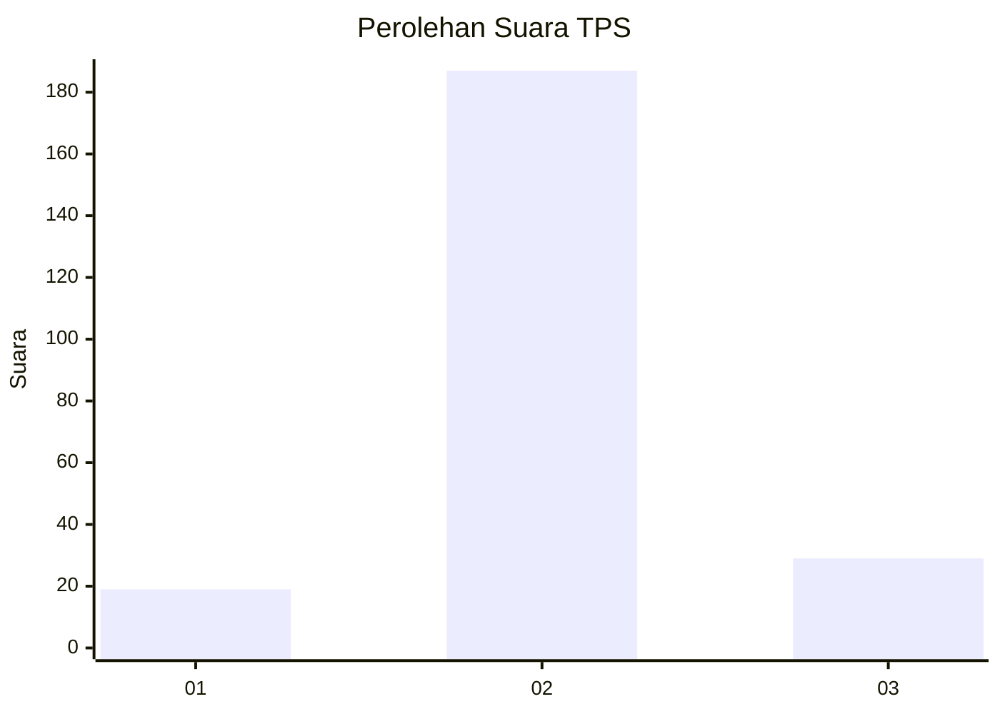
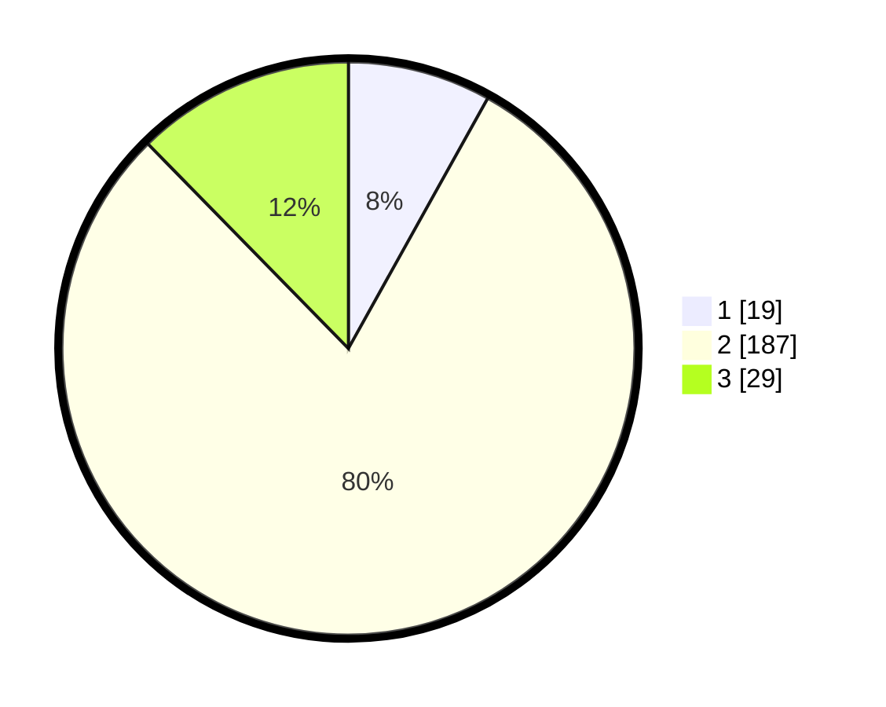

# Hasil

## Grafik

## Tabel

| No. | Nama Paslon    | Suara | Suara (raw) | Persentase |
|:--- |:-------------- | -----:| -----------:| ----------:|
| 1   | ANIES MUHAIMIN | 19    | [19][p-1]   | 8,09       |
| 2   | PRABOWO GIBRAN | 187   | [187][p-2]  | 79,57      |
| 3   | GANJAR MAHFUD  | 29    | [29][p-3]   | 12,34      |

[p-1]: https://github.com/gigit-pemilu/pemilu-2024/blob/main/pilpres/hitung-suara/sub/35-jawa-timur/sub/10-banyuwangi/sub/04-tegaldlimo/sub/2004-kedungwungu/sub/024-tps/sub/paslon-1.txt
[p-2]: https://github.com/gigit-pemilu/pemilu-2024/blob/main/pilpres/hitung-suara/sub/35-jawa-timur/sub/10-banyuwangi/sub/04-tegaldlimo/sub/2004-kedungwungu/sub/024-tps/sub/paslon-2.txt
[p-3]: https://github.com/gigit-pemilu/pemilu-2024/blob/main/pilpres/hitung-suara/sub/35-jawa-timur/sub/10-banyuwangi/sub/04-tegaldlimo/sub/2004-kedungwungu/sub/024-tps/sub/paslon-3.txt

## Foto C Plano

https://sirekap-obj-formc.kpu.go.id/001b/pemilu/ppwp/35/10/04/20/04/3510042004024-20240218-193547--ac6b7e5f-47ed-462b-ad08-d25a908c5e20.jpg

https://sirekap-obj-formc.kpu.go.id/001b/pemilu/ppwp/35/10/04/20/04/3510042004024-20240218-193822--df804998-779e-4e2c-8ee2-5e19a664180f.jpg

https://sirekap-obj-formc.kpu.go.id/001b/pemilu/ppwp/35/10/04/20/04/3510042004024-20240218-194008--c7903c04-8530-4e89-ac78-364c0694f00a.jpg

## Metadata

| Key        | Value               |
| ---------- | ------------------- |
| Time Stamp | 2024-02-21 18:00:00 |

