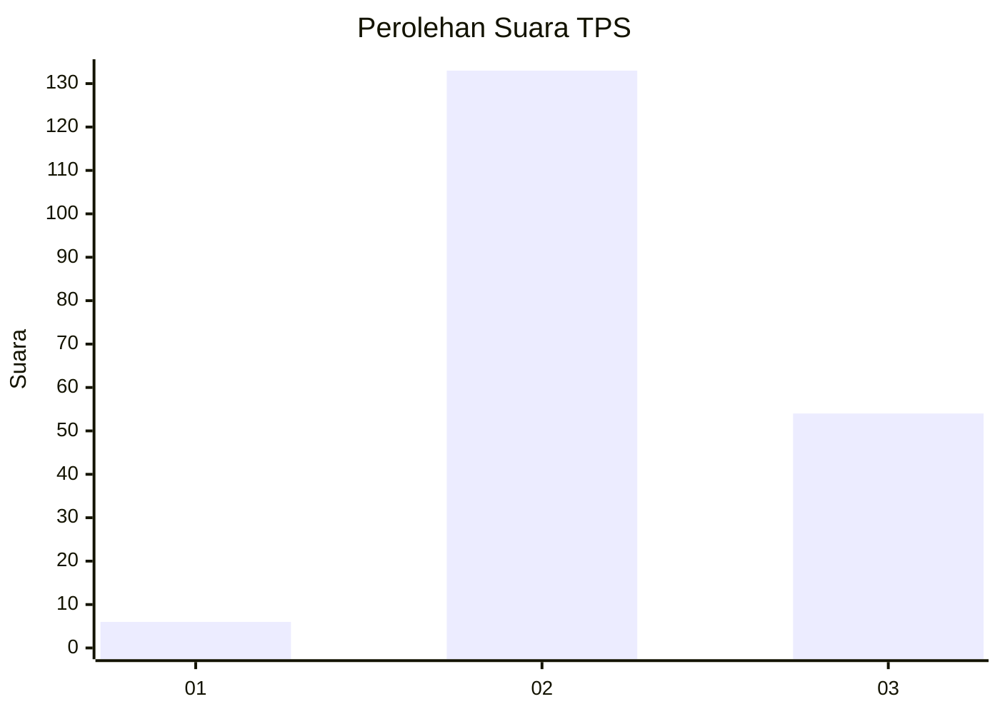
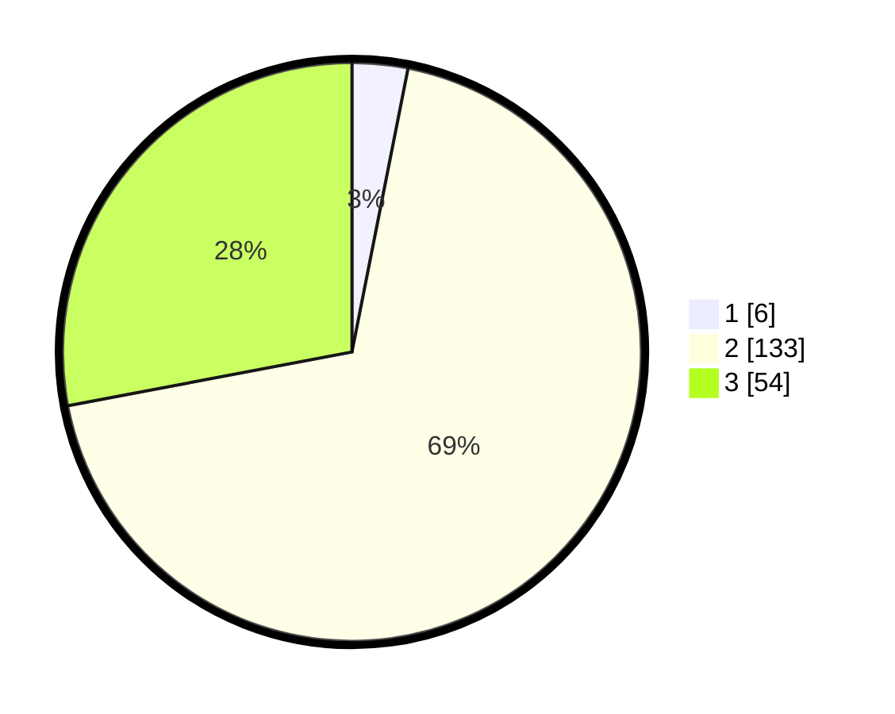

# Hasil

## Grafik

## Tabel

| No. | Nama Paslon    | Suara | Suara (raw) | Persentase |
|:--- |:-------------- | -----:| -----------:| ----------:|
| 1   | ANIES MUHAIMIN | 6     | [6][p-1]    | 3,11       |
| 2   | PRABOWO GIBRAN | 133   | [133][p-2]  | 68,91      |
| 3   | GANJAR MAHFUD  | 54    | [54][p-3]   | 27,98      |

[p-1]: https://github.com/gigit-pemilu/pemilu-2024/blob/main/pilpres/hitung-suara/sub/35-jawa-timur/sub/10-banyuwangi/sub/04-tegaldlimo/sub/2006-wringinpitu/sub/001-tps/sub/paslon-1.txt
[p-2]: https://github.com/gigit-pemilu/pemilu-2024/blob/main/pilpres/hitung-suara/sub/35-jawa-timur/sub/10-banyuwangi/sub/04-tegaldlimo/sub/2006-wringinpitu/sub/001-tps/sub/paslon-2.txt
[p-3]: https://github.com/gigit-pemilu/pemilu-2024/blob/main/pilpres/hitung-suara/sub/35-jawa-timur/sub/10-banyuwangi/sub/04-tegaldlimo/sub/2006-wringinpitu/sub/001-tps/sub/paslon-3.txt

## Foto C Plano

https://sirekap-obj-formc.kpu.go.id/fe0b/pemilu/ppwp/35/10/04/20/06/3510042006001-20240215-000936--7d61adaa-9cf2-4eb0-8f28-e0bf13d85af9.jpg

https://sirekap-obj-formc.kpu.go.id/fe0b/pemilu/ppwp/35/10/04/20/06/3510042006001-20240215-001511--2346473e-22d0-4d68-ba51-13f1be151da4.jpg

https://sirekap-obj-formc.kpu.go.id/fe0b/pemilu/ppwp/35/10/04/20/06/3510042006001-20240215-001844--c56f8dce-ae9a-483f-8858-215a384c4396.jpg

## Metadata

| Key        | Value               |
| ---------- | ------------------- |
| Time Stamp | 2024-02-15 17:00:25 |

