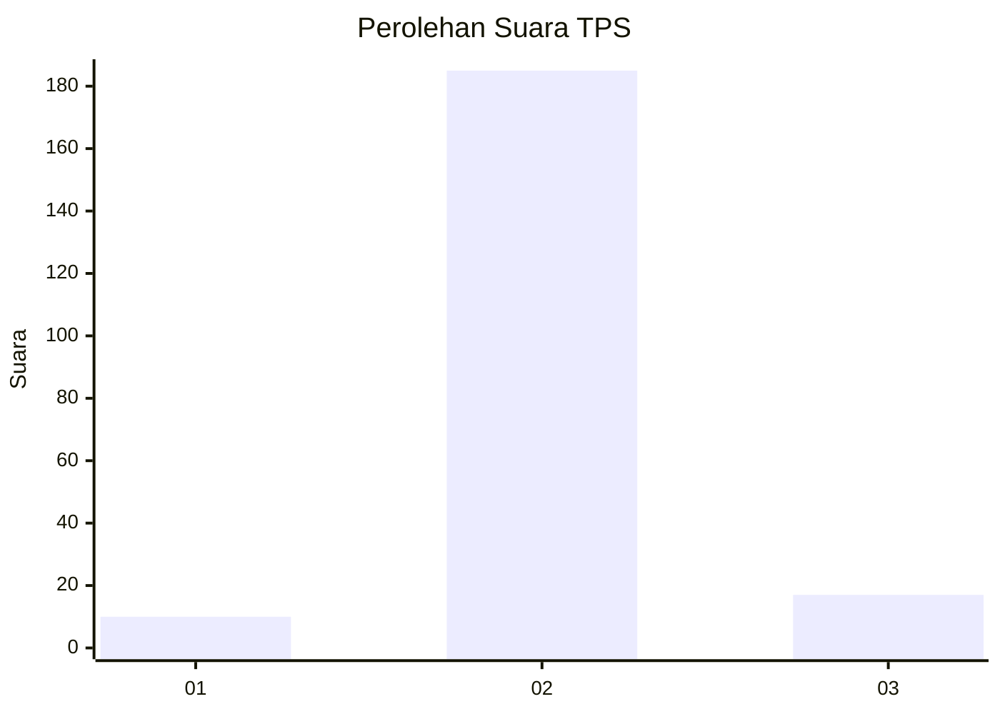
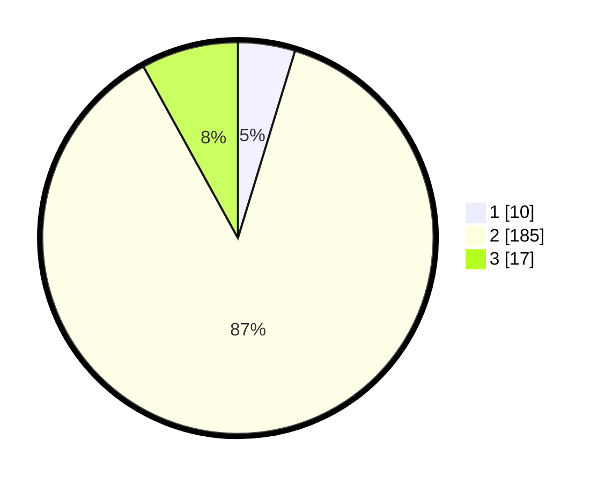

# Hasil

## Grafik

## Tabel

| No. | Nama Paslon    | Suara | Suara (raw) | Persentase |
|:--- |:-------------- | -----:| -----------:| ----------:|
| 1   | ANIES MUHAIMIN | 10    | [10][p-1]   | 4,72       |
| 2   | PRABOWO GIBRAN | 185   | [185][p-2]  | 87,26      |
| 3   | GANJAR MAHFUD  | 17    | [17][p-3]   | 8,02       |

[p-1]: https://github.com/gigit-pemilu/pemilu-2024-35-jawa-timur/blob/main/pilpres/hitung-suara/sub/35-jawa-timur/sub/10-banyuwangi/sub/04-tegaldlimo/sub/2009-kalipait/sub/006-tps/sub/paslon-1.txt
[p-2]: https://github.com/gigit-pemilu/pemilu-2024-35-jawa-timur/blob/main/pilpres/hitung-suara/sub/35-jawa-timur/sub/10-banyuwangi/sub/04-tegaldlimo/sub/2009-kalipait/sub/006-tps/sub/paslon-2.txt
[p-3]: https://github.com/gigit-pemilu/pemilu-2024-35-jawa-timur/blob/main/pilpres/hitung-suara/sub/35-jawa-timur/sub/10-banyuwangi/sub/04-tegaldlimo/sub/2009-kalipait/sub/006-tps/sub/paslon-3.txt

## Foto C Plano

https://sirekap-obj-formc.kpu.go.id/ed56/pemilu/ppwp/35/10/04/20/09/3510042009006-20240217-170100--c9b21b66-bf57-443b-bfd7-e4d8afe82900.jpg

https://sirekap-obj-formc.kpu.go.id/ed56/pemilu/ppwp/35/10/04/20/09/3510042009006-20240217-164841--d9754adf-745a-401a-bd7f-73cd928c73cf.jpg

https://sirekap-obj-formc.kpu.go.id/ed56/pemilu/ppwp/35/10/04/20/09/3510042009006-20240217-165352--52ce4531-110e-4048-a60c-3529de607f0f.jpg

## Metadata

| Key        | Value               |
| ---------- | ------------------- |
| Time Stamp | 2024-02-22 10:00:00 |

