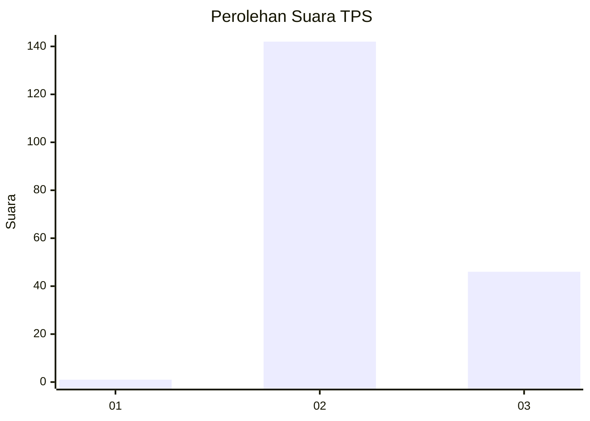
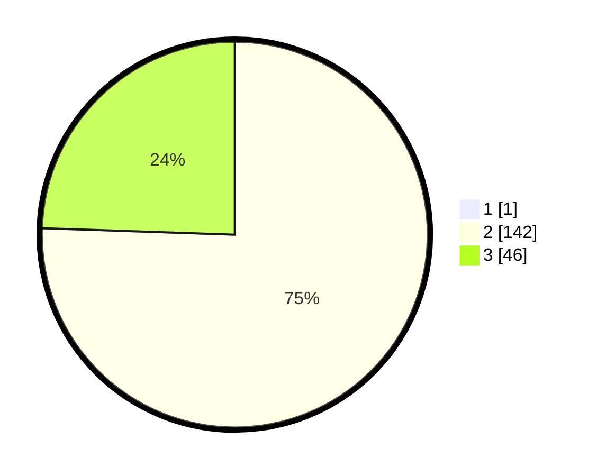

# Hasil

## Grafik

## Tabel

| No. | Nama Paslon    | Suara | Suara (raw) | Persentase |
|:--- |:-------------- | -----:| -----------:| ----------:|
| 1   | ANIES MUHAIMIN | 1     | [1][p-1]    | 0,53       |
| 2   | PRABOWO GIBRAN | 142   | [142][p-2]  | 75,13      |
| 3   | GANJAR MAHFUD  | 46    | [46][p-3]   | 24,34      |

[p-1]: https://github.com/gigit-pemilu/pemilu-2024-35-jawa-timur/blob/main/pilpres/hitung-suara/sub/35-jawa-timur/sub/10-banyuwangi/sub/05-muncar/sub/2001-sumberberas/sub/001-tps/sub/paslon-1.txt
[p-2]: https://github.com/gigit-pemilu/pemilu-2024-35-jawa-timur/blob/main/pilpres/hitung-suara/sub/35-jawa-timur/sub/10-banyuwangi/sub/05-muncar/sub/2001-sumberberas/sub/001-tps/sub/paslon-2.txt
[p-3]: https://github.com/gigit-pemilu/pemilu-2024-35-jawa-timur/blob/main/pilpres/hitung-suara/sub/35-jawa-timur/sub/10-banyuwangi/sub/05-muncar/sub/2001-sumberberas/sub/001-tps/sub/paslon-3.txt

## Foto C Plano

https://sirekap-obj-formc.kpu.go.id/672b/pemilu/ppwp/35/10/05/20/01/3510052001001-20240217-141721--bddb120f-a822-49da-9873-b32f787b7f4a.jpg

https://sirekap-obj-formc.kpu.go.id/672b/pemilu/ppwp/35/10/05/20/01/3510052001001-20240217-141749--cd668d32-16e8-488f-b888-60ddd1ccf137.jpg

https://sirekap-obj-formc.kpu.go.id/672b/pemilu/ppwp/35/10/05/20/01/3510052001001-20240217-141804--45ee447d-26c6-435b-a44c-4eef8d51298d.jpg

## Metadata

| Key        | Value               |
| ---------- | ------------------- |
| Time Stamp | 2024-02-21 18:00:00 |

