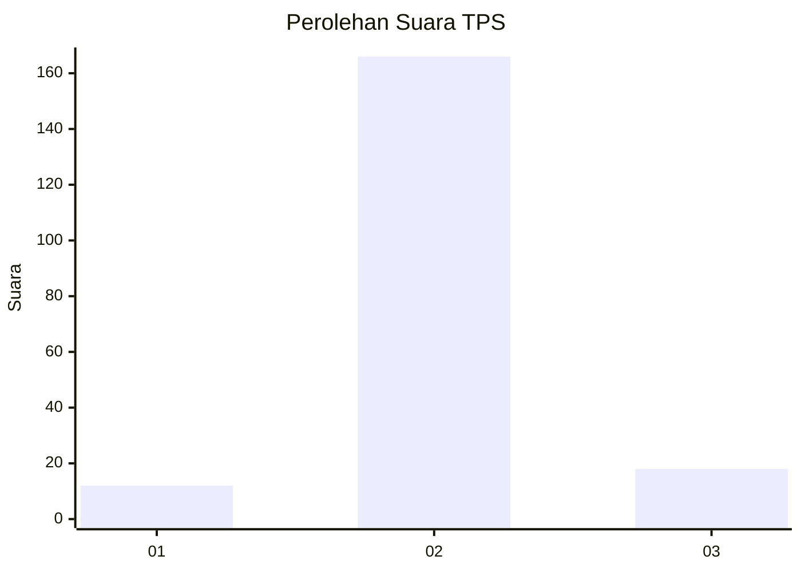
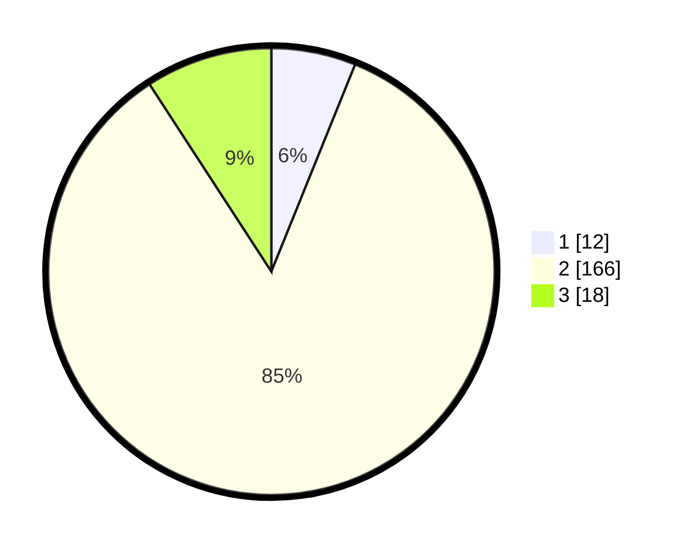

# Hasil

## Grafik

## Tabel

| No. | Nama Paslon    | Suara | Suara (raw) | Persentase |
|:--- |:-------------- | -----:| -----------:| ----------:|
| 1   | ANIES MUHAIMIN | 12    | [12][p-1]   | 6,12       |
| 2   | PRABOWO GIBRAN | 166   | [166][p-2]  | 84,69      |
| 3   | GANJAR MAHFUD  | 18    | [18][p-3]   | 9,18       |

[p-1]: https://github.com/gigit-pemilu/pemilu-2024/blob/main/pilpres/hitung-suara/sub/35-jawa-timur/sub/10-banyuwangi/sub/05-muncar/sub/2002-kedungrejo/sub/003-tps/sub/paslon-1.txt
[p-2]: https://github.com/gigit-pemilu/pemilu-2024/blob/main/pilpres/hitung-suara/sub/35-jawa-timur/sub/10-banyuwangi/sub/05-muncar/sub/2002-kedungrejo/sub/003-tps/sub/paslon-2.txt
[p-3]: https://github.com/gigit-pemilu/pemilu-2024/blob/main/pilpres/hitung-suara/sub/35-jawa-timur/sub/10-banyuwangi/sub/05-muncar/sub/2002-kedungrejo/sub/003-tps/sub/paslon-3.txt

## Foto C Plano

https://sirekap-obj-formc.kpu.go.id/2dd8/pemilu/ppwp/35/10/05/20/02/3510052002003-20240220-142045--c2599d5d-0cf0-48b6-acb9-9197d39bdfaa.jpg

https://sirekap-obj-formc.kpu.go.id/2dd8/pemilu/ppwp/35/10/05/20/02/3510052002003-20240220-142153--d1b1ba99-9f89-4a6b-8083-1b5a126c5629.jpg

https://sirekap-obj-formc.kpu.go.id/2dd8/pemilu/ppwp/35/10/05/20/02/3510052002003-20240220-142344--57dfb4cc-3d2e-467a-93da-4bb98e38be39.jpg

## Metadata

| Key        | Value               |
| ---------- | ------------------- |
| Time Stamp | 2024-02-24 22:31:28 |

