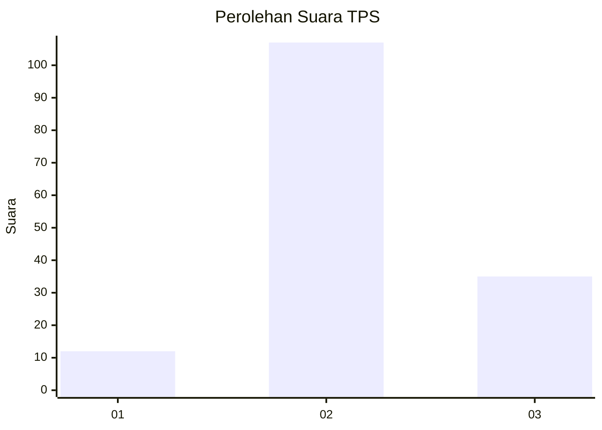
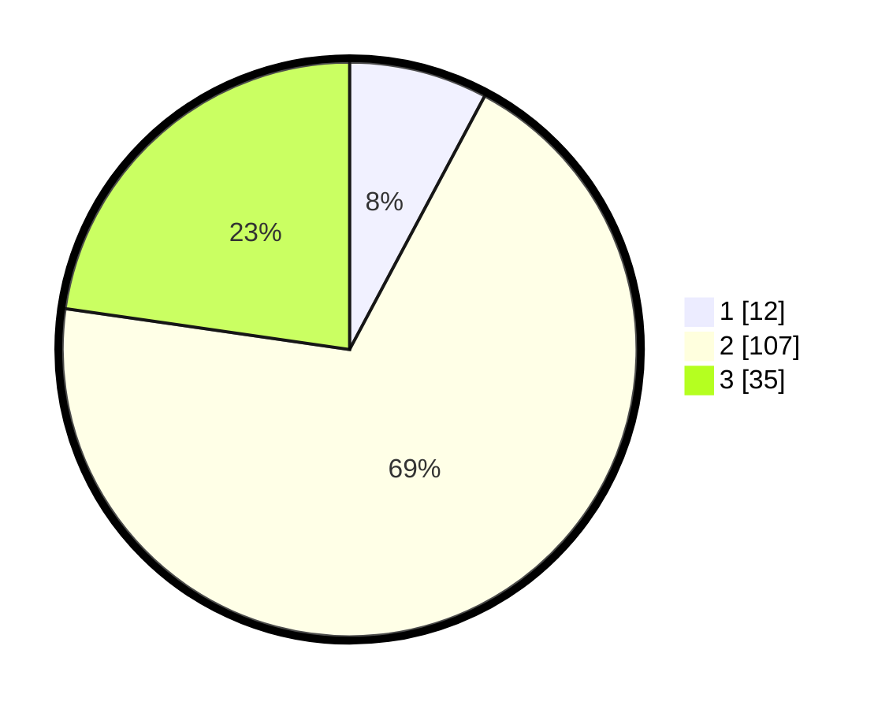

# Hasil

## Grafik

## Tabel

| No. | Nama Paslon    | Suara | Suara (raw) | Persentase |
|:--- |:-------------- | -----:| -----------:| ----------:|
| 1   | ANIES MUHAIMIN | 12    | [12][p-1]   | 7,79       |
| 2   | PRABOWO GIBRAN | 107   | [107][p-2]  | 69,48      |
| 3   | GANJAR MAHFUD  | 35    | [35][p-3]   | 22,73      |

[p-1]: https://github.com/gigit-pemilu/pemilu-2024/blob/main/pilpres/hitung-suara/sub/35-jawa-timur/sub/10-banyuwangi/sub/05-muncar/sub/2002-kedungrejo/sub/005-tps/sub/paslon-1.txt
[p-2]: https://github.com/gigit-pemilu/pemilu-2024/blob/main/pilpres/hitung-suara/sub/35-jawa-timur/sub/10-banyuwangi/sub/05-muncar/sub/2002-kedungrejo/sub/005-tps/sub/paslon-2.txt
[p-3]: https://github.com/gigit-pemilu/pemilu-2024/blob/main/pilpres/hitung-suara/sub/35-jawa-timur/sub/10-banyuwangi/sub/05-muncar/sub/2002-kedungrejo/sub/005-tps/sub/paslon-3.txt

## Foto C Plano

https://sirekap-obj-formc.kpu.go.id/661b/pemilu/ppwp/35/10/05/20/02/3510052002005-20240221-033639--70645a9f-65d2-4873-8960-1c62acc363a8.jpg

https://sirekap-obj-formc.kpu.go.id/661b/pemilu/ppwp/35/10/05/20/02/3510052002005-20240221-034921--6420b250-d6ec-43cc-a6ce-c21cc5569ae7.jpg

https://sirekap-obj-formc.kpu.go.id/661b/pemilu/ppwp/35/10/05/20/02/3510052002005-20240221-035531--78b7070c-5e69-4251-88ae-e33acfb4f86c.jpg

## Metadata

| Key        | Value               |
| ---------- | ------------------- |
| Time Stamp | 2024-02-24 22:31:28 |

