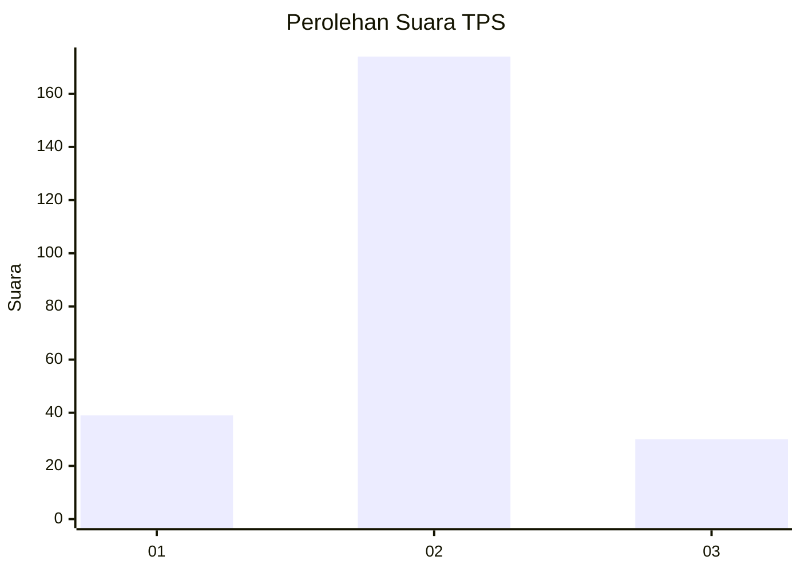
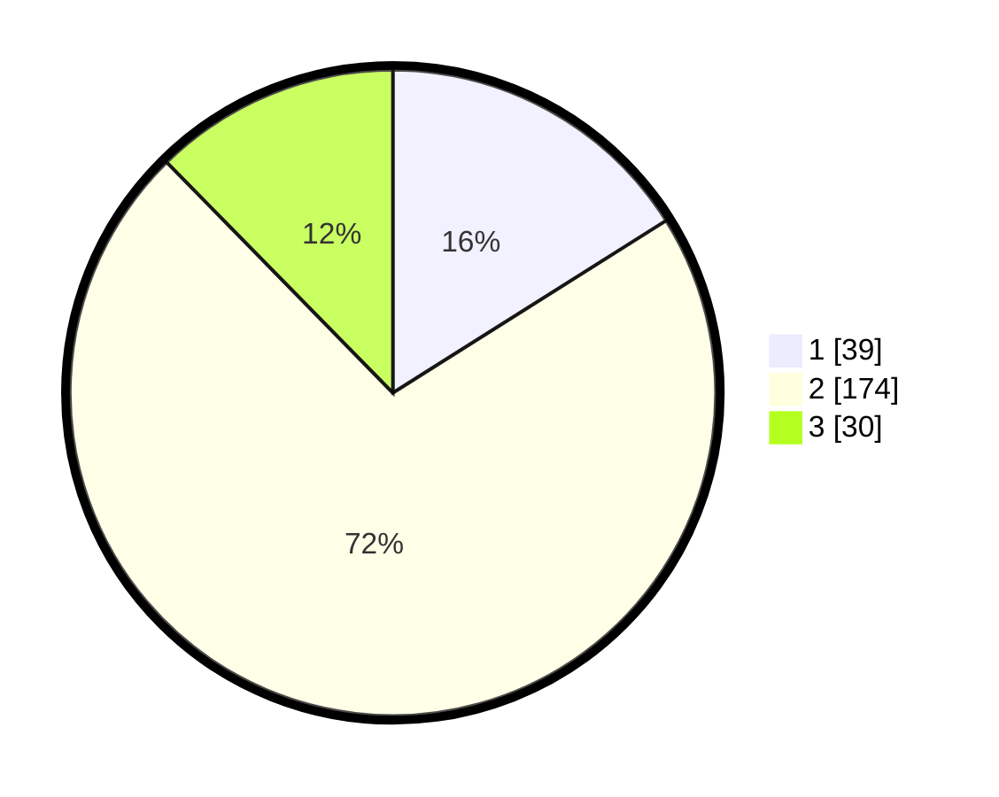

# Hasil

## Grafik

## Tabel

| No. | Nama Paslon    | Suara | Suara (raw) | Persentase |
|:--- |:-------------- | -----:| -----------:| ----------:|
| 1   | ANIES MUHAIMIN | 39    | [39][p-1]   | 16,05      |
| 2   | PRABOWO GIBRAN | 174   | [174][p-2]  | 71,60      |
| 3   | GANJAR MAHFUD  | 30    | [30][p-3]   | 12,35      |

[p-1]: https://github.com/gigit-pemilu/pemilu-2024-35-jawa-timur/blob/main/pilpres/hitung-suara/sub/35-jawa-timur/sub/10-banyuwangi/sub/05-muncar/sub/2002-kedungrejo/sub/010-tps/sub/paslon-1.txt
[p-2]: https://github.com/gigit-pemilu/pemilu-2024-35-jawa-timur/blob/main/pilpres/hitung-suara/sub/35-jawa-timur/sub/10-banyuwangi/sub/05-muncar/sub/2002-kedungrejo/sub/010-tps/sub/paslon-2.txt
[p-3]: https://github.com/gigit-pemilu/pemilu-2024-35-jawa-timur/blob/main/pilpres/hitung-suara/sub/35-jawa-timur/sub/10-banyuwangi/sub/05-muncar/sub/2002-kedungrejo/sub/010-tps/sub/paslon-3.txt

## Foto C Plano

https://sirekap-obj-formc.kpu.go.id/f9d0/pemilu/ppwp/35/10/05/20/02/3510052002010-20240218-061145--9be54cb2-4498-4243-8d93-e0959c6e3768.jpg

https://sirekap-obj-formc.kpu.go.id/f9d0/pemilu/ppwp/35/10/05/20/02/3510052002010-20240217-171555--3d755277-f363-4da6-800d-646af3fb42dc.jpg

https://sirekap-obj-formc.kpu.go.id/f9d0/pemilu/ppwp/35/10/05/20/02/3510052002010-20240217-173913--9ea52fb0-38f3-4072-a289-0705d85fd00b.jpg

## Metadata

| Key        | Value               |
| ---------- | ------------------- |
| Time Stamp | 2024-02-24 22:31:28 |

