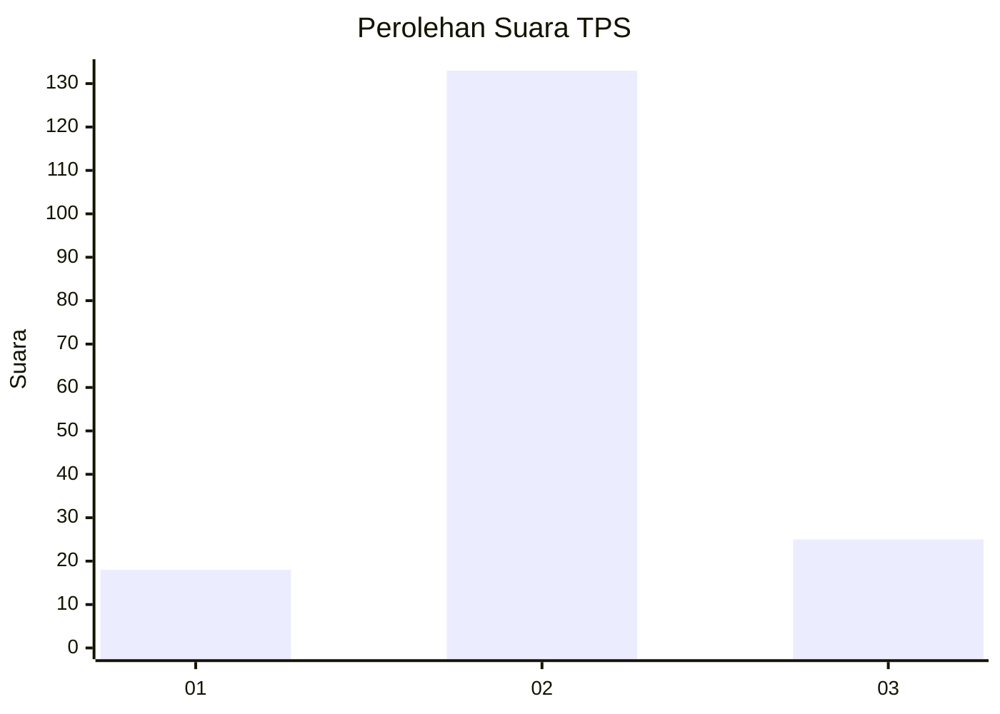
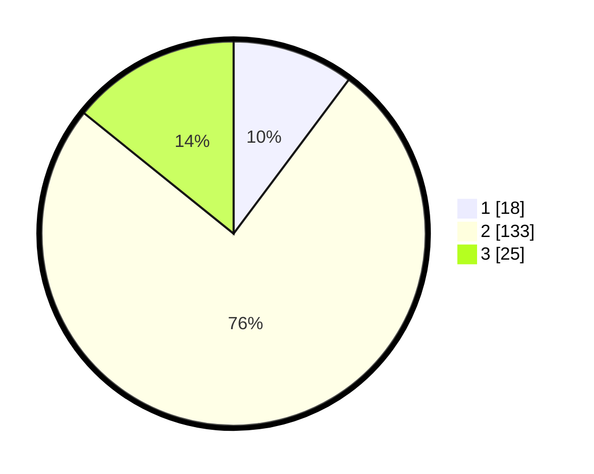

# Hasil

## Grafik

## Tabel

| No. | Nama Paslon    | Suara | Suara (raw) | Persentase |
|:--- |:-------------- | -----:| -----------:| ----------:|
| 1   | ANIES MUHAIMIN | 18    | [18][p-1]   | 10,23      |
| 2   | PRABOWO GIBRAN | 133   | [133][p-2]  | 75,57      |
| 3   | GANJAR MAHFUD  | 25    | [25][p-3]   | 14,20      |

[p-1]: https://github.com/gigit-pemilu/pemilu-2024-35-jawa-timur/blob/main/pilpres/hitung-suara/sub/35-jawa-timur/sub/10-banyuwangi/sub/05-muncar/sub/2002-kedungrejo/sub/020-tps/sub/paslon-1.txt
[p-2]: https://github.com/gigit-pemilu/pemilu-2024-35-jawa-timur/blob/main/pilpres/hitung-suara/sub/35-jawa-timur/sub/10-banyuwangi/sub/05-muncar/sub/2002-kedungrejo/sub/020-tps/sub/paslon-2.txt
[p-3]: https://github.com/gigit-pemilu/pemilu-2024-35-jawa-timur/blob/main/pilpres/hitung-suara/sub/35-jawa-timur/sub/10-banyuwangi/sub/05-muncar/sub/2002-kedungrejo/sub/020-tps/sub/paslon-3.txt

## Foto C Plano

https://sirekap-obj-formc.kpu.go.id/d259/pemilu/ppwp/35/10/05/20/02/3510052002020-20240215-122753--1ef6fe2b-36fb-4cad-ba73-13ede4b28907.jpg

https://sirekap-obj-formc.kpu.go.id/d259/pemilu/ppwp/35/10/05/20/02/3510052002020-20240215-123203--8b9d0128-bb2b-4456-a068-8d6013afb4af.jpg

https://sirekap-obj-formc.kpu.go.id/d259/pemilu/ppwp/35/10/05/20/02/3510052002020-20240215-123334--3c755c1c-ccb8-480b-b5a3-1cc3af7338cd.jpg

## Metadata

| Key        | Value               |
| ---------- | ------------------- |
| Time Stamp | 2024-02-21 18:00:00 |

