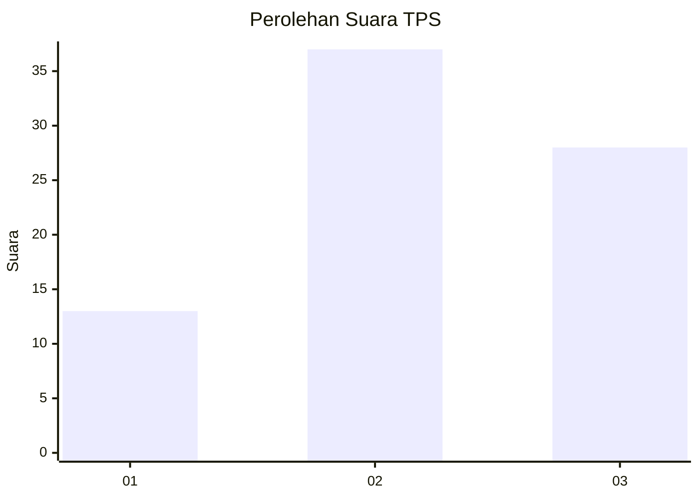
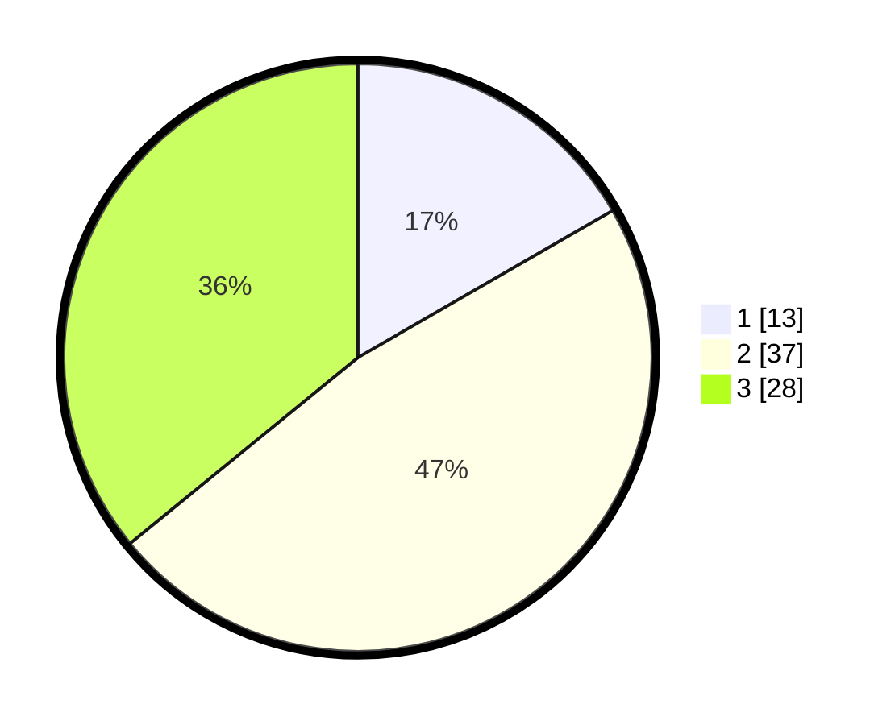

# Hasil

## Grafik

## Tabel

| No. | Nama Paslon    | Suara | Suara (raw) | Persentase |
|:--- |:-------------- | -----:| -----------:| ----------:|
| 1   | ANIES MUHAIMIN | 13    | [13][p-1]   | 16,67      |
| 2   | PRABOWO GIBRAN | 37    | [37][p-2]   | 47,44      |
| 3   | GANJAR MAHFUD  | 28    | [28][p-3]   | 35,90      |

[p-1]: https://github.com/gigit-pemilu/pemilu-2024-35-jawa-timur/blob/main/pilpres/hitung-suara/sub/35-jawa-timur/sub/10-banyuwangi/sub/05-muncar/sub/2002-kedungrejo/sub/027-tps/sub/paslon-1.txt
[p-2]: https://github.com/gigit-pemilu/pemilu-2024-35-jawa-timur/blob/main/pilpres/hitung-suara/sub/35-jawa-timur/sub/10-banyuwangi/sub/05-muncar/sub/2002-kedungrejo/sub/027-tps/sub/paslon-2.txt
[p-3]: https://github.com/gigit-pemilu/pemilu-2024-35-jawa-timur/blob/main/pilpres/hitung-suara/sub/35-jawa-timur/sub/10-banyuwangi/sub/05-muncar/sub/2002-kedungrejo/sub/027-tps/sub/paslon-3.txt

## Foto C Plano

https://sirekap-obj-formc.kpu.go.id/7cb2/pemilu/ppwp/35/10/05/20/02/3510052002027-20240222-110118--f99f4907-201d-47fa-a27c-8dcb7c9acf9f.jpg

https://sirekap-obj-formc.kpu.go.id/7cb2/pemilu/ppwp/35/10/05/20/02/3510052002027-20240222-110209--3b9da422-284e-4872-91cd-43800b6ec5ed.jpg

https://sirekap-obj-formc.kpu.go.id/7cb2/pemilu/ppwp/35/10/05/20/02/3510052002027-20240222-110216--b7fb7d8c-2bb9-46ad-8fac-409594be6e1a.jpg

## Metadata

| Key        | Value               |
| ---------- | ------------------- |
| Time Stamp | 2024-02-24 22:31:28 |

