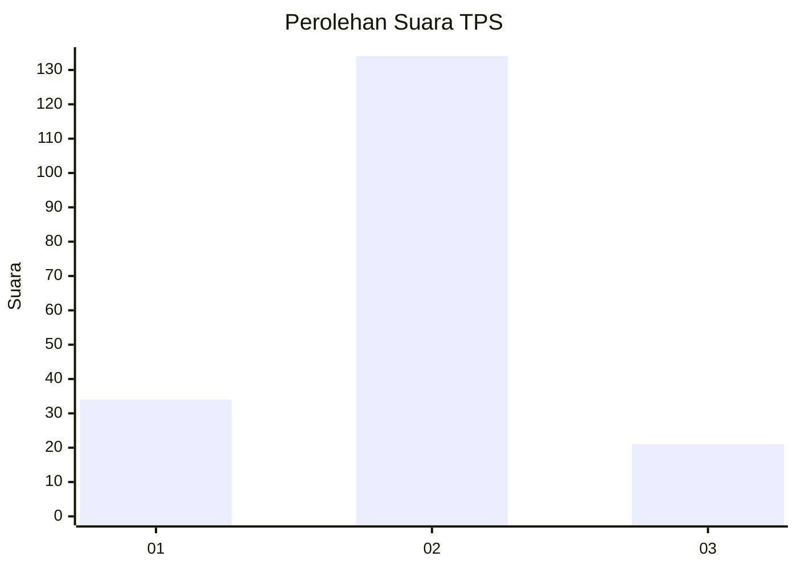
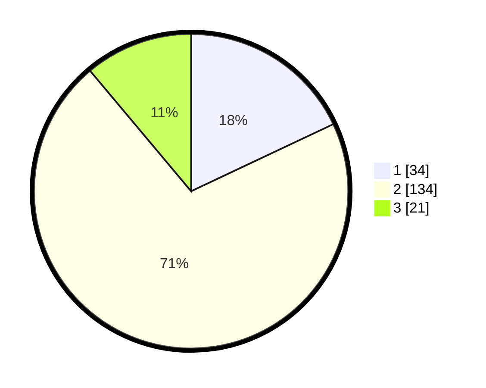

# Hasil

## Grafik

## Tabel

| No. | Nama Paslon    | Suara | Suara (raw) | Persentase |
|:--- |:-------------- | -----:| -----------:| ----------:|
| 1   | ANIES MUHAIMIN | 34    | [34][p-1]   | 17,99      |
| 2   | PRABOWO GIBRAN | 134   | [134][p-2]  | 70,90      |
| 3   | GANJAR MAHFUD  | 21    | [21][p-3]   | 11,11      |

[p-1]: https://github.com/gigit-pemilu/pemilu-2024-35-jawa-timur/blob/main/pilpres/hitung-suara/sub/35-jawa-timur/sub/10-banyuwangi/sub/05-muncar/sub/2002-kedungrejo/sub/062-tps/sub/paslon-1.txt
[p-2]: https://github.com/gigit-pemilu/pemilu-2024-35-jawa-timur/blob/main/pilpres/hitung-suara/sub/35-jawa-timur/sub/10-banyuwangi/sub/05-muncar/sub/2002-kedungrejo/sub/062-tps/sub/paslon-2.txt
[p-3]: https://github.com/gigit-pemilu/pemilu-2024-35-jawa-timur/blob/main/pilpres/hitung-suara/sub/35-jawa-timur/sub/10-banyuwangi/sub/05-muncar/sub/2002-kedungrejo/sub/062-tps/sub/paslon-3.txt

## Foto C Plano

https://sirekap-obj-formc.kpu.go.id/28e8/pemilu/ppwp/35/10/05/20/02/3510052002062-20240214-213358--2ae3d805-812b-4a2e-9522-97bb61e72e4b.jpg

https://sirekap-obj-formc.kpu.go.id/28e8/pemilu/ppwp/35/10/05/20/02/3510052002062-20240215-014914--8ec9d2d1-80a7-4da2-899a-b9a8fc922497.jpg

https://sirekap-obj-formc.kpu.go.id/28e8/pemilu/ppwp/35/10/05/20/02/3510052002062-20240215-015136--374adeca-485a-4709-bde9-52b0fa14e41f.jpg

## Metadata

| Key        | Value               |
| ---------- | ------------------- |
| Time Stamp | 2024-02-24 22:31:28 |

