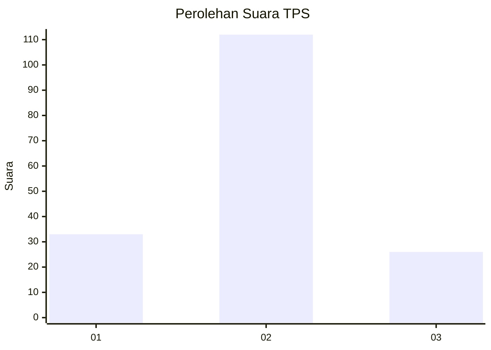
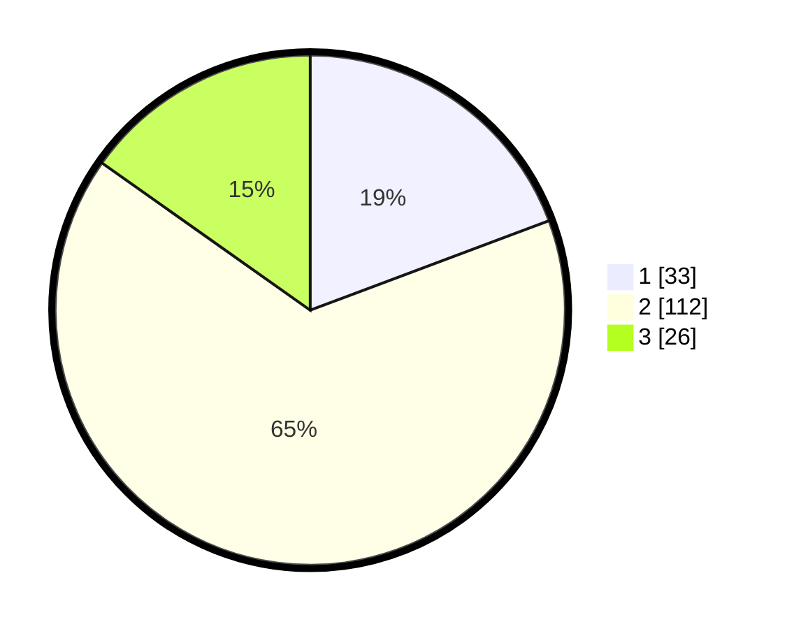

# Hasil

## Grafik

## Tabel

| No. | Nama Paslon    | Suara | Suara (raw) | Persentase |
|:--- |:-------------- | -----:| -----------:| ----------:|
| 1   | ANIES MUHAIMIN | 33    | [33][p-1]   | 19,30      |
| 2   | PRABOWO GIBRAN | 112   | [112][p-2]  | 65,50      |
| 3   | GANJAR MAHFUD  | 26    | [26][p-3]   | 15,20      |

[p-1]: https://github.com/gigit-pemilu/pemilu-2024/blob/main/pilpres/hitung-suara/sub/35-jawa-timur/sub/10-banyuwangi/sub/05-muncar/sub/2002-kedungrejo/sub/073-tps/sub/paslon-1.txt
[p-2]: https://github.com/gigit-pemilu/pemilu-2024/blob/main/pilpres/hitung-suara/sub/35-jawa-timur/sub/10-banyuwangi/sub/05-muncar/sub/2002-kedungrejo/sub/073-tps/sub/paslon-2.txt
[p-3]: https://github.com/gigit-pemilu/pemilu-2024/blob/main/pilpres/hitung-suara/sub/35-jawa-timur/sub/10-banyuwangi/sub/05-muncar/sub/2002-kedungrejo/sub/073-tps/sub/paslon-3.txt

## Foto C Plano

https://sirekap-obj-formc.kpu.go.id/c612/pemilu/ppwp/35/10/05/20/02/3510052002073-20240221-082113--01c51926-9b9b-4432-8f1e-d4d55190d863.jpg

https://sirekap-obj-formc.kpu.go.id/c612/pemilu/ppwp/35/10/05/20/02/3510052002073-20240214-141546--9df61c09-c6f5-4b27-b686-0db33a3d687d.jpg

https://sirekap-obj-formc.kpu.go.id/c612/pemilu/ppwp/35/10/05/20/02/3510052002073-20240214-141019--5b3982c8-fbae-42cc-bfa0-0011aea42c77.jpg

## Metadata

| Key        | Value               |
| ---------- | ------------------- |
| Time Stamp | 2024-02-21 18:00:00 |

