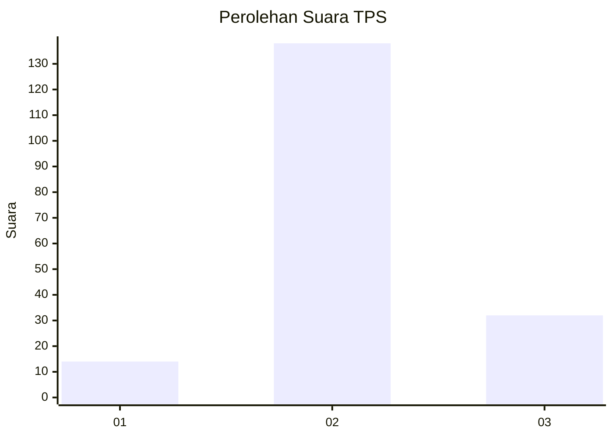

# Hasil

## Grafik

## Tabel

| No. | Nama Paslon    | Suara | Suara (raw) | Persentase |
|:--- |:-------------- | -----:| -----------:| ----------:|
| 1   | ANIES MUHAIMIN | 14    | [14][p-1]   | 7,61       |
| 2   | PRABOWO GIBRAN | 138   | [138][p-2]  | 75,00      |
| 3   | GANJAR MAHFUD  | 32    | [32][p-3]   | 17,39      |

[p-1]: https://github.com/gigit-pemilu/pemilu-2024-35-jawa-timur/blob/main/pilpres/hitung-suara/sub/35-jawa-timur/sub/10-banyuwangi/sub/05-muncar/sub/2003-tembokrejo/sub/072-tps/sub/paslon-1.txt
[p-2]: https://github.com/gigit-pemilu/pemilu-2024-35-jawa-timur/blob/main/pilpres/hitung-suara/sub/35-jawa-timur/sub/10-banyuwangi/sub/05-muncar/sub/2003-tembokrejo/sub/072-tps/sub/paslon-2.txt
[p-3]: https://github.com/gigit-pemilu/pemilu-2024-35-jawa-timur/blob/main/pilpres/hitung-suara/sub/35-jawa-timur/sub/10-banyuwangi/sub/05-muncar/sub/2003-tembokrejo/sub/072-tps/sub/paslon-3.txt

## Foto C Plano

https://sirekap-obj-formc.kpu.go.id/210d/pemilu/ppwp/35/10/05/20/03/3510052003072-20240217-194258--a16fc655-4e2b-44b0-88af-51ed4cc475d2.jpg

https://sirekap-obj-formc.kpu.go.id/210d/pemilu/ppwp/35/10/05/20/03/3510052003072-20240214-230721--f22136ab-cab2-4621-8e1f-a97bfb53f86b.jpg

https://sirekap-obj-formc.kpu.go.id/210d/pemilu/ppwp/35/10/05/20/03/3510052003072-20240214-230756--241982f0-f7a9-4855-92a7-0733b3f96f39.jpg

## Metadata

| Key        | Value               |
| ---------- | ------------------- |
| Time Stamp | 2024-02-21 18:00:00 |

