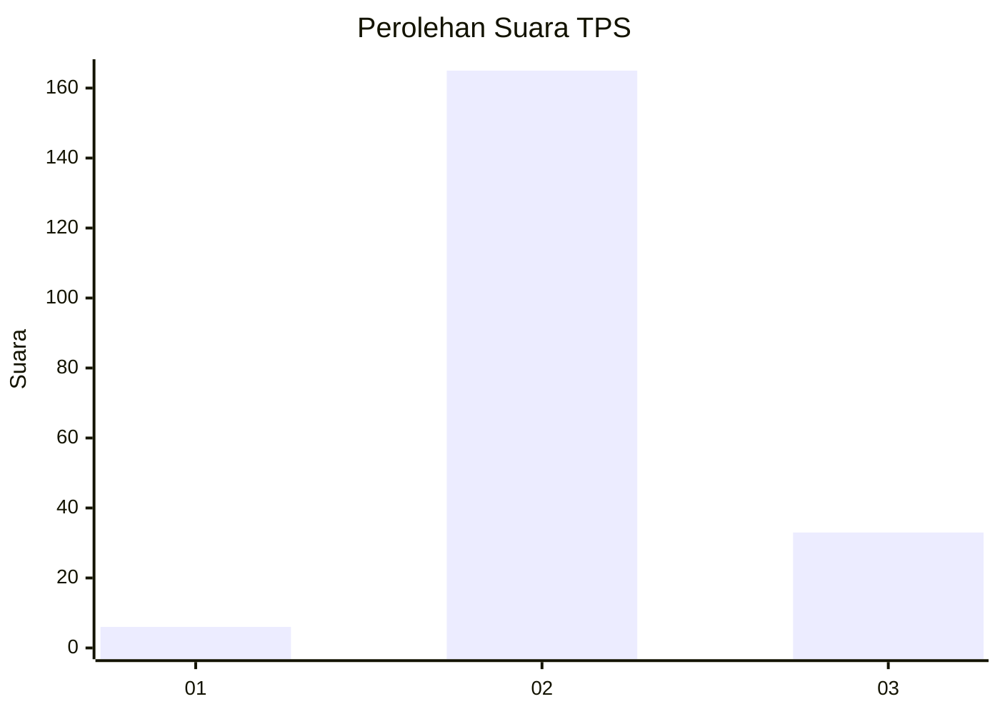
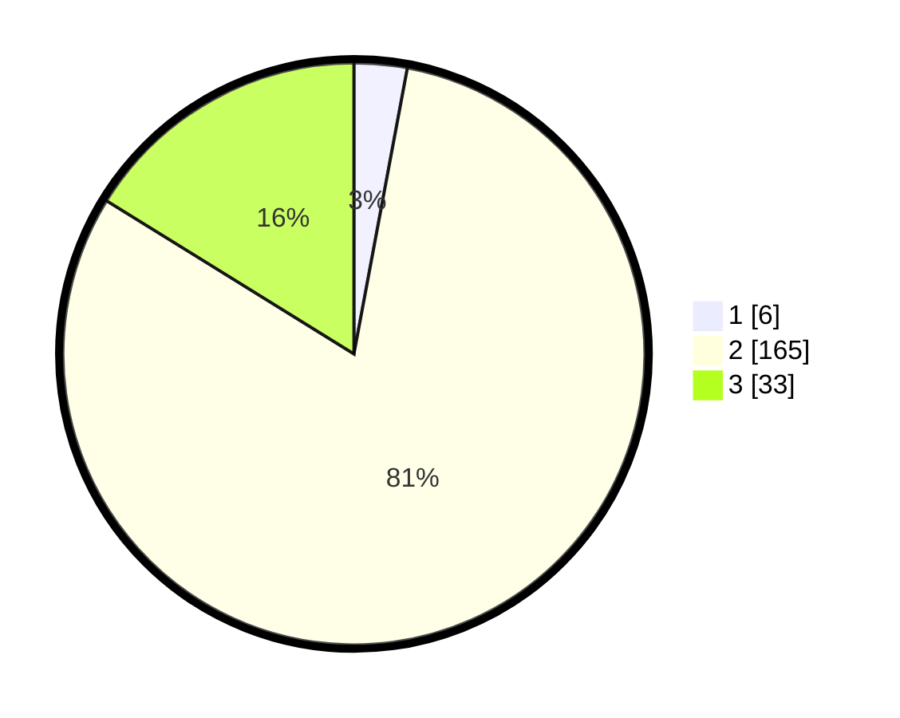

# Hasil

## Grafik

## Tabel

| No. | Nama Paslon    | Suara | Suara (raw) | Persentase |
|:--- |:-------------- | -----:| -----------:| ----------:|
| 1   | ANIES MUHAIMIN | 6     | [6][p-1]    | 2,94       |
| 2   | PRABOWO GIBRAN | 165   | [165][p-2]  | 80,88      |
| 3   | GANJAR MAHFUD  | 33    | [33][p-3]   | 16,18      |

[p-1]: https://github.com/gigit-pemilu/pemilu-2024-35-jawa-timur/blob/main/pilpres/hitung-suara/sub/35-jawa-timur/sub/10-banyuwangi/sub/05-muncar/sub/2004-sumbersewu/sub/002-tps/sub/paslon-1.txt
[p-2]: https://github.com/gigit-pemilu/pemilu-2024-35-jawa-timur/blob/main/pilpres/hitung-suara/sub/35-jawa-timur/sub/10-banyuwangi/sub/05-muncar/sub/2004-sumbersewu/sub/002-tps/sub/paslon-2.txt
[p-3]: https://github.com/gigit-pemilu/pemilu-2024-35-jawa-timur/blob/main/pilpres/hitung-suara/sub/35-jawa-timur/sub/10-banyuwangi/sub/05-muncar/sub/2004-sumbersewu/sub/002-tps/sub/paslon-3.txt

## Foto C Plano

https://sirekap-obj-formc.kpu.go.id/535d/pemilu/ppwp/35/10/05/20/04/3510052004002-20240216-190245--33408835-530f-4b33-8fbd-eb802326abe0.jpg

https://sirekap-obj-formc.kpu.go.id/535d/pemilu/ppwp/35/10/05/20/04/3510052004002-20240215-025244--d29d9e4a-98c5-403e-89c8-002c7ec6dead.jpg

https://sirekap-obj-formc.kpu.go.id/535d/pemilu/ppwp/35/10/05/20/04/3510052004002-20240215-023914--3c03a26d-9dfe-4e7f-801b-e6b9a568538b.jpg

## Metadata

| Key        | Value               |
| ---------- | ------------------- |
| Time Stamp | 2024-02-21 18:00:00 |

