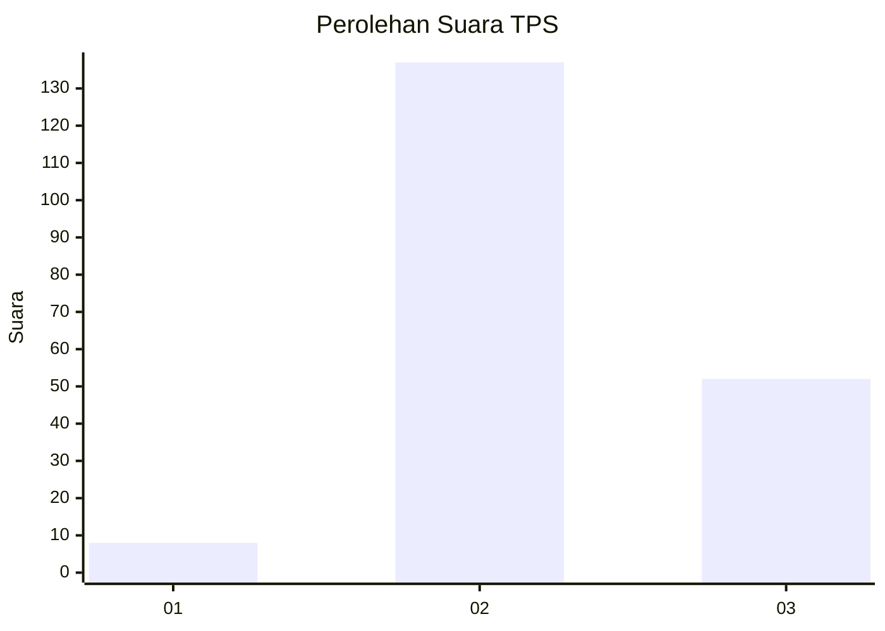

# Hasil

## Grafik

## Tabel

| No. | Nama Paslon    | Suara | Suara (raw) | Persentase |
|:--- |:-------------- | -----:| -----------:| ----------:|
| 1   | ANIES MUHAIMIN | 8     | [8][p-1]    | 4,06       |
| 2   | PRABOWO GIBRAN | 137   | [137][p-2]  | 69,54      |
| 3   | GANJAR MAHFUD  | 52    | [52][p-3]   | 26,40      |

[p-1]: https://github.com/gigit-pemilu/pemilu-2024/blob/main/pilpres/hitung-suara/sub/35-jawa-timur/sub/10-banyuwangi/sub/05-muncar/sub/2005-blambangan/sub/021-tps/sub/paslon-1.txt
[p-2]: https://github.com/gigit-pemilu/pemilu-2024/blob/main/pilpres/hitung-suara/sub/35-jawa-timur/sub/10-banyuwangi/sub/05-muncar/sub/2005-blambangan/sub/021-tps/sub/paslon-2.txt
[p-3]: https://github.com/gigit-pemilu/pemilu-2024/blob/main/pilpres/hitung-suara/sub/35-jawa-timur/sub/10-banyuwangi/sub/05-muncar/sub/2005-blambangan/sub/021-tps/sub/paslon-3.txt

## Foto C Plano

https://sirekap-obj-formc.kpu.go.id/5da0/pemilu/ppwp/35/10/05/20/05/3510052005021-20240216-152658--77d851f5-a439-4661-bf2e-41cd43c4cdd3.jpg

https://sirekap-obj-formc.kpu.go.id/5da0/pemilu/ppwp/35/10/05/20/05/3510052005021-20240217-152849--3b99b2b0-1311-4751-bbb5-8831d8d805f3.jpg

https://sirekap-obj-formc.kpu.go.id/5da0/pemilu/ppwp/35/10/05/20/05/3510052005021-20240216-152716--7e5c4559-a7b4-4c65-a454-8faae1a83dea.jpg

## Metadata

| Key        | Value               |
| ---------- | ------------------- |
| Time Stamp | 2024-02-19 06:16:00 |

## DATA PEMILIH TETAP

Jumlah pemilih dalam DPT: **1**.
 * L: **0**.
 * P: **0**.

## DATA PENGGUNA HAK PILIH

Jumlah pengguna hak pilih dalam DPT: **1**.
 * L: **0**.
 * P: **0**.

Jumlah pengguna hak pilih dalam DPTb: **470**.
 * L: **444**.
 * P: **4**.

Jumlah pengguna hak pilih dalam DPK: **0**.
 * L: **464**.
 * P: **6**.

Jumlah pengguna hak pilih: **0**.
 * L: **464**.
 * P: **6**.

## JUMLAH SUARA SAH DAN TIDAK SAH

JUMLAH SELURUH SUARA SAH: **197**.

JUMLAH SUARA TIDAK SAH: **2**.

JUMLAH SELURUH SUARA SAH DAN SUARA TIDAK SAH: **199**.

