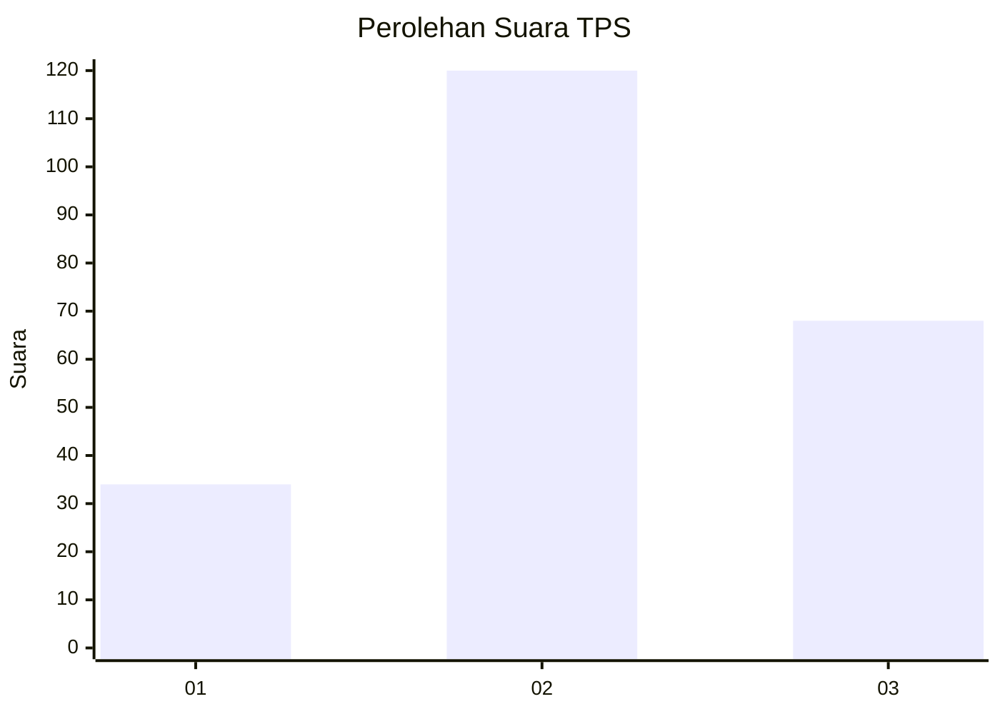
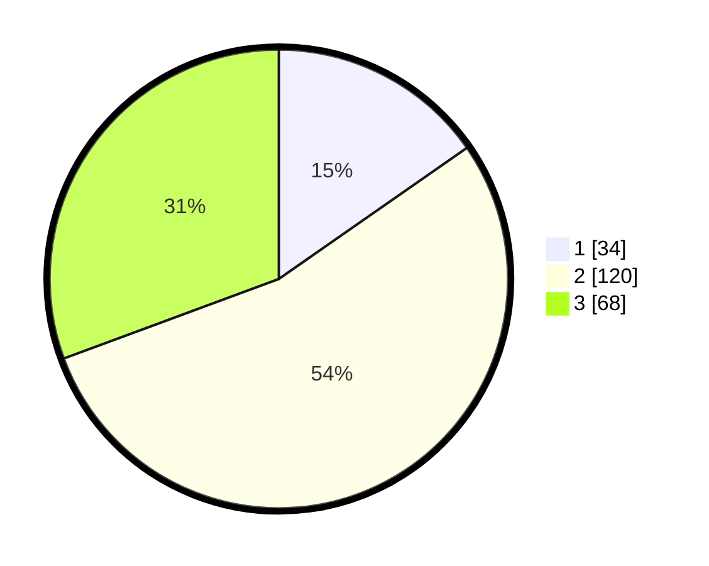

# Hasil

## Grafik

## Tabel

| No. | Nama Paslon    | Suara | Suara (raw) | Persentase |
|:--- |:-------------- | -----:| -----------:| ----------:|
| 1   | ANIES MUHAIMIN | 34    | [34][p-1]   | 15,32      |
| 2   | PRABOWO GIBRAN | 120   | [120][p-2]  | 54,05      |
| 3   | GANJAR MAHFUD  | 68    | [68][p-3]   | 30,63      |

[p-1]: https://github.com/gigit-pemilu/pemilu-2024-35-jawa-timur/blob/main/pilpres/hitung-suara/sub/35-jawa-timur/sub/10-banyuwangi/sub/05-muncar/sub/2006-tapanrejo/sub/007-tps/sub/paslon-1.txt
[p-2]: https://github.com/gigit-pemilu/pemilu-2024-35-jawa-timur/blob/main/pilpres/hitung-suara/sub/35-jawa-timur/sub/10-banyuwangi/sub/05-muncar/sub/2006-tapanrejo/sub/007-tps/sub/paslon-2.txt
[p-3]: https://github.com/gigit-pemilu/pemilu-2024-35-jawa-timur/blob/main/pilpres/hitung-suara/sub/35-jawa-timur/sub/10-banyuwangi/sub/05-muncar/sub/2006-tapanrejo/sub/007-tps/sub/paslon-3.txt

## Foto C Plano

https://sirekap-obj-formc.kpu.go.id/0f1d/pemilu/ppwp/35/10/05/20/06/3510052006007-20240215-012303--2754dc80-e790-4704-a925-10ca0b4525d5.jpg

https://sirekap-obj-formc.kpu.go.id/0f1d/pemilu/ppwp/35/10/05/20/06/3510052006007-20240215-012537--dba4ef61-5a4e-447e-ad1a-068d0807ea89.jpg

https://sirekap-obj-formc.kpu.go.id/0f1d/pemilu/ppwp/35/10/05/20/06/3510052006007-20240215-013020--e6381ad1-669f-4834-9efa-e8cd8196a63b.jpg

## Metadata

| Key        | Value               |
| ---------- | ------------------- |
| Time Stamp | 2024-02-21 18:00:00 |

