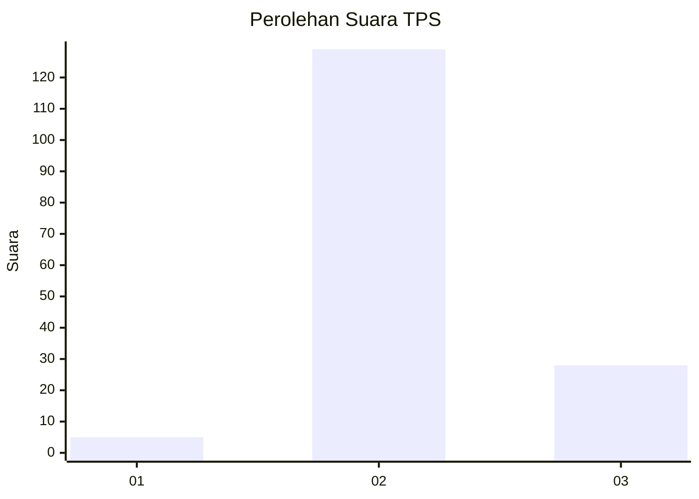

# Hasil

## Grafik

## Tabel

| No. | Nama Paslon    | Suara | Suara (raw) | Persentase |
|:--- |:-------------- | -----:| -----------:| ----------:|
| 1   | ANIES MUHAIMIN | 5     | [5][p-1]    | 3,09       |
| 2   | PRABOWO GIBRAN | 129   | [129][p-2]  | 79,63      |
| 3   | GANJAR MAHFUD  | 28    | [28][p-3]   | 17,28      |

[p-1]: https://github.com/gigit-pemilu/pemilu-2024-35-jawa-timur/blob/main/pilpres/hitung-suara/sub/35-jawa-timur/sub/10-banyuwangi/sub/05-muncar/sub/2006-tapanrejo/sub/012-tps/sub/paslon-1.txt
[p-2]: https://github.com/gigit-pemilu/pemilu-2024-35-jawa-timur/blob/main/pilpres/hitung-suara/sub/35-jawa-timur/sub/10-banyuwangi/sub/05-muncar/sub/2006-tapanrejo/sub/012-tps/sub/paslon-2.txt
[p-3]: https://github.com/gigit-pemilu/pemilu-2024-35-jawa-timur/blob/main/pilpres/hitung-suara/sub/35-jawa-timur/sub/10-banyuwangi/sub/05-muncar/sub/2006-tapanrejo/sub/012-tps/sub/paslon-3.txt

## Foto C Plano

https://sirekap-obj-formc.kpu.go.id/dcd7/pemilu/ppwp/35/10/05/20/06/3510052006012-20240215-044330--b6e068d8-7bda-41aa-978e-31ad57e1611d.jpg

https://sirekap-obj-formc.kpu.go.id/dcd7/pemilu/ppwp/35/10/05/20/06/3510052006012-20240215-043916--bfe0149f-6a75-4682-85a7-54f6320c6f06.jpg

https://sirekap-obj-formc.kpu.go.id/dcd7/pemilu/ppwp/35/10/05/20/06/3510052006012-20240215-045046--a8e2cd1c-930a-4522-b6ac-fd14f238c1a4.jpg

## Metadata

| Key        | Value               |
| ---------- | ------------------- |
| Time Stamp | 2024-02-22 10:00:00 |

