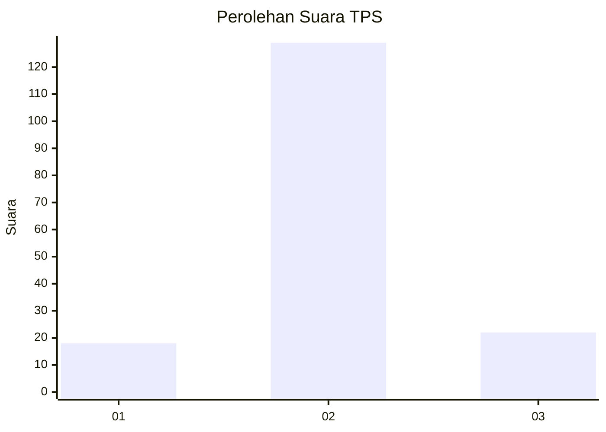
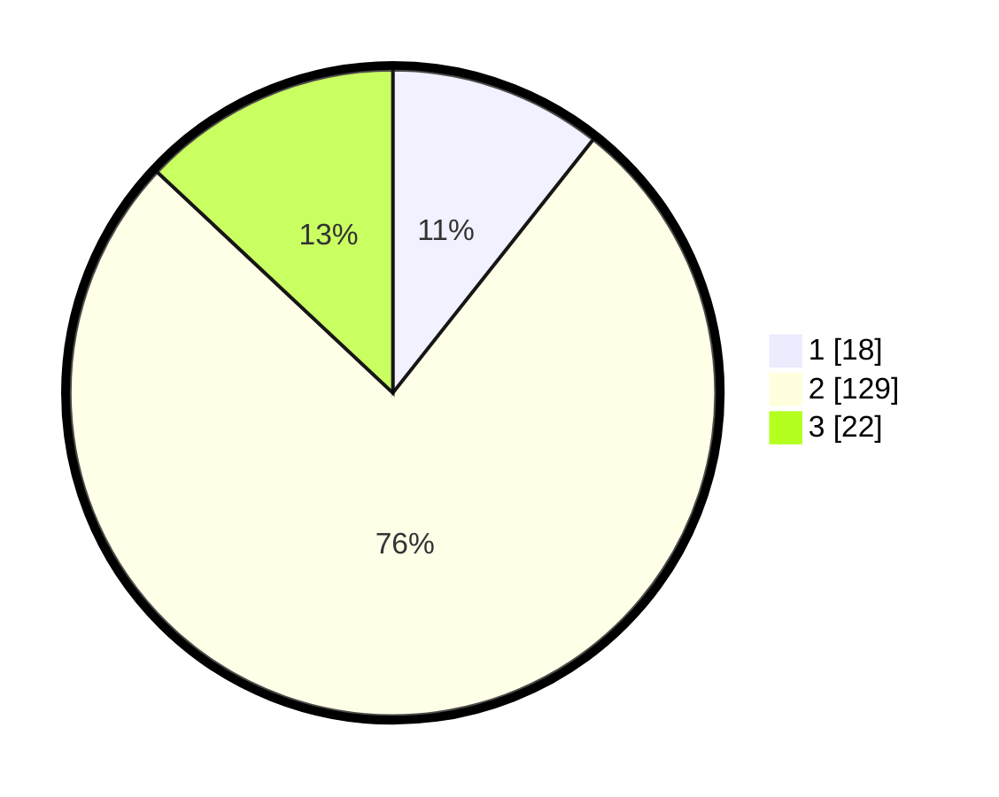

# Hasil

## Grafik

## Tabel

| No. | Nama Paslon    | Suara | Suara (raw) | Persentase |
|:--- |:-------------- | -----:| -----------:| ----------:|
| 1   | ANIES MUHAIMIN | 18    | [18][p-1]   | 10,65      |
| 2   | PRABOWO GIBRAN | 129   | [129][p-2]  | 76,33      |
| 3   | GANJAR MAHFUD  | 22    | [22][p-3]   | 13,02      |

[p-1]: https://github.com/gigit-pemilu/pemilu-2024-35-jawa-timur/blob/main/pilpres/hitung-suara/sub/35-jawa-timur/sub/10-banyuwangi/sub/05-muncar/sub/2009-kedungringin/sub/020-tps/sub/paslon-1.txt
[p-2]: https://github.com/gigit-pemilu/pemilu-2024-35-jawa-timur/blob/main/pilpres/hitung-suara/sub/35-jawa-timur/sub/10-banyuwangi/sub/05-muncar/sub/2009-kedungringin/sub/020-tps/sub/paslon-2.txt
[p-3]: https://github.com/gigit-pemilu/pemilu-2024-35-jawa-timur/blob/main/pilpres/hitung-suara/sub/35-jawa-timur/sub/10-banyuwangi/sub/05-muncar/sub/2009-kedungringin/sub/020-tps/sub/paslon-3.txt

## Foto C Plano

https://sirekap-obj-formc.kpu.go.id/a76c/pemilu/ppwp/35/10/05/20/09/3510052009020-20240215-110727--a382800f-0d6f-4b95-81e0-6c44258f7597.jpg

https://sirekap-obj-formc.kpu.go.id/a76c/pemilu/ppwp/35/10/05/20/09/3510052009020-20240215-110748--ceb7b806-aa76-4368-a75b-f6589910af06.jpg

https://sirekap-obj-formc.kpu.go.id/a76c/pemilu/ppwp/35/10/05/20/09/3510052009020-20240215-110753--7cd01053-00e2-471e-80a9-7b78744e3298.jpg

## Metadata

| Key        | Value               |
| ---------- | ------------------- |
| Time Stamp | 2024-02-24 22:31:28 |

