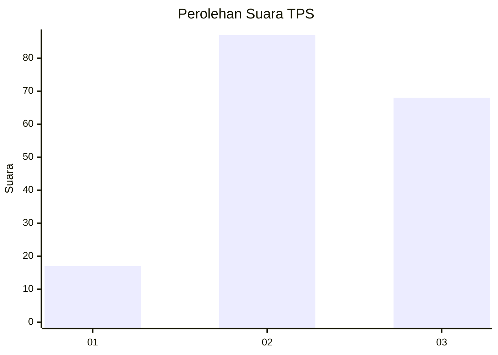
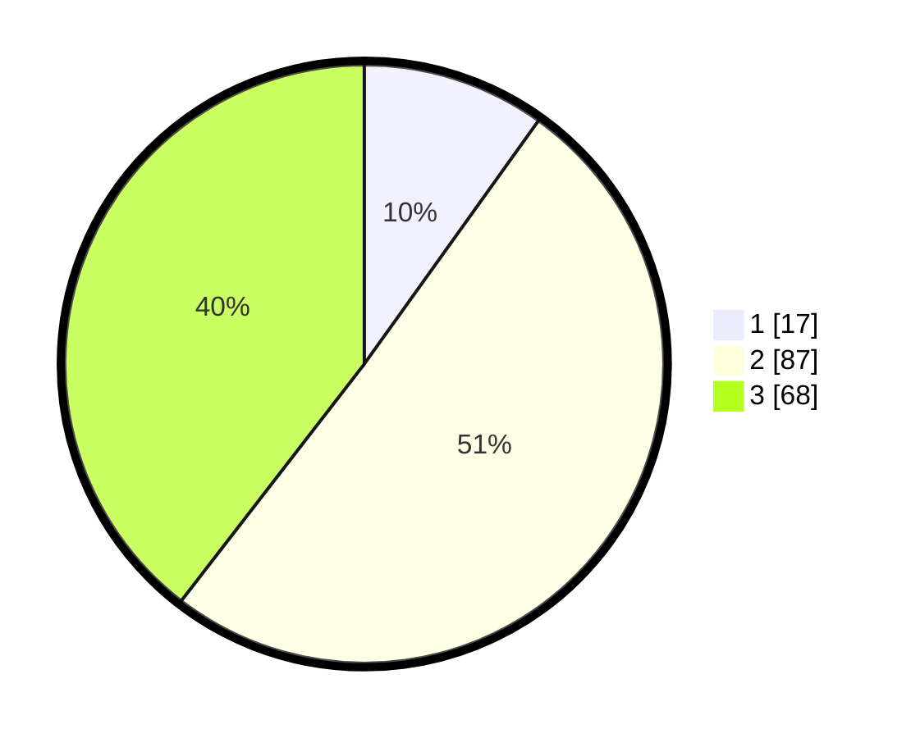

# Hasil

## Grafik

## Tabel

| No. | Nama Paslon    | Suara | Suara (raw) | Persentase |
|:--- |:-------------- | -----:| -----------:| ----------:|
| 1   | ANIES MUHAIMIN | 17    | [17][p-1]   | 9,88       |
| 2   | PRABOWO GIBRAN | 87    | [87][p-2]   | 50,58      |
| 3   | GANJAR MAHFUD  | 68    | [68][p-3]   | 39,53      |

[p-1]: https://github.com/gigit-pemilu/pemilu-2024/blob/main/pilpres/hitung-suara/sub/35-jawa-timur/sub/10-banyuwangi/sub/06-cluring/sub/2001-plampangrejo/sub/024-tps/sub/paslon-1.txt
[p-2]: https://github.com/gigit-pemilu/pemilu-2024/blob/main/pilpres/hitung-suara/sub/35-jawa-timur/sub/10-banyuwangi/sub/06-cluring/sub/2001-plampangrejo/sub/024-tps/sub/paslon-2.txt
[p-3]: https://github.com/gigit-pemilu/pemilu-2024/blob/main/pilpres/hitung-suara/sub/35-jawa-timur/sub/10-banyuwangi/sub/06-cluring/sub/2001-plampangrejo/sub/024-tps/sub/paslon-3.txt

## Foto C Plano

https://sirekap-obj-formc.kpu.go.id/14b6/pemilu/ppwp/35/10/06/20/01/3510062001024-20240215-164234--7584cf39-82d6-4533-a5e8-796192b91968.jpg

https://sirekap-obj-formc.kpu.go.id/14b6/pemilu/ppwp/35/10/06/20/01/3510062001024-20240215-190716--6a1ff923-5289-4dca-ab85-c7a3cb681f0c.jpg

https://sirekap-obj-formc.kpu.go.id/14b6/pemilu/ppwp/35/10/06/20/01/3510062001024-20240215-190848--69192029-d60e-44f0-80ae-83fdd19b135e.jpg

## Metadata

| Key        | Value               |
| ---------- | ------------------- |
| Time Stamp | 2024-02-24 22:31:28 |

