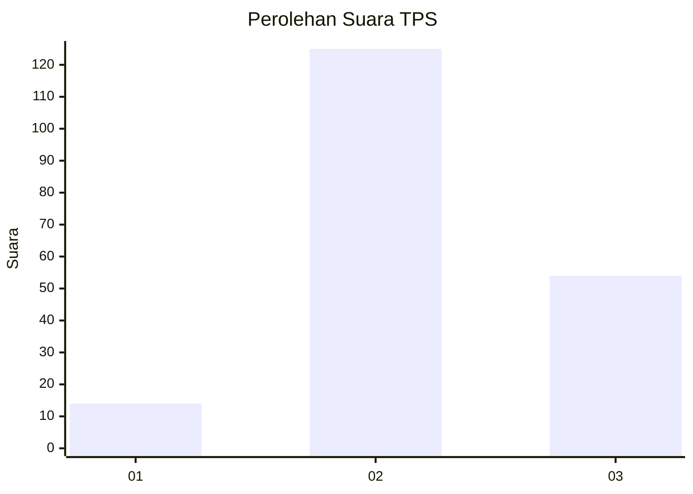

# Hasil

## Grafik

## Tabel

| No. | Nama Paslon    | Suara | Suara (raw) | Persentase |
|:--- |:-------------- | -----:| -----------:| ----------:|
| 1   | ANIES MUHAIMIN | 14    | [14][p-1]   | 7,25       |
| 2   | PRABOWO GIBRAN | 125   | [125][p-2]  | 64,77      |
| 3   | GANJAR MAHFUD  | 54    | [54][p-3]   | 27,98      |

[p-1]: https://github.com/gigit-pemilu/pemilu-2024/blob/main/pilpres/hitung-suara/sub/35-jawa-timur/sub/10-banyuwangi/sub/06-cluring/sub/2003-sembulung/sub/010-tps/sub/paslon-1.txt
[p-2]: https://github.com/gigit-pemilu/pemilu-2024/blob/main/pilpres/hitung-suara/sub/35-jawa-timur/sub/10-banyuwangi/sub/06-cluring/sub/2003-sembulung/sub/010-tps/sub/paslon-2.txt
[p-3]: https://github.com/gigit-pemilu/pemilu-2024/blob/main/pilpres/hitung-suara/sub/35-jawa-timur/sub/10-banyuwangi/sub/06-cluring/sub/2003-sembulung/sub/010-tps/sub/paslon-3.txt

## Foto C Plano

https://sirekap-obj-formc.kpu.go.id/18da/pemilu/ppwp/35/10/06/20/03/3510062003010-20240218-193032--fd40e28b-e190-4364-9ecf-5b8eabeb768e.jpg

https://sirekap-obj-formc.kpu.go.id/18da/pemilu/ppwp/35/10/06/20/03/3510062003010-20240218-193211--da2f1d6e-eeda-43fb-8a95-a6f9ed608b78.jpg

https://sirekap-obj-formc.kpu.go.id/18da/pemilu/ppwp/35/10/06/20/03/3510062003010-20240217-121256--6c8ffb83-2b9f-449e-9c51-b4d5c598095c.jpg

## Metadata

| Key        | Value               |
| ---------- | ------------------- |
| Time Stamp | 2024-02-21 18:00:00 |

