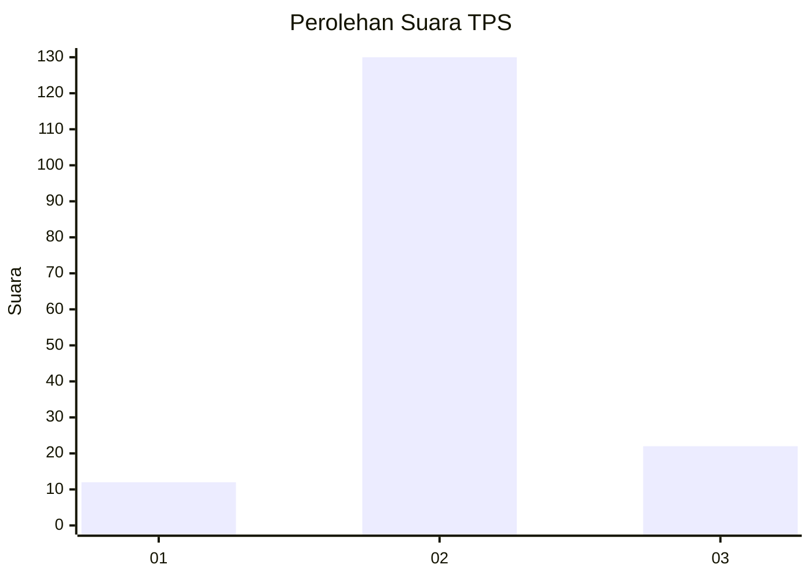
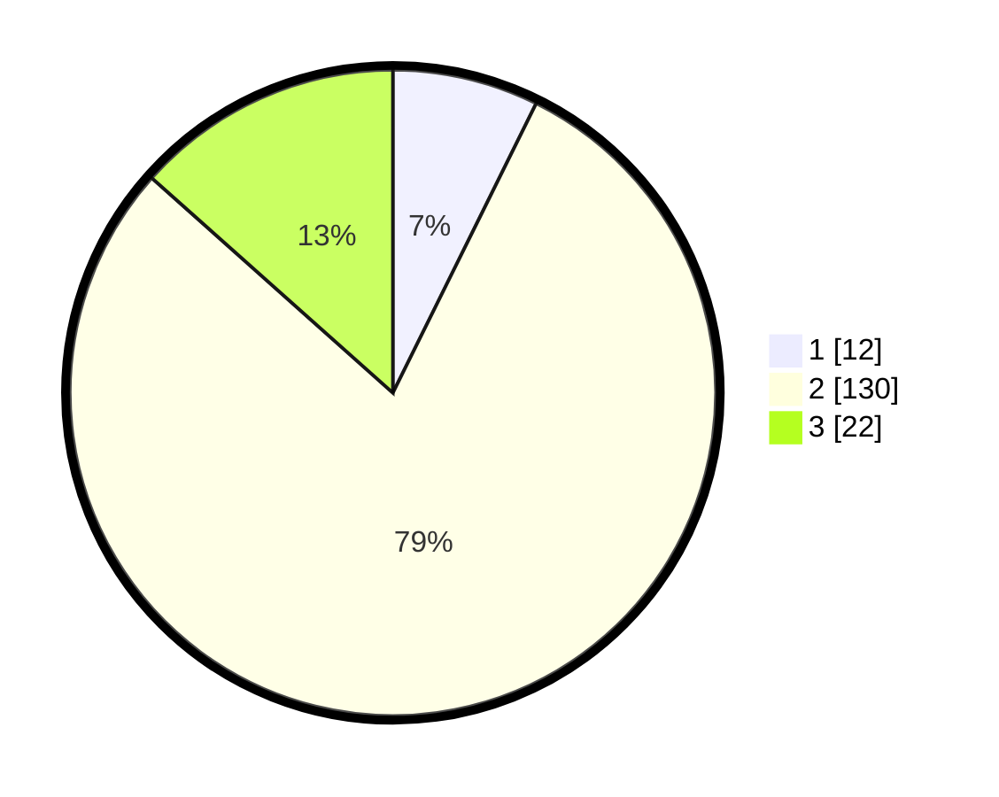

# Hasil

## Grafik

## Tabel

| No. | Nama Paslon    | Suara | Suara (raw) | Persentase |
|:--- |:-------------- | -----:| -----------:| ----------:|
| 1   | ANIES MUHAIMIN | 12    | [12][p-1]   | 7,32       |
| 2   | PRABOWO GIBRAN | 130   | [130][p-2]  | 79,27      |
| 3   | GANJAR MAHFUD  | 22    | [22][p-3]   | 13,41      |

[p-1]: https://github.com/gigit-pemilu/pemilu-2024/blob/main/pilpres/hitung-suara/sub/35-jawa-timur/sub/10-banyuwangi/sub/06-cluring/sub/2005-benculuk/sub/006-tps/sub/paslon-1.txt
[p-2]: https://github.com/gigit-pemilu/pemilu-2024/blob/main/pilpres/hitung-suara/sub/35-jawa-timur/sub/10-banyuwangi/sub/06-cluring/sub/2005-benculuk/sub/006-tps/sub/paslon-2.txt
[p-3]: https://github.com/gigit-pemilu/pemilu-2024/blob/main/pilpres/hitung-suara/sub/35-jawa-timur/sub/10-banyuwangi/sub/06-cluring/sub/2005-benculuk/sub/006-tps/sub/paslon-3.txt

## Foto C Plano

https://sirekap-obj-formc.kpu.go.id/f619/pemilu/ppwp/35/10/06/20/05/3510062005006-20240215-020405--2eb6a808-aee0-4289-ba35-35c27ad7edbb.jpg

https://sirekap-obj-formc.kpu.go.id/f619/pemilu/ppwp/35/10/06/20/05/3510062005006-20240215-020521--f56e250a-18dd-4b7b-9634-d528cf0fa175.jpg

https://sirekap-obj-formc.kpu.go.id/f619/pemilu/ppwp/35/10/06/20/05/3510062005006-20240215-020625--7c4e3b8c-1df7-4c8e-90b4-a684eddfd1e3.jpg

## Metadata

| Key        | Value               |
| ---------- | ------------------- |
| Time Stamp | 2024-02-21 18:00:00 |

