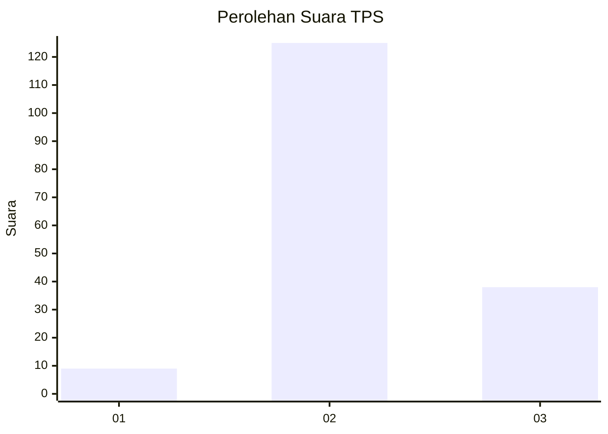

# Hasil

## Grafik

## Tabel

| No. | Nama Paslon    | Suara | Suara (raw) | Persentase |
|:--- |:-------------- | -----:| -----------:| ----------:|
| 1   | ANIES MUHAIMIN | 9     | [9][p-1]    | 5,23       |
| 2   | PRABOWO GIBRAN | 125   | [125][p-2]  | 72,67      |
| 3   | GANJAR MAHFUD  | 38    | [38][p-3]   | 22,09      |

[p-1]: https://github.com/gigit-pemilu/pemilu-2024-35-jawa-timur/blob/main/pilpres/hitung-suara/sub/35-jawa-timur/sub/10-banyuwangi/sub/06-cluring/sub/2005-benculuk/sub/014-tps/sub/paslon-1.txt
[p-2]: https://github.com/gigit-pemilu/pemilu-2024-35-jawa-timur/blob/main/pilpres/hitung-suara/sub/35-jawa-timur/sub/10-banyuwangi/sub/06-cluring/sub/2005-benculuk/sub/014-tps/sub/paslon-2.txt
[p-3]: https://github.com/gigit-pemilu/pemilu-2024-35-jawa-timur/blob/main/pilpres/hitung-suara/sub/35-jawa-timur/sub/10-banyuwangi/sub/06-cluring/sub/2005-benculuk/sub/014-tps/sub/paslon-3.txt

## Foto C Plano

https://sirekap-obj-formc.kpu.go.id/eb1a/pemilu/ppwp/35/10/06/20/05/3510062005014-20240218-134738--5310d5b8-1a67-4991-b4a9-b57594428235.jpg

https://sirekap-obj-formc.kpu.go.id/eb1a/pemilu/ppwp/35/10/06/20/05/3510062005014-20240218-134029--dc286711-2edf-4104-9633-36549e275864.jpg

https://sirekap-obj-formc.kpu.go.id/eb1a/pemilu/ppwp/35/10/06/20/05/3510062005014-20240214-231932--6e53031b-026e-4360-89c9-0a631cc2f025.jpg

## Metadata

| Key        | Value               |
| ---------- | ------------------- |
| Time Stamp | 2024-02-21 18:00:00 |

