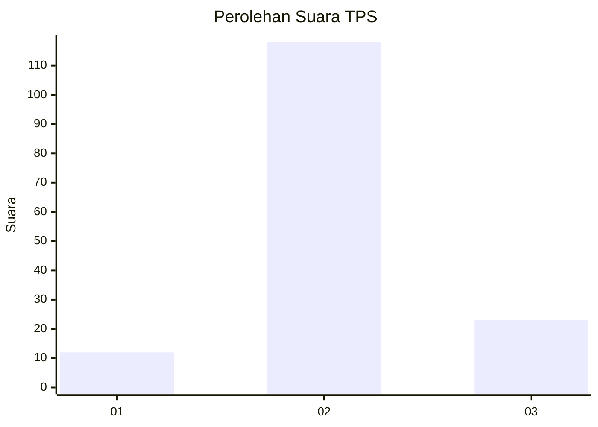

# Hasil

## Grafik

## Tabel

| No. | Nama Paslon    | Suara | Suara (raw) | Persentase |
|:--- |:-------------- | -----:| -----------:| ----------:|
| 1   | ANIES MUHAIMIN | 12    | [12][p-1]   | 7,84       |
| 2   | PRABOWO GIBRAN | 118   | [118][p-2]  | 77,12      |
| 3   | GANJAR MAHFUD  | 23    | [23][p-3]   | 15,03      |

[p-1]: https://github.com/gigit-pemilu/pemilu-2024-35-jawa-timur/blob/main/pilpres/hitung-suara/sub/35-jawa-timur/sub/10-banyuwangi/sub/06-cluring/sub/2005-benculuk/sub/018-tps/sub/paslon-1.txt
[p-2]: https://github.com/gigit-pemilu/pemilu-2024-35-jawa-timur/blob/main/pilpres/hitung-suara/sub/35-jawa-timur/sub/10-banyuwangi/sub/06-cluring/sub/2005-benculuk/sub/018-tps/sub/paslon-2.txt
[p-3]: https://github.com/gigit-pemilu/pemilu-2024-35-jawa-timur/blob/main/pilpres/hitung-suara/sub/35-jawa-timur/sub/10-banyuwangi/sub/06-cluring/sub/2005-benculuk/sub/018-tps/sub/paslon-3.txt

## Foto C Plano

https://sirekap-obj-formc.kpu.go.id/62fa/pemilu/ppwp/35/10/06/20/05/3510062005018-20240214-233553--d7ad46f1-0cf2-4d77-ad38-8b72594d93b9.jpg

https://sirekap-obj-formc.kpu.go.id/62fa/pemilu/ppwp/35/10/06/20/05/3510062005018-20240214-233737--adcafcc4-be8c-4f30-af56-63602f5dc464.jpg

https://sirekap-obj-formc.kpu.go.id/62fa/pemilu/ppwp/35/10/06/20/05/3510062005018-20240214-233906--cea959e1-3a47-4fc1-8e7d-33f7bb2eeec4.jpg

## Metadata

| Key        | Value               |
| ---------- | ------------------- |
| Time Stamp | 2024-02-24 22:31:28 |

