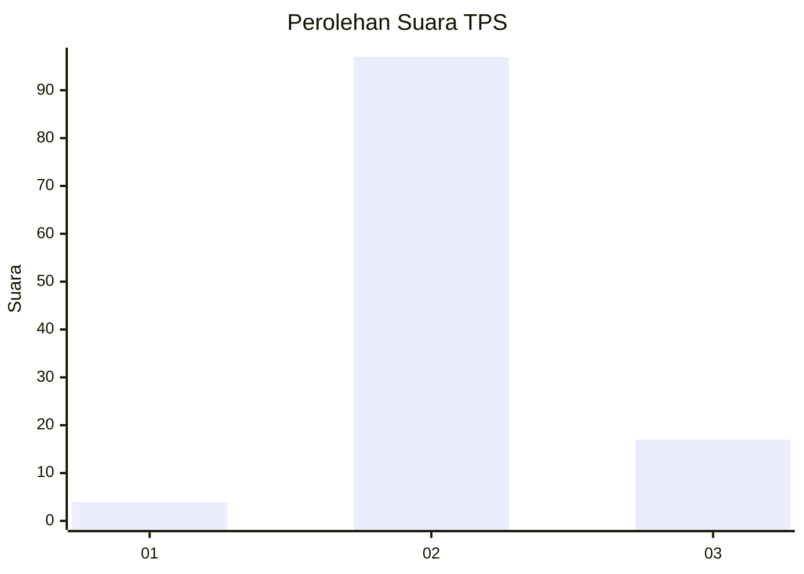
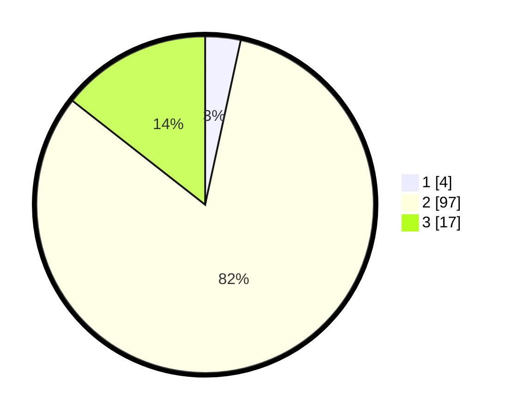

# Hasil

## Grafik

## Tabel

| No. | Nama Paslon    | Suara | Suara (raw) | Persentase |
|:--- |:-------------- | -----:| -----------:| ----------:|
| 1   | ANIES MUHAIMIN | 4     | [4][p-1]    | 3,39       |
| 2   | PRABOWO GIBRAN | 97    | [97][p-2]   | 82,20      |
| 3   | GANJAR MAHFUD  | 17    | [17][p-3]   | 14,41      |

[p-1]: https://github.com/gigit-pemilu/pemilu-2024/blob/main/pilpres/hitung-suara/sub/35-jawa-timur/sub/10-banyuwangi/sub/06-cluring/sub/2007-tamanagung/sub/021-tps/sub/paslon-1.txt
[p-2]: https://github.com/gigit-pemilu/pemilu-2024/blob/main/pilpres/hitung-suara/sub/35-jawa-timur/sub/10-banyuwangi/sub/06-cluring/sub/2007-tamanagung/sub/021-tps/sub/paslon-2.txt
[p-3]: https://github.com/gigit-pemilu/pemilu-2024/blob/main/pilpres/hitung-suara/sub/35-jawa-timur/sub/10-banyuwangi/sub/06-cluring/sub/2007-tamanagung/sub/021-tps/sub/paslon-3.txt

## Foto C Plano

https://sirekap-obj-formc.kpu.go.id/2f44/pemilu/ppwp/35/10/06/20/07/3510062007021-20240218-120441--978af54b-d392-4a82-b2a1-ae043c747250.jpg

https://sirekap-obj-formc.kpu.go.id/2f44/pemilu/ppwp/35/10/06/20/07/3510062007021-20240218-120615--549b32e3-4fa2-440f-99ad-5cf258e19ae0.jpg

https://sirekap-obj-formc.kpu.go.id/2f44/pemilu/ppwp/35/10/06/20/07/3510062007021-20240218-120827--0231844f-7093-46ac-b8f2-f3ab963cb2f1.jpg

## Metadata

| Key        | Value               |
| ---------- | ------------------- |
| Time Stamp | 2024-02-24 22:31:28 |

