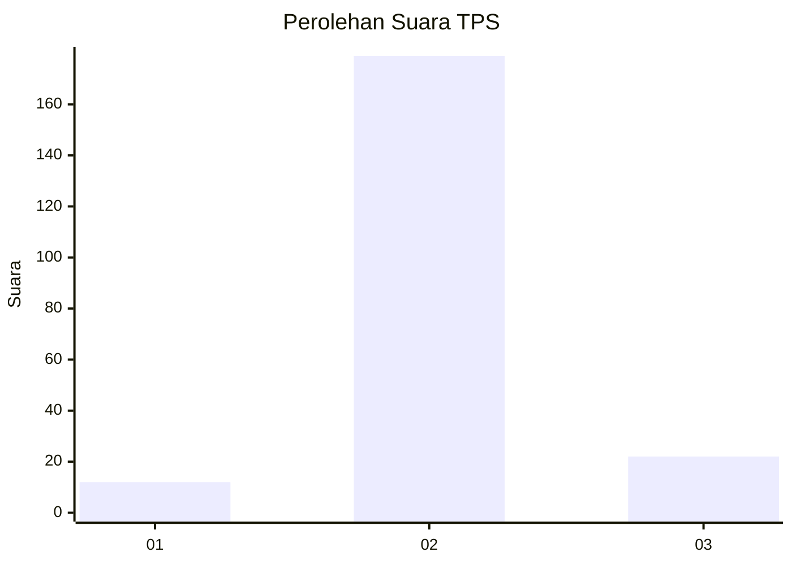
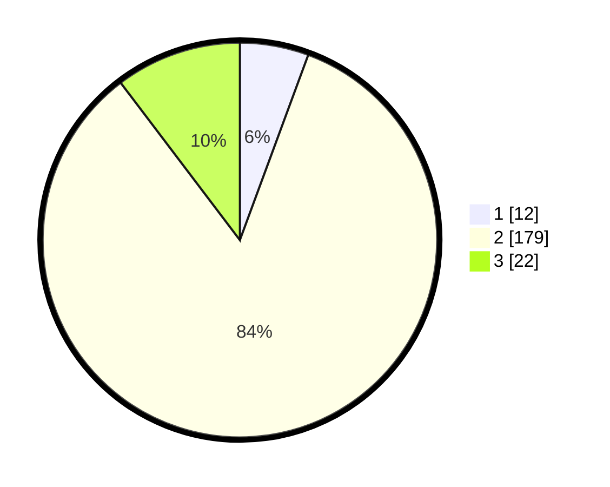

# Hasil

## Grafik

## Tabel

| No. | Nama Paslon    | Suara | Suara (raw) | Persentase |
|:--- |:-------------- | -----:| -----------:| ----------:|
| 1   | ANIES MUHAIMIN | 12    | [12][p-1]   | 5,63       |
| 2   | PRABOWO GIBRAN | 179   | [179][p-2]  | 84,04      |
| 3   | GANJAR MAHFUD  | 22    | [22][p-3]   | 10,33      |

[p-1]: https://github.com/gigit-pemilu/pemilu-2024/blob/main/pilpres/hitung-suara/sub/35-jawa-timur/sub/10-banyuwangi/sub/06-cluring/sub/2007-tamanagung/sub/026-tps/sub/paslon-1.txt
[p-2]: https://github.com/gigit-pemilu/pemilu-2024/blob/main/pilpres/hitung-suara/sub/35-jawa-timur/sub/10-banyuwangi/sub/06-cluring/sub/2007-tamanagung/sub/026-tps/sub/paslon-2.txt
[p-3]: https://github.com/gigit-pemilu/pemilu-2024/blob/main/pilpres/hitung-suara/sub/35-jawa-timur/sub/10-banyuwangi/sub/06-cluring/sub/2007-tamanagung/sub/026-tps/sub/paslon-3.txt

## Foto C Plano

https://sirekap-obj-formc.kpu.go.id/73a4/pemilu/ppwp/35/10/06/20/07/3510062007026-20240215-020947--bdc8a119-0578-4f31-bddf-9b3cdc0152cf.jpg

https://sirekap-obj-formc.kpu.go.id/73a4/pemilu/ppwp/35/10/06/20/07/3510062007026-20240215-021221--6f2a1261-23cc-4d14-ad17-4ed5b6f34452.jpg

https://sirekap-obj-formc.kpu.go.id/73a4/pemilu/ppwp/35/10/06/20/07/3510062007026-20240215-021121--4add2fa2-113d-46b7-9469-7d93947eb746.jpg

## Metadata

| Key        | Value               |
| ---------- | ------------------- |
| Time Stamp | 2024-02-24 22:31:28 |

