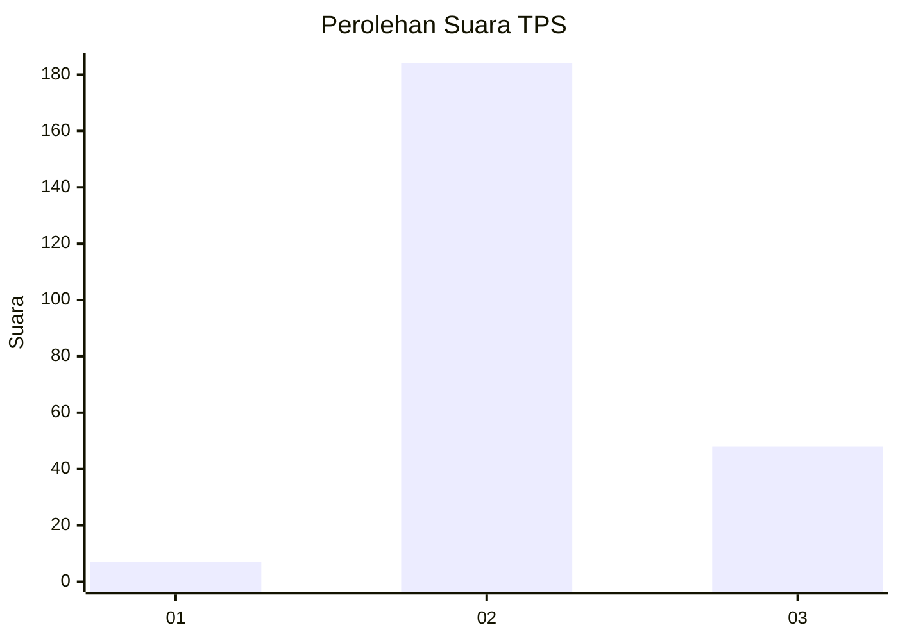

# Hasil

## Grafik

## Tabel

| No. | Nama Paslon    | Suara | Suara (raw) | Persentase |
|:--- |:-------------- | -----:| -----------:| ----------:|
| 1   | ANIES MUHAIMIN | 7     | [7][p-1]    | 2,93       |
| 2   | PRABOWO GIBRAN | 184   | [184][p-2]  | 76,99      |
| 3   | GANJAR MAHFUD  | 48    | [48][p-3]   | 20,08      |

[p-1]: https://github.com/gigit-pemilu/pemilu-2024-35-jawa-timur/blob/main/pilpres/hitung-suara/sub/35-jawa-timur/sub/10-banyuwangi/sub/06-cluring/sub/2009-kaliploso/sub/004-tps/sub/paslon-1.txt
[p-2]: https://github.com/gigit-pemilu/pemilu-2024-35-jawa-timur/blob/main/pilpres/hitung-suara/sub/35-jawa-timur/sub/10-banyuwangi/sub/06-cluring/sub/2009-kaliploso/sub/004-tps/sub/paslon-2.txt
[p-3]: https://github.com/gigit-pemilu/pemilu-2024-35-jawa-timur/blob/main/pilpres/hitung-suara/sub/35-jawa-timur/sub/10-banyuwangi/sub/06-cluring/sub/2009-kaliploso/sub/004-tps/sub/paslon-3.txt

## Foto C Plano

https://sirekap-obj-formc.kpu.go.id/5e95/pemilu/ppwp/35/10/06/20/09/3510062009004-20240218-172821--7eae09b8-3296-4842-b52f-e371c167ac0b.jpg

https://sirekap-obj-formc.kpu.go.id/5e95/pemilu/ppwp/35/10/06/20/09/3510062009004-20240218-172852--2adff66a-3c16-41ac-9cf0-53c10373a2c7.jpg

https://sirekap-obj-formc.kpu.go.id/5e95/pemilu/ppwp/35/10/06/20/09/3510062009004-20240218-172923--a36453bb-1303-4e45-a2f4-3284554117b8.jpg

## Metadata

| Key        | Value               |
| ---------- | ------------------- |
| Time Stamp | 2024-02-24 22:31:28 |

